> **Documento histórico — julio de 2026.** Escrito para el árbol anterior del
> proyecto (`moldesign-app`) y traído aquí por trazabilidad. Puede describir un
> estado que ya no es el vigente: la versión 1.0.0 es una aplicación de
> escritorio y no tiene componente en la nube. No se ha reescrito su contenido.

# Pipeline Cientifico de MolDesign AI

## Diagrama de Flujo Principal

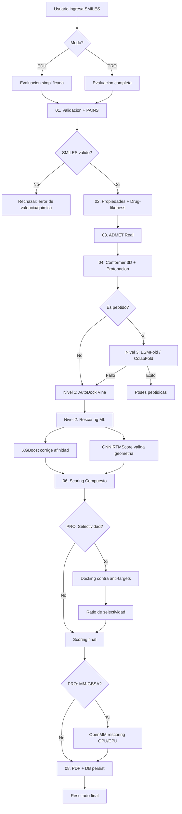

---

## Pipeline Detallado por Etapa

### 01 — Validacion Quimica + PAINS

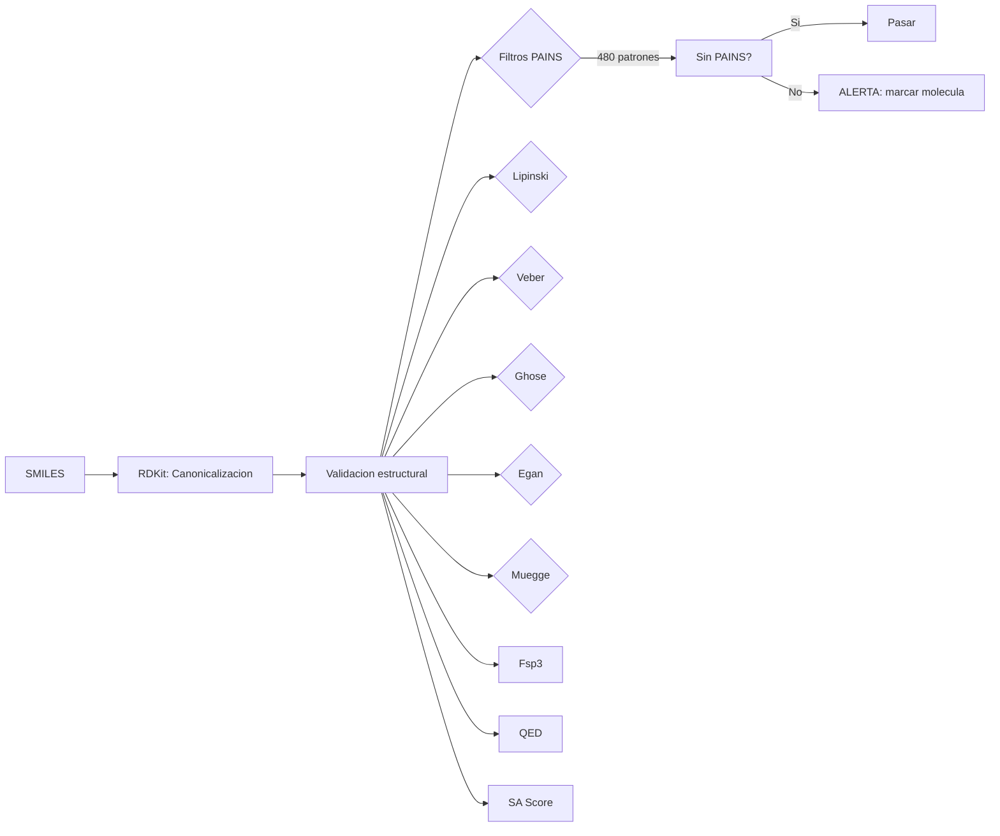

**Tecnologias:**
- RDKit: MolFromSmiles, canonicalizacion, validacion de valencias
- FilterCatalog: 480 patrones PAINS (Baell & Holloway 2010)
- 6 reglas de drug-likeness: Lipinski, Veber, Ghose, Egan, Muegge, Fsp3

**Archivos:** `chem/validator.py`, `chem/pains.py`, `chem/properties.py`

---

### 02 — ADMET Real (NO mock)

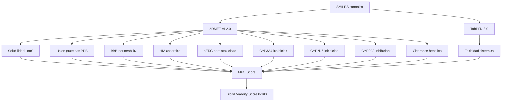

**Tecnologias:**
- ADMET-AI: Ensamble Chemprop (D-MPNN) de Swanson et al.
- TabPFN: Transformer para clasificacion tabular in-context
- MPO: Multi-Parameter Optimization score geometrico

**Archivos:** `chem/blood_viability.py`, `chem/properties.py`

---

### 03 — Conformer 3D + Protonacion

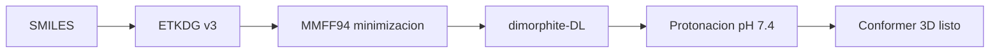

**Archivos:** `chem/conformer.py`

---

### 04 — Docking Molecular (Nivel 1)

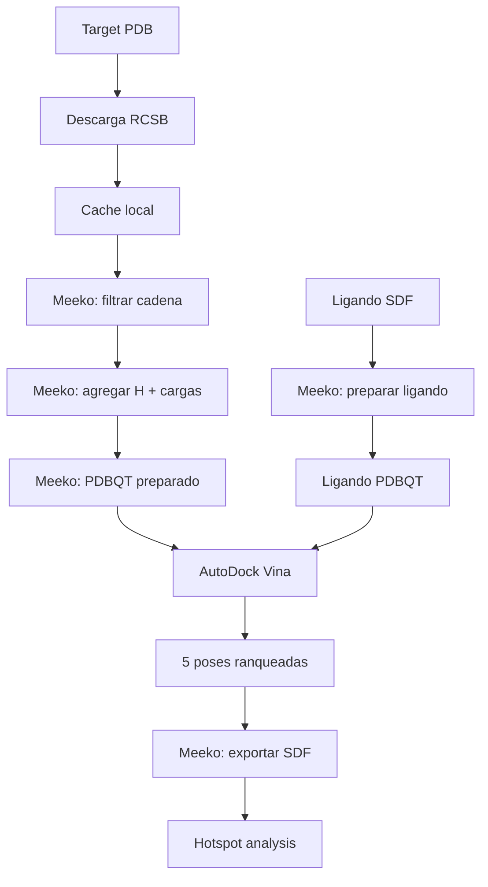

**Tecnologias:**
- AutoDock Vina 1.2.5: Iterated Local Search, exhaustiveness=8
- **Vina-GPU Hybrid** (opcional, v1.5+): GPU search (OpenCL, 2s) + CPU refine fp64 (0.06s) = 30× speedup
- Meeko: preparacion de receptor y ligando, exportacion SDF
- ProDy: parseo mejorado de PDB (opcional)

**Archivos:** `services/docking/vina_service.py`, `services/docking/preparer.py`
**Modulo GPU:** `D:\ad-gpu-project\` — Ver [10_VINA_GPU_HYBRID.md](10_VINA_GPU_HYBRID.md)

---

### 05 — Rescoring ML (Nivel 2)

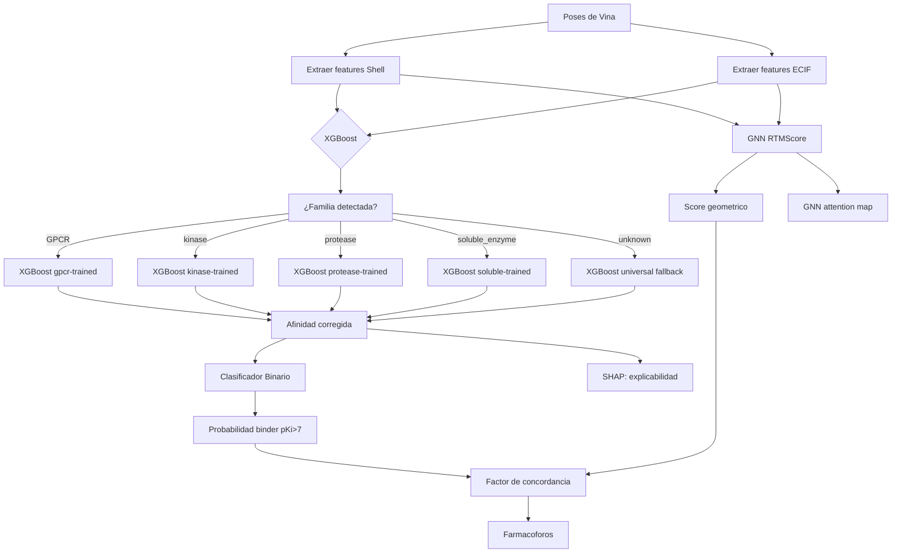

**NOTA (fix #3):** Las interacciones ProLIF (puentes H, pi-stacking, etc.)
ya NO se usan como features de regresion (daban ρ=-0.035 en GPCRs).
Se extraen pero solo se exponen en la respuesta API para visualizacion
en el visor 3D (Molstar).

**Tecnologias:**
- XGBoost 2.1: modelos por familia estructural (gpcr, kinase, protease, nuclear_receptor, soluble_enzyme) + universal fallback
- RTMScore GNN (PyG): red neuronal de grafos geometrica — **PyTorch Geometric** (nativo en Windows sin DGL)
- SHAP 0.46: valores de explicabilidad por feature
- ProLIF 2.1: interaction fingerprints (reemplaza ODDT)

**Clasificacion por familia:** `structural_family.py` clasifica cada receptor PDBbind en 6 familias via
`family_map.json` (865 complejos curados). Si la familia tiene ≥15 complejos, se usa su modelo
entrenado especificamente. Caso contrario → fallback al modelo universal.

**GPU:** PyTorch Geometric detecta CUDA automaticamente (`torch.cuda.is_available()`). Para una sola
molecula, CPU es mas rapido (~1.7s vs 3.0s por overhead de GPU). Para batch ≥2, GPU gana 3-7x.
El sidecar usa CPU por defecto para single-molecule inference.

**Archivos:** `rescoring/app.py`, `rescoring/feature_extractor.py`, `rescoring/model_manager.py`
(family routing), `rescoring/structural_family.py`, `rescoring/gnn_service.py`,
`rescoring/RTMScore/model/model2_pyg.py` (PyG), `rescoring/RTMScore/feats/mol2graph_pyg.py` (PyG),
`services/docking/rescoring_client.py`

---

### 06 — Scoring: Ranking vs Flags (fix #2 Spearman)

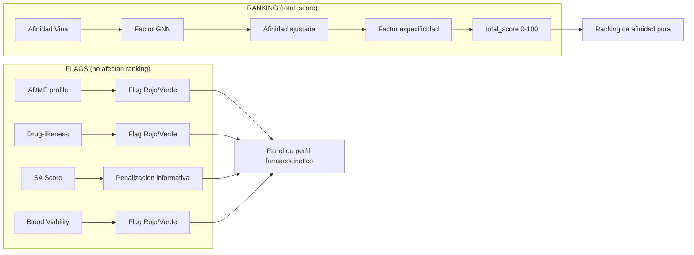

**IMPORTANTE (fix #2):** `total_score` = SOLO afinidad de union.
ADME, Drug-likeness, SA, Blood Viability son flags informativos que
el quimico medicinal consulta en el panel, no variables de ranking.

**Benchmark**: El composite original (mezclando ADME) daba ρ=-0.11 en 5-HT1A.
Vina solo daba ρ=+0.19. Al desacoplar, el ranking refleja afinidad pura.

**Archivos:** `scoring/engine.py`, `scoring/normalizer.py`

---

### 07 — Selectividad Multi-Target (PRO)

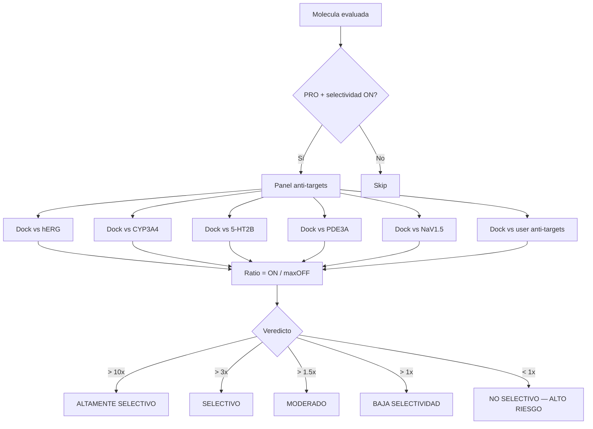

**Anti-targets default:**
- hERG (5VA1): canal de potasio cardiaco — arritmia
- CYP3A4 (4NY4): metabolismo hepatico — interacciones droga-droga
- 5-HT2B (4NC3): receptor de serotonina — valvulopatia
- PDE3A (1SO2): fosfodiesterasa — contractilidad
- NaV1.5 (6MVW): canal de sodio — conduccion

**Anti-targets del usuario:** cualquier PDB subido con `is_anti_target=true`

**Archivos:** `services/docking/selectivity.py`, `api/routers/pro_features.py`

---

### 08 — MM-GBSA Rescoring (PRO)

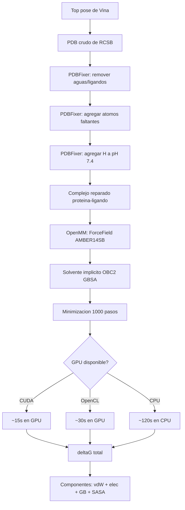

**PDBFixer (fix #4):** Los PDBs cristalograficos del RCSB no tienen H y a veces
faltan atomos de cadena lateral. PDBFixer (autores de OpenMM) repara el PDB
antes de pasarlo al motor de fisica. Sin este paso, OpenMM crashea con
`No template found for residue... Missing H atoms`.

**Archivos:** `scoring/mmgbsa.py`

---

### 09 — Visualización de Interacciones ProLIF (v1.2)

```mermaid
flowchart LR
    A[Molecule ID] --> B[GET /evaluation/interactions/{id}]
    B --> C[ProLIF: detecta interacciones]
    C --> D[Coords 3D: lig_x/y/z + prot_x/y/z]
    D --> E[Frontend: buildInteractionsPdb]
    E --> F[Molstar: midpoint spheres]
    F --> G{H Bond?}
    G -->|Si| H[Esfera roja - puente H]
    G -->|No| I{Hidrofobico?}
    I -->|Si| J[Esfera gris]
    I -->|No| K{Pi stacking?}
    K -->|Si| L[Esfera azul]
    K -->|No| M{Puente salino?}
    M -->|Si| N[Esfera amarilla]
    M -->|No| O[Esfera verde - cation pi]
```

Cada interacción se renderiza como una esfera coloreada en el punto medio (midpoint)
entre el átomo del ligando y el átomo de la proteína. El color codifica el tipo:

| Tipo de interacción | Elemento | Color | Visualización |
|--------------------|----------|-------|---------------|
| Puente de H | O | Rojo | `#ff4d4d` |
| Hidrofóbica | C | Gris | `#808080` |
| Pi-stacking | N | Azul | `#4d4dff` |
| Puente salino | S | Amarillo | `#ffff4d` |
| Pi-catión | F | Verde | `#4dff4d` |

**Datos incluidos en API (v1.2):** `ligand_coords` y `protein_coords` en cada interacción.

**Archivos:** `frontend/components/interfaces/pro/AdvancedMolstarViewer.tsx` (buildInteractionsPdb),
`backend/api/routers/interactions.py`, `backend/services/interactions/analyzer.py`

---

### 10 — Búsqueda e Ingesta de Targets (v1.2)

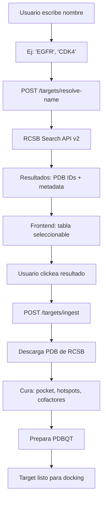

**Arquitectura de búsqueda:**
1. `search_rcsb_by_name()` consulta RCSB Search API v2 (`text` + `contains_phrase`)
2. Para cada resultado, `_fetch_rcsb_entry_detail()` obtiene metadata de RCSB Data API
3. Resultados ordenados por resolución (mejor primero)
4. Al seleccionar, se dispara el pipeline de ingesta existente (`POST /targets/ingest`)

**Archivos:** `backend/utils/file_handlers.py`, `backend/api/routers/targets.py`,
`frontend/components/interfaces/pro/TargetSelectorModal.tsx`

---

## Niveles de Evaluacion

| Nivel | Tecnologia | Que hace | Cuando se usa |
|-------|-----------|----------|---------------|
| **1** | AutoDock Vina | Docking fisico | Siempre (default) |
| **2** | XGBoost + GNN (PyG) | Correccion ML de afinidad + validacion geometrica | Siempre (si sidecar disponible) |
| **2b** | XGBoost por familia | Modelo especifico GPCR/kinase/protease/etc | Siempre (si family_map detecta la familia) |
| **3** | ESMFold / ColabFold | Docking de peptidos por difusion | Molecula con >=3 enlaces peptidicos |
| **PRO** | Panel anti-targets | Safety profiling | Modo PRO activado |
| **PRO** | MM-GBSA | Rescoring con dinamica molecular | Modo PRO + toggle activado |

---

## Metricas de Calidad

| Metrica | Implementacion |
|---------|---------------|
| Spearman rho | Pipeline de benchmark contra PDBbind/ChEMBL (21 targets) |
| RMSD re-docking | Validacion de grid box contra ligando co-cristalizado |
| PAINS coverage | 480 patrones de Baell & Holloway 2010 |
| ADMET accuracy | Modelos Chemprop entrenados en datos curados (ADMET-AI) |
| Uncertainty | Desviacion estandar del ensemble de poses de Vina |

---

## ADMET-AI: Predictivo vs Cache (v1.0)

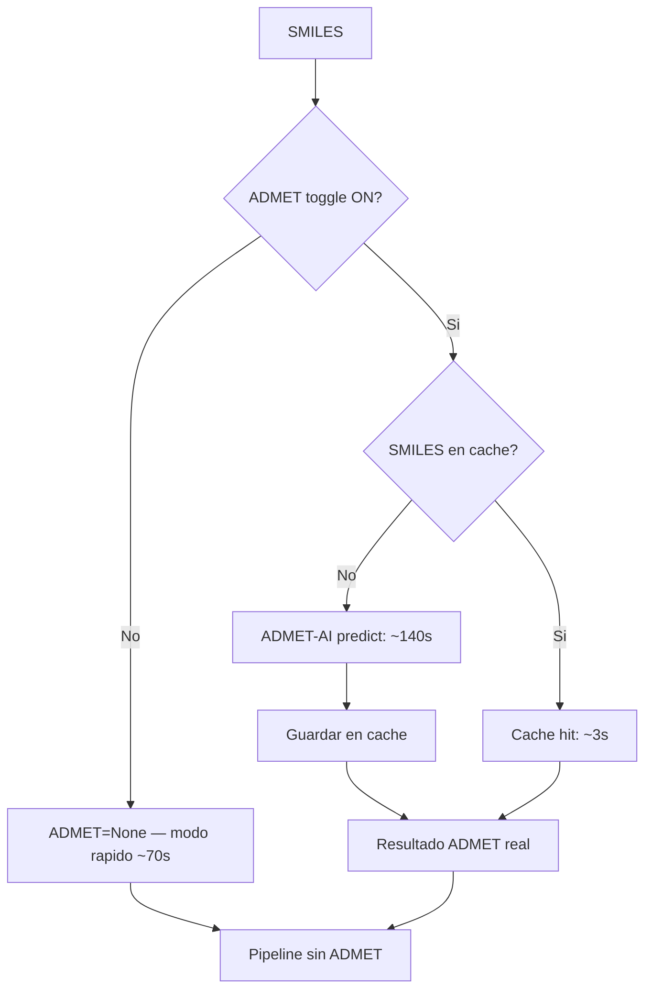

### Cache Strategy

| Cache | Key | Lifetime | Impacto |
|-------|-----|----------|---------|
| ADMET | SMILES hash | Hasta reinicio del backend | -140s en 2da+ evaluacion |
| Vina | SMILES + Target | Hasta reinicio del backend | -15s en 2da+ evaluacion |
| PDB | Target PDB ID | Disco (persistente) | -10s preparacion receptor |

---

## Drug-Likeness Completo (v1.0)

6 reglas implementadas:

| Regla | Parametros | Referencia |
|-------|-----------|------------|
| Lipinski Ro5 | MW<=500, LogP<=5, HBD<=5, HBA<=10 | Lipinski 1997 |
| Veber | RotB<=10, TPSA<=140 | Veber 2002 |
| Ghose | MW 160-480, LogP -0.4/5.6, atoms 20-70 | Ghose 1999 |
| Egan | TPSA<=132, LogP -1/5.88 | Egan 2000 |
| Muegge | Score 0-9 (>=2 passes) | Muegge 2001 |
| Fsp3 | Fraccion carbonos sp3 | Lovering 2009 |

---

## SAR: Structure-Activity Relationship (v1.0)

Endpoint: GET /sar/{molecule_id}

Retorna todos los analogos evaluados contra el MISMO target, ranqueados por score.
Incluye delta (?) vs baseline para cada metrica.

Ver [03_API.md](03_API.md) para el detalle del endpoint.

---

## ADMET Toggle + Cache (v1.1)

El usuario puede desactivar ADMET-AI para evaluaciones rapidas (~70s vs ~210s).

Cache por SMILES: misma molecula = mismo resultado ADMET. 2a evaluacion = 3s.

## Login Desktop (v1.1)

Auto-login sin credenciales. El usuario nunca ve pantalla de login.
Cuenta cloud opcional solo para comunidad/atribucion.

## Community (v1.1)

Targets compartidos globalmente. Download con un click. Leaderboard de scores.
Arquitectura hibrida: desktop local + cloud opcional.
