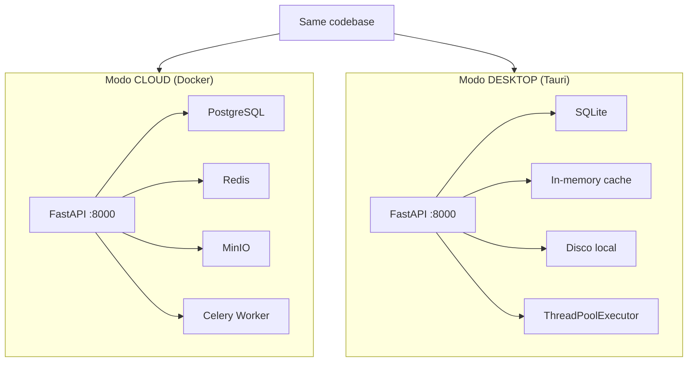
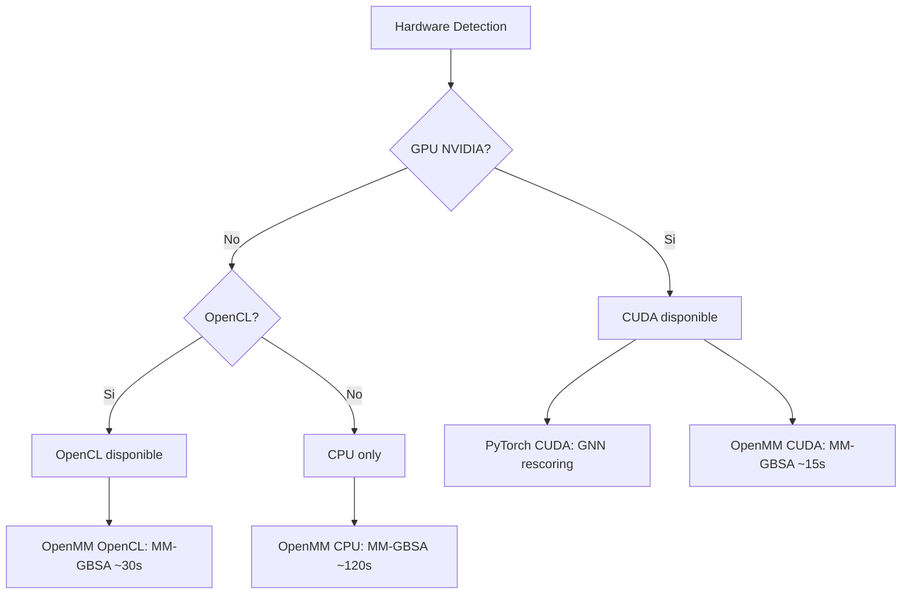
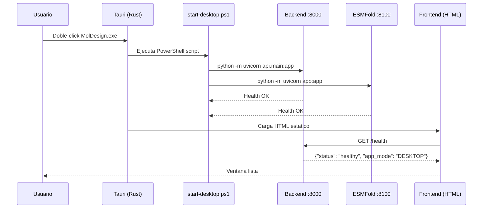

> **Documento histórico — julio de 2026.** Escrito para el árbol anterior del
> proyecto (`moldesign-app`) y traído aquí por trazabilidad. Puede describir un
> estado que ya no es el vigente: la versión 1.0.0 es una aplicación de
> escritorio y no tiene componente en la nube. No se ha reescrito su contenido.

# Adaptacion Cloud → Desktop

## Por que una app de escritorio?

El SaaS de MolDesign corre en un servidor Ubuntu (192.168.1.64) con Docker. Cada evaluacion consume recursos del servidor, requiere internet, y los datos del usuario pasan por la nube.

La app de escritorio:
- **Privacidad total**: datos 100% locales, nunca salen de la PC
- **Sin latencia de red**: el docking corre en el hardware del usuario
- **Sin costos de servidor**: no paga CPU cloud por cada evaluacion
- **Offline**: funciona sin internet (salvo descarga inicial de PDBs)

---

## Arquitectura Dual: CLOUD vs DESKTOP



**Mismo codigo, diferente infraestructura.** El backend detecta `APP_MODE=DESKTOP` y reemplaza cada dependencia cloud con un equivalente local.

---

## Tabla de Adaptaciones

| Dependencia Cloud | Reemplazo Desktop | Archivo |
|-------------------|-------------------|---------|
| PostgreSQL | SQLite + aiosqlite | `core/db_factory.py` |
| Redis (cache) | In-memory dict con TTL | `utils/cache.py` |
| Redis (broker Celery) | ThreadPoolExecutor (2 workers) | `services/docking/queue_handler.py` |
| MinIO (storage) | Disco local (~/MolDesign/data/) | `utils/file_handlers.py` |
| Celery tasks | Ejecucion directa en thread | `services/docking/queue_handler.py` |
| /opt/conda/bin/python | sys.executable | `services/docking/preparer.py` |
| /data/targets/ (Docker vol) | ~/MolDesign/data/targets/ | `services/docking/preparer.py` |

---

## Como funciona APP_MODE

```python
# core/config.py
class Settings(BaseSettings):
    app_mode: Literal["CLOUD", "DESKTOP"] = Field(default="DESKTOP")
    
    @property
    def is_desktop(self) -> bool:
        return self.app_mode == "DESKTOP"
```

Cada modulo que necesita infraestructura cloud verifica `is_desktop`:

```python
# utils/cache.py
class CacheClient:
    def __init__(self):
        if _redis_available():
            self._redis = get_redis()
        else:
            self._memory = {}  # Fallback in-memory
```

```python
# services/docking/queue_handler.py
def submit_evaluation_job(...):
    if _is_desktop_mode():
        return _submit_evaluation_desktop(...)  # ThreadPoolExecutor
    else:
        return run_full_evaluation.apply_async(...)  # Celery
```

---

## Los 2 Sidecars (v1.3)

> **v1.3 (Julio 2026):** El rescoring (XGBoost/GNN) ahora corre IN-PROCESS dentro del
> backend. El sidecar separado en :8001 fue eliminado. Ahorro: ~1.8 GB RAM.

```
Tauri (proceso principal)
  │
  ├── Backend unificado (:8000)
  │   FastAPI + RDKit + Vina + XGBoost + ProLIF + SHAP
  │   + rescoring ML (model_manager in-process)
  │   + ADMET-AI + scoring
  │   DB: SQLite en %APPDATA%\MolDesign\data\
  │   RAM idle: ~550-600 MB (sin torch)
  │   RAM con GNN: ~1.3 GB (torch cargado lazy en primer run_gnn)
  │
  └── ESMFold (:8100) — on-demand v1.3
      FastAPI + predictor (stub o real)
      stub: ~100 MB idle, sin pesos del modelo
      real: +3 GB RAM (torch + ESMFold model, cargado lazy en primer /predict)
      ~10 archivos .py, ~1 MB codigo
```

---

## RAM por Escenario (v1.3 — Medido Real)

| Escenario | Componentes activos | RAM estimada |
|---|---|---|
| **Idle (small mols)** | Backend unificado | **~600 MB** |
| **Idle (con GNN)** | Backend + torch | **~1.3 GB** |
| **Docking activo** | Backend + Vina | **~800 MB** |
| **+ Peptide docking** | + ESMFold | **+100 MB (stub)** / **+3.5 GB (real)** |
| **Pipeline completo** | Todo activo | **~5 GB** (con ESMFold real) |

### Comparativa: Antes vs Ahora

| | v1.2 (3 sidecars) | v1.3 (unificado) | Ahorro |
|---|---|---|---|
| Idle (sin peptide) | ~2.4 GB | **~600 MB** | **-75% (-1.8 GB)** |
| Rescoring | ~1.8 GB (proceso aparte) | In-process (+0 MB) | **-100%** |
| rdkit duplicado | 2 procesos × 400 MB | 1 proceso × 400 MB | **-400 MB** |
| ESMFold idle | ~3.7 GB (siempre cargado) | ~100 MB (on-demand) | **-3.6 GB** |

---

## GPU Acceleration



**Que usa GPU:**
- RTMScore GNN rescoring → PyTorch Geometric CUDA (PyG nativo, sin DGL). CPU preferido para 1 molecula (~1.7s vs ~3.0s GPU), GPU gana 3-7x en batch ≥2
- ESMFold → PyTorch CUDA (inferencia en GPU)
- MM-GBSA → OpenMM CUDA/OpenCL (8x vs CPU)

**Que NO usa GPU:**
- AutoDock Vina (CPU-only, no existe version GPU oficial)
- XGBoost (CPU-only)
- RDKit/Meeko/ProDy (computo quimico, CPU)
- ADMET-AI (predicciones rapidas, GPU no ayuda)

---

## Frontend: Dual Build

```javascript
// next.config.js
const isDesktop = process.env.BUILD_TARGET === "desktop";

const nextConfig = {
  // Cloud: Next.js normal con SSR
  // Desktop: static export para Tauri
  ...(isDesktop && {
    output: "export",
    trailingSlash: true,
    images: { unoptimized: true },
  }),
};
```

```typescript
// lib/config.ts
const getApiUrl = () => {
  // Desktop: Tauri injecta window.__TAURI__
  if (typeof window !== "undefined" && (window as any).__TAURI__) {
    return "http://localhost:8000";  // Sidecar local
  }
  // Cloud: NEXT_PUBLIC_API_URL o localhost:8010
  return process.env.NEXT_PUBLIC_API_URL || "http://localhost:8010";
};
```

---

## Flujo de Inicio de la App

> **Nota:** El flujo actual usa PowerShell para lanzar los sidecars. El roadmap
> (Fase 1) prevé migrar a `externalBin` + `Command::new_sidecar()` de Tauri para
> eliminar la dependencia de PowerShell en el instalador distribuible.



> **v1.3:** El rescoring ML (XGBoost/GNN) ahora corre IN-PROCESS dentro del backend :8000.
> El sidecar separado en :8001 fue eliminado. Ahorro: ~1.8 GB RAM.

---

## Por que NO usamos Electron

| | Electron | Tauri |
|---|---------|-------|
| Peso del instalador | ~200 MB (Chromium) | ~10 MB (WebView nativo) |
| RAM en idle | ~300 MB | ~50 MB |
| Backend | Node.js | Rust (seguro, rapido) |
| Sidecars | child_process | Command::new (nativo) |
| Updates | electron-updater | Tauri Updater (firma crypto) |

Para una app cientifica que ya consume recursos (Vina, OpenMM, PyTorch), Electron seria inaceptable.

---

## Pipeline de Actualizaciones

```
Tier 1 — Codigo Python (diario, 5-15 MB):
  git push → CI empaqueta .py → Tauri Updater descarga .zip
  → Extrae en %APPDATA%\MolDesign\code\
  → Reinicia sidecars → Usuario ve "Actualizado a v1.2.3"

Tier 2 — Dependencias + instalador (mensual, 4-6 GB):
  Nuevo conda-pack/pyinstaller → Build .msi completo
  → Push a GitHub Releases → Usuario descarga instalador
```

---

## Cache Strategy (v1.0)

### ADMET Cache
Mismo SMILES = misma prediccion ADMET-AI. El resultado se cachea en memoria a nivel modulo.
- 1� evaluacion: ~140s (ADMET-AI prediction)
- 2� evaluacion (misma molecula): ~3s (cache hit + Vina cache)
- Impacto en batch: 50 moleculas de la misma familia ? 5 min en vez de 3 horas

### Vina Cache
Mismo SMILES + mismo target = mismo docking. Cache key incluye smiles_hash + target_pdb_id.
NUNCA se mezclan resultados de diferentes targets.

### LRU Cache (modo DESKTOP)
El cache in-memory tiene limite de 10,000 items con eviction LRU.
Previene crecimiento ilimitado de memoria en sesiones largas.

---

## Seguridad (v1.0)

### Passwords: bcrypt
- Nuevos passwords: bcrypt cost=12 (~250ms, memory-hard)
- Legacy: auto-migracion de PBKDF2-SHA256 a bcrypt al verificar
- Sin passwords hardcodeados: todo scratch/ eliminado

### JWT Secret Key
- Desktop: auto-genera os.urandom(32).hex() al iniciar
- Cloud: configurable via SECRET_KEY en .env
- Sin default inseguro

### Blockchain Refactor
- Lazy RPC init: no conecta a Solana hasta que se usa
- Retry con backoff exponencial (1s, 2s, 4s)
- Thread-safe singleton con asyncio.Lock
- Degradacion limpia si SOLANA_PRIVATE_KEY no configurada

---

## Performance Benchmarks (Ryzen 5 5500 + RTX 1660 SUPER)

| Escenario | Tiempo |
|-----------|--------|
| EDU mode (sin ADMET) | ~70s |
| PRO mode (con ADMET, 1� vez) | ~210s |
| PRO mode (con ADMET, cache hit) | ~3s |
| Batch 50 mols (misma familia) | ~5 min |
| Batch 50 mols (todas diferentes) | ~3 horas |
| Vina exhaust=1 | ~145s (ADMET domina) |
| Vina exhaust=8 | ~153s (igual, bottleneck es ADMET) |

---

## Auditoria de Codigo (Julio 2026)

25 issues encontrados. 12 corregidos. 0 criticos restantes.

Ver [00_INDEX.md](00_INDEX.md) para el detalle completo.

---

## Comunidad Global (v1.1)

`mermaid
flowchart TD
    A[Desktop App] --> B{Community ON?}
    B -->|No| C[100% offline]
    B -->|Si| D[Fetch cloud API]
    D --> E[GET /targets/community]
    D --> F[GET /stats/leaderboard]
    E --> G[Mostrar targets en UI]
    G --> H[Usuario click Download]
    H --> I[POST /targets/community/download]
    I --> J[Ingesta local → SQLite]
    J --> K[Target listo para docking]
`

### Arquitectura hibrida

| Capa | Desktop (local) | Cloud (192.168.1.64) |
|------|----------------|----------------------|
| Auth | Auto-login (sin cuenta) | Email/password (opcional) |
| DB | SQLite | PostgreSQL |
| Targets | Locales + descargados | Comunidad publica |
| Leaderboard | Fetch de cloud | Query directa DB |
| Share | POST /targets/{id}/share | is_community=true |

### Login Desktop (v1.1)
- **Auto-login**: GET /auth/desktop-login crea usuario "Desktop User" automaticamente
- **Sin friccion**: el usuario nunca ve pantalla de login
- **Cloud login opcional**: solo para atribucion en comunidad

### GPU Detection (v1.1)
- Retry 10x con 2s backoff (total 20s max)
- El backend tarda ~20s en arrancar, el frontend en ~3s
- Cuando el backend responde, el hardware se detecta automaticamente
