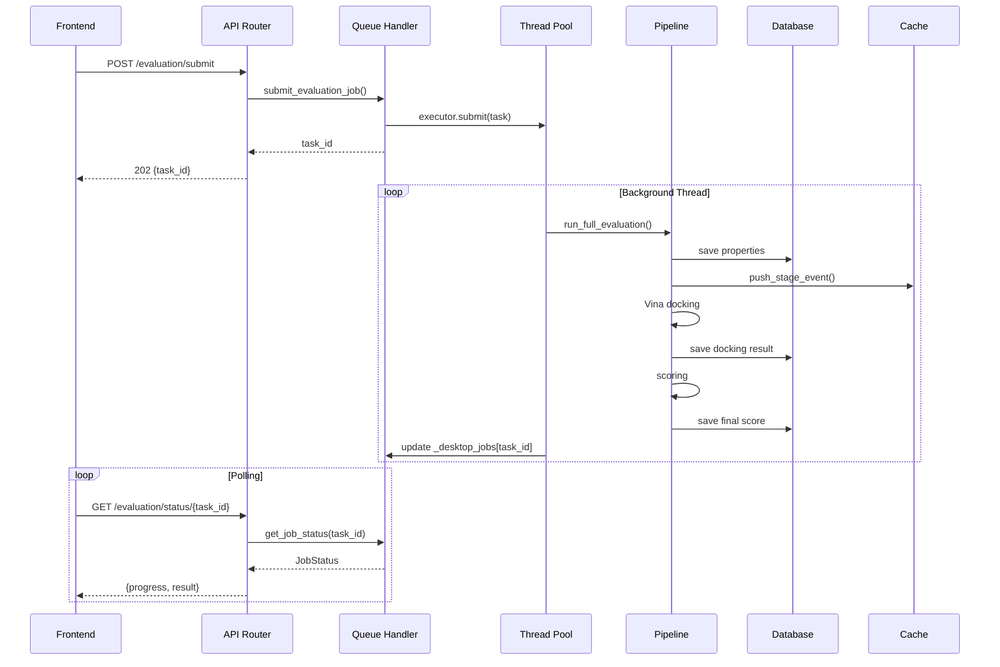

> **Documento histórico — julio de 2026.** Escrito para el árbol anterior del
> proyecto (`moldesign-app`) y traído aquí por trazabilidad. Puede describir un
> estado que ya no es el vigente: la versión 1.0.0 es una aplicación de
> escritorio y no tiene componente en la nube. No se ha reescrito su contenido.

# Arquitectura del Codigo

## Estructura de Directorios

```
moldesign-app/
│
├── backend/                    # FastAPI — Pipeline cientifico principal
│   ├── api/                    # Capa HTTP: routers, middleware, entrypoint
│   │   ├── main.py             # FastAPI app + lifespan + health + hardware
│   │   ├── routers/            # Endpoints REST
│   │   │   ├── evaluation.py   # POST submit, GET status, GET files
│   │   │   ├── batch.py        # POST batch, GET batch/{id}, export Excel/CSV
│   │   │   │   ├── interactions.py # GET interactions/{molecule_id} — PLIF (con coords 3D v1.2)
│   │   │   ├── pro_features.py # GET/POST selectivity, MM-GBSA, GPU, anti-targets
│   │   │   ├── targets.py      # GET targets, POST upload (custom PDB)
│   │   │   ├── auth.py         # POST login/register/refresh
│   │   │   ├── history.py      # GET history, stats
│   │   │   ├── blockchain.py   # POST certify, GET certificate
│   │   │   ├── suggestions.py  # De novo molecular suggestions
│   │   │   ├── rescoring.py    # GET /rescoring/health, /info, /ram (v1.3)
│   │   │   └── stats.py        # Global community stats
│   │   ├── auth.py             # JWT helpers
│   │   ├── dependencies.py     # FastAPI dependency injection
│   │   ├── middleware.py       # CORS, rate limiting
│   │   ├── celery_app.py       # Celery config (solo CLOUD)
│   │   └── moldex.py           # Catalogo Moldex (Pokedex)
│   │
│   ├── core/                   # Configuracion, modelos, DB, hardware
│   │   ├── config.py           # Settings globales + APP_MODE
│   │   ├── models.py           # ORM (TargetORM, MoleculeORM, etc.) + Pydantic
│   │   ├── database.py         # Engine factory, session management
│   │   ├── db_factory.py       # Selector SQLite/PostgreSQL segun APP_MODE
│   │   ├── storage.py          # Dual storage: MinIO (cloud) o disco (desktop)
│   │   ├── hardware.py         # Deteccion CPU/RAM/GPU + estimacion de tiempo
│   │   └── exceptions.py       # Excepciones tipadas del dominio
│   │
│   ├── chem/                   # Quimica computacional (RDKit)
│   │   ├── validator.py        # Validacion SMILES + canonicalizacion
│   │   ├── properties.py       # Calculo de propiedades + drug-likeness
│   │   ├── conformer.py        # Generacion de conformeros 3D (ETKDG)
│   │   ├── blood_viability.py  # ADMET-AI + TabPFN + MPO score
│   │   ├── pains.py            # Filtro PAINS (480 patrones RDKit)
│   │   └── router.py           # Endpoints de quimica
│   │
│   ├── services/               # Logica de negocio
│   │   ├── docking/            # Motor de docking
│   │   │   ├── vina_service.py # Ejecuta AutoDock Vina como subproceso
│   │   │   ├── preparer.py     # Prepara receptor con Meeko + ProDy
│   │   │   ├── rescoring_client.py # Bridge: directo (DESKTOP) o HTTP (CLOUD) v1.3
│   │   │   ├── queue_handler.py # Despachador CLOUD (Celery) y DESKTOP (Thread)
│   │   │   ├── selectivity.py  # Panel multi-target anti-targets
│   │   │   └── quantum_ad4_service.py # AutoDock4 con cargas cuanticas
│   │   ├── pipeline/           # Pipeline modular (modo PRO)
│   │   │   ├── registry.py     # Registro de stages (validation, docking, etc.)
│   │   │   └── runner.py       # Ejecutor secuencial con eventos SSE
│   │   ├── interactions/       # Analisis de interacciones proteina-ligando
│   │   │   └── analyzer.py     # PLIF con ProLIF + fallback distancia
│   │   ├── ai/                 # Reportes de IA
│   │   │   └── interpreter.py  # Gemini/Claude/Ollama (actualmente desactivado)
│   │   ├── blockchain/         # Certificacion + PDF
│   │   │   ├── certifier.py    # Solana devnet
│   │   │   ├── pdf_generator.py # PDF paper-ready con 10 secciones
│   │   │   └── target_info.py  # Metadata de targets
│   │   ├── targets/            # Gestion de targets
│   │   │   └── ingestion_manager.py # Auto-curacion de PDBs subidos
│   │   ├── denovo/             # Generacion de moleculas de novo
│   │   │   └── generator.py
│   │   ├── esmfold/        # Cliente al sidecar ESMFold :8100
│   │   │   └── service.py      # Circuit breaker + retry
│   │   ├── rescoring_service.py # Bridge in-process al ModelManager (v1.3)
│   │   ├── colabfold/          # Cliente al sidecar ColabFold
│   │   │   └── service.py
│   │   ├── diffdock/           # Cliente DiffDock (deprecated)
│   │   ├── alphafold/          # Cliente AlphaFold DB
│   │   └── xtb/                # GFN2-xTB (planificado)
│   │
│   ├── scoring/                # Motor de scoring
│   │   ├── engine.py           # Scoring compuesto (v1.3: afinidad pura, ADME son flags)
│   │   ├── normalizer.py       # Normalizacion de afinidad (Hill sigmoid)
│   │   ├── auto_recalibrator.py # Recalibracion semi-automatica
│   │   ├── calibration_health.py # Monitoreo de calidad de calibracion
│   │   ├── mmgbsa.py           # MM-GBSA con OpenMM + PDBFixer (GPU/CPU)
│   │   ├── mmgbsa_light.py     # MM-GBSA ligero (sin GAFF, mas rapido)
│   │   ├── mmgbsa_interaction.py # MM-GBSA descompuesto por interaccion
│   │   ├── mmgbsa_full.py      # MM-GBSA completo con GAFF2 + openmmforcefields
│   │   └── sci_config_registry.py # Registro centralizado de config cientifica
│   │
│   ├── db/                     # Capa de datos
│   │   └── repository.py       # Patron Repository para todas las entidades
│   │
│   ├── utils/                  # Utilidades transversales
│   │   ├── cache.py            # CacheClient dual (Redis o in-memory)
│   │   ├── file_handlers.py    # Storage dual + RCSB download/search (search_rcsb_by_name v1.2)
│   │   ├── logger.py           # Logging estructurado con structlog
│   │   ├── structural.py       # Pocket discovery + validacion hotspots
│   │   ├── scientific.py       # Auditoria de calidad cientifica
│   │   └── refinement.py       # OpenMM refinement para peptidos
│   │
│   └── tasks/                  # Tareas asincronas (solo DESKTOP)
│       └── dispatcher.py       # ThreadPoolExecutor dispatcher
│
├── rescoring/                  # ML Rescoring (in-process v1.3, PyG nativo, sin DGL)
│   ├── app.py                  # FastAPI server :8001 (solo modo CLOUD)
│   ├── config.py               # Settings del rescoring
│   ├── model_manager.py        # XGBoost: modelos por familia + universal + auto-conversion .joblib→.json
│   ├── model_router.py         # Router hardware-aware: engine="cpu" (artifacts/) vs "gpu" (artifacts/gpu/). Singleton vía get_router(). Fallback automático si GPU no existe. Usado por benchmark scripts.
│   ├── feature_extractor.py    # Extraccion de features con ProLIF (v4.1, 167 features)
│   ├── gnn_service.py          # GNN RTMScore inference (PyTorch Geometric)
│   ├── gnn_v2/                 # GNN-v2: clasificador ortogonal (contrastive learning)
│   │   ├── models.py           # GATConv/GINConv + classifier head
│   │   ├── data.py             # Construccion de grafos proteina-ligando
│   │   ├── inference.py        # Predictor con MC dropout
│   │   ├── contrastive.py      # Entrenamiento contrastivo
│   │   ├── train.py            # Entrenamiento clasificador
│   │   └── train_gpu.py        # Entrenamiento GPU (guarda en artifacts/gpu/)
│   ├── structural_family.py    # Clasifica receptor en familia estructural (865 PDBs curados)
│   ├── pose_filter.py          # Filtro de poses invalidas
│   ├── applicability_domain.py # Dominio de aplicabilidad
│   ├── artifacts/              # Modelos + metadata
│   │   ├── family_map.json     # Mapeo PDB→familia (865 entradas, via RCSB GraphQL)
│   │   ├── model_a.joblib/.json/.metadata    # XGBoost CPU (poses Vina-CPU FP64)
│   │   ├── model_null.joblib/.json           # Null model CPU
│   │   ├── classifier_binder.joblib/.json/.metadata # Clasificador binario CPU
│   │   ├── clgnn_finetuned.pt               # CL-GNN CPU
│   │   ├── gnn_v2_best.pt                   # GNN-v2 CPU
│   │   ├── model_a_{familia}.joblib         # XGBoost por familia (CPU)
│   │   └── gpu/                # Modelos GPU — entrenados con Vina-GPU FP32
│   │       ├── model_a.joblib/.json/.metadata    # XGBoost GPU (Spearman 0.55)
│   │       ├── model_a_extended.joblib           # XGBoost extended GPU
│   │       ├── model_null.joblib/.json           # Null model GPU
│   │       ├── gnn_v2_best.pt                   # GNN-v2 GPU (AUC 0.68)
│   │       └── gnn_v2_results.json              # Resultados GNN-v2 GPU
│   ├── RTMScore/               # GNN PyG (DGL removido de inference)
│   │   ├── model/
│   │   │   ├── model2_pyg.py   # PyG model (state_dict-compatible con DGL checkpoint)
│   │   │   └── model2.py       # Original DGL (solo training)
│   │   └── feats/
│   │       ├── mol2graph_pyg.py # PyG graph construction
│   │       └── mol2graph_rdmda_res.py # Original DGL (solo training)
│   ├── train_families.py       # Entrenamiento por familia usando feature_cache_v4
│   ├── train_pipeline.py       # Pipeline de entrenamiento original (CPU)
│   ├── train_pipeline_gpu.py   # Pipeline de entrenamiento con datos Vina-GPU → artifacts/gpu/
│   └── trained_models/         # Modelos entrenados legacy
│
├── esmfold/                # Sidecar: Peptide Docking (on-demand v1.3)
│   ├── app.py                  # FastAPI server en :8100
│   ├── predictor.py            # StubPredictor + RealPredictor (lazy loading)
│   ├── config.py               # ServiceConfig: port, mode, idle timeout
│   └── models/                 # Pesos del modelo (1.5 GB, solo Pro DLC)
│
├── esmfold-pro/            # Sidecar experimental: RFdiffusion
│   ├── app.py                  # FastAPI server en :8300
│   └── predictor.py            # Predictor con RFdiffusion (GPU, ≥8GB VRAM)
│
├── frontend/                   # Next.js + Tauri
│   ├── app/                    # Next.js pages (App Router)
│   │   ├── page.tsx            # Landing page con pipeline visual
│   │   ├── evaluation/
│   │   │   ├── page.tsx        # Evaluacion simple (EDU)
│   │   │   └── batch/
│   │   │       └── page.tsx    # Batch screening masivo
│   │   ├── history/            # Historial de evaluaciones
│   │   ├── login/              # Login/Registro (email + OAuth cloud)
│   │   ├── moldex/             # Catalogo Pokedex
│   │   └── globals.css         # Estilos globales Tailwind
│   ├── components/             # Componentes React reutilizables
│   │   ├── interfaces/
│   │   │   └── pro/            # Componentes especificos del modo PRO
│   │   │       ├── ProEvaluation.tsx    # Panel PRO completo (2216 lineas)
│   │   │       ├── ProConfigPanel.tsx  # Configuracion de workers, toggles
│   │   │       ├── DockingEnginePanel.tsx # Selector Vina/QuickVina2/FP16
│   │   │       ├── StageCard.tsx       # Tarjeta de etapa del pipeline
│   │   │       ├── TargetSelectorModal.tsx
│   │   │       └── AdvancedMolstarViewer.tsx
│   │   ├── DrugLikenessPanel.tsx # Panel de 6 reglas + PAINS + Fsp3
│   │   ├── Navigation.tsx      # Barra de navegacion + toggle EDU/PRO
│   │   ├── ScoreCard.tsx       # Tarjeta de puntuacion
│   │   ├── MoleculeViewer3D.tsx # Visor 3D con Three.js
│   │   ├── KetcherEditor.tsx   # Editor molecular Ketcher
│   │   ├── PDFReportViewer.tsx # Visor de PDF inline
│   │   ├── PipelineFlowchart.tsx # Diagrama del pipeline (home page)
│   │   ├── TechNetwork3D.tsx   # Red 3D de tecnologias (Three.js, home)
│   │   ├── TechIcons.tsx       # Iconos SVG del tech stack
│   │   ├── MolecularInsight.tsx # Insights farmacologicos generados por AI
│   │   ├── MolecularComparison.tsx # Comparacion lado a lado de moleculas
│   │   ├── CommunityPanel.tsx  # Targets comunitarios + leaderboard
│   │   ├── CertificationModal.tsx # Modal de certificacion blockchain
│   │   ├── WalletProvider.tsx  # Provider de wallet Solana
│   │   ├── MethodDisclaimer.tsx # Formula matematica del scoring (expandible)
│   │   ├── SARTable.tsx        # Tabla SAR con ranking y delta
│   │   ├── ReproducibilityInfo.tsx # Version Vina, seed, metricas
│   │   ├── ui/                 # Componentes de UI genericos
│   │   │   ├── ScoreGauge.tsx  # Medidor circular SVG animado
│   │   │   ├── Skeleton.tsx    # Loading states animados
│   │   │   └── ErrorBoundary.tsx # Error boundary con retry
│   │   ├── ai/                 # Componentes del chatbot AI
│   │   │   ├── ChatPanel.tsx   # Panel de chat completo
│   │   │   ├── ChatInput.tsx   # Input de mensajes con voice
│   │   │   ├── ChatMessage.tsx # Burbuja de mensaje individual
│   │   │   ├── MarkdownRenderer.tsx # Renderizado Markdown con LaTeX
│   │   │   ├── AISettingsModal.tsx # Modal de configuracion AI
│   │   │   └── ProviderBadge.tsx # Badge GPU/CPU/Cloud en vivo
│   │   └── ...
│   ├── lib/                    # Utilidades frontend
│   │   ├── api.ts              # Cliente HTTP tipado (todos los endpoints)
│   │   ├── config.ts           # API_URL dinamica (cloud vs desktop)
│   │   ├── auth.tsx            # AuthProvider (JWT client-side)
│   │   ├── types.ts            # Tipos TypeScript compartidos
│   │   └── pipelineStream.ts   # SSE streaming para pipeline events
│   ├── context/                # React Context providers
│   │   └── InterfaceContext.tsx # Modo EDU/PRO + persistencia
│   ├── src-tauri/              # Tauri wrapper (Rust)
│   │   ├── src/
│   │   │   ├── main.rs         # Entry point
│   │   │   └── lib.rs          # Setup hook: lanza sidecars
│   │   ├── tauri.conf.json     # Config: ventana, CSP, bundle
│   │   └── Cargo.toml          # Dependencias Rust
│   ├── next.config.js          # Build dual: cloud + desktop static export
│   └── package.json            # Dependencias + scripts (tauri, desktop:dev)
│
├── desktop/                    # Assets del instalador
│   └── icons/                  # Iconos .ico, .png
│
├── scripts/                    # Scripts de desarrollo y build
│   ├── benchmark_ef_vina.py    # Benchmark EF con Vina-CPU (engine=cpu|gpu, model_router)
│   ├── benchmark_ef_gpu.py     # Benchmark EF con Vina-GPU híbrido (engine=cpu|gpu, model_router)
│   ├── run_multitarget_benchmark.py # Orquestador multi-target (--engine cpu|gpu --targets all)
│   ├── start-desktop.ps1       # Lanza los 2 sidecars en Windows
│   ├── sync-from-prod.ps1      # Sincroniza codigo .py desde el servidor
│   └── prefetch-pdbs.ps1       # Descarga 25 PDBs para empaquetar
│
├── tools/                      # Binarios externos
│   └── vina/
│       └── vina.exe            # AutoDock Vina para Windows
│
└── docs/                       # Documentacion
    ├── 00_INDEX.md             # Este documento — indice + vision general
    ├── 01_PIPELINE.md          # Pipeline cientifico con diagramas
    ├── 02_DESKTOP.md           # Adaptacion cloud→desktop
    ├── 03_API.md               # API reference
    └── 04_ARCHITECTURE.md      # Organizacion del codigo
```

---

## Patrones de Arquitectura

### 0. Bridge Pattern (v1.3 — Unificacion Rescoring)

El rescoring ML se integró **in-process** dentro del backend, eliminando el sidecar HTTP separado.
El patron usa import directo del `ModelManager` desde `rescoring/` con fallback HTTP para CLOUD:

```python
# rescoring_client.py
def get_ml_rescore(...):
    if _is_direct_available():
        return predict_rescore(...)  # funcion directa, sin HTTP
    else:
        return await http_post(...)  # fallback HTTP para CLOUD
```

**Beneficios**: -1.8 GB RAM (rdkit no duplicado), -200ms latencia (sin serializacion HTTP),
features compartidas (cache LRU), batch inference vectorizada.

**Archivos**: `backend/services/rescoring_service.py`, `api/routers/rescoring.py`

### 1. Clean Architecture (capas)

```
api/        ← HTTP controllers (thin)
  ↓
services/   ← Business logic (thick)
  ↓
core/       ← Domain models + config
  ↓
db/         ← Data access (Repository pattern)
  ↓
PostgreSQL / SQLite
```

**Regla:** Las dependencias van hacia abajo. `api/` conoce a `services/`. `services/` conoce a `core/` y `db/`. Nunca al reves.

### 2. Repository Pattern

```python
class Repository:
    async def get_target_by_pdb_id(self, pdb_id: str) -> TargetORM | None
    async def get_anti_targets(self) -> list[TargetORM]
    async def get_evaluation_result(self, molecule_id: UUID) -> EvaluationResultORM | None
    async def create_or_get_molecule(self, smiles: str, ...) -> MoleculeORM
    # ... 50+ metodos
```

Toda consulta SQL pasa por el Repository. Nunca hay SQL crudo en los routers.

### 3. Strategy Pattern (APP_MODE)

Cada dependencia de infraestructura tiene dos implementaciones:

```python
# storage.py
async def save_file(key, data):
    if is_desktop():
        return _save_local(key, data)    # pathlib
    else:
        return await _save_minio(key, data)  # S3/MinIO

# queue_handler.py
def submit_evaluation_job(...):
    if _is_desktop_mode():
        return _submit_evaluation_desktop(...)  # ThreadPoolExecutor
    else:
        return run_full_evaluation.apply_async(...)  # Celery

# cache.py
class CacheClient:
    async def get(self, key):
        if self._is_desktop:
            return self._memory.get(key)  # dict
        else:
            return await self._redis.get(key)  # Redis
```

### 4. Singleton + Lazy Init

```python
# config.py
@lru_cache(maxsize=1)
def get_settings() -> Settings:
    return Settings()

# database.py
_engine = None
def get_engine():
    global _engine
    if _engine is None:
        _engine = create_async_engine(...)
    return _engine
```

### 5. Fire-and-Forget Tasks

En DESKTOP, las evaluaciones se lanzan en background threads:

```python
# queue_handler.py
executor.submit(_run_in_thread)  # No espera resultado
return task                       # Retorna ID inmediatamente

# El frontend hace polling a GET /evaluation/status/{task_id}
```

---

## Flujo de Datos en una Evaluacion



---

## Archivos Nuevos (v1.0)

### Backend � Quimica
| Archivo | Proposito |
|---------|-----------|
| chem/pains.py | Filtro PAINS: 480 patrones RDKit FilterCatalog con descripciones humanas |
| chem/blood_viability.py | ADMET-AI con cache por SMILES + lazy model loading. Sin mock fallback |

### Backend — Scoring
| Archivo | Proposito |
|---------|-----------|
| scoring/mmgbsa.py | MM-GBSA via OpenMM. GPU auto-detect (CUDA > OpenCL > CPU). Corregido bug de scope |

### Rescoring — Sidecar ML (PyG, v2.0 — Julio 2026)
| Archivo | Proposito |
|---------|-----------|
| rescoring/model_manager.py | XGBoost: carga modelos por familia + universal fallback. Auto-convierte .joblib → .json. NaN/Inf guards en predicciones |
| rescoring/gnn_service.py | RTMScore via PyTorch Geometric (PyG). GPU auto-detect. CPU preferido para single-molecule. Checkpoint state_dict-compatible con DGL original |
| rescoring/structural_family.py | Clasifica receptor en 6 familias estructurales. CURATED_FAMILIES: 865 PDBbind IDs. Auto-carga family_map.json. Fallback: soluble_enzyme |
| rescoring/RTMScore/model/model2_pyg.py | Modelo GNN reimplementado en PyG (430 lineas). Misma arquitectura que DGL original. Pesos idénticos |
| rescoring/RTMScore/feats/mol2graph_pyg.py | Construccion de grafos moleculares en PyG (230 lineas). Reemplaza mol2graph_rdmda_res.py (DGL) |
| rescoring/train_families.py | Entrenamiento XGBoost por familia usando feature_cache_v4. Minimo 15 complejos por familia |
| rescoring/artifacts/family_map.json | Mapeo PDB ID → familia via RCSB GraphQL API. 865 entradas curadas |

### Backend � Docking Services
| Archivo | Proposito |
|---------|-----------|
| services/docking/selectivity.py | Panel multi-target: 5 anti-targets default + DB-backed custom. Error states (ok/unpreparable/no_pdb/timeout) |
| services/interactions/analyzer.py | PLIF via ProLIF + fallback por distancia. H-bonds con geometria, pi-stacking, salt bridges |

### Backend � API Routers
| Archivo | Proposito |
|---------|-----------|
| pi/routers/batch.py | Batch screening: POST CSV/Excel/SDF, GET status, GET export Excel/CSV |
| pi/routers/sar.py | SAR analysis: GET analogos contra mismo target con delta vs baseline |
| pi/routers/interactions.py | GET PLIF para visualizacion de interacciones |
| pi/routers/pro_features.py | POST selectivity, POST mmgbsa, GET anti-targets (DB-backed), GET gpu |

### Backend � Core
| Archivo | Proposito |
|---------|-----------|
| core/hardware.py | Deteccion CPU/RAM/GPU + estimacion de tiempo de evaluacion |
| core/db_factory.py | Selector SQLite/PostgreSQL segun APP_MODE |
| core/storage.py | Dual storage: MinIO (cloud) o disco local (desktop) |

### Backend � Blockchain (refactorizado)
| Archivo | Proposito |
|---------|-----------|
| services/blockchain/certifier.py | Solana certifier async-safe. Lazy RPC init, retry backoff, singleton con Lock, memo v1 CC0 |
| pi/routers/blockchain.py | Endpoints actualizados para usar nueva API del certifier |

### Backend � Utils (actualizados)
| Archivo | Cambio |
|---------|--------|
| utils/cache.py | +LRU eviction (max 10000 items). +_memory_order tracking |
| utils/file_handlers.py | Desktop mode: upload/download/exists en disco local |
| utils/structural.py | +50 buffers en skip list, +MIN_LIGAND_ATOMS=3, +grid size adaptativo |

### Backend � Auth (actualizado)
| Archivo | Cambio |
|---------|--------|
| pi/routers/auth.py | bcrypt (cost=12) para nuevos passwords. Auto-migracion de hashes PBKDF2 legacy |

### Frontend � Componentes Nuevos
| Archivo | Proposito |
|---------|-----------|
| components/DrugLikenessPanel.tsx | Panel con 6 reglas + PAINS + Fsp3 + QED. Modo EDU y PRO |
| components/SARTable.tsx | Tabla SAR con ranking, delta, best-in-class, badges base/PAINS |
| components/interfaces/pro/ProConfigPanel.tsx | Workers, selectivity toggles, MM-GBSA, ADMET toggle |
| components/interfaces/pro/DockingEnginePanel.tsx | Selector Vina/QuickVina2/FP16 |
| pp/evaluation/batch/page.tsx | Pagina completa de batch screening con upload, progress, download |

### Frontend � Actualizaciones
| Archivo | Cambio |
|---------|--------|
| lib/config.ts | API_URL detecta Tauri (window.__TAURI__) vs cloud |
| lib/types.ts | +ghose_pass, egan_pass, muegge_pass, fsp3, is_pains, selectivity fields |
| context/InterfaceContext.tsx | GAMIFIED ? EDU (renombrado). Persistencia en localStorage |
| pp/page.tsx | Pipeline actualizado a 8 pasos reales. Tecnologias actualizadas |
| pp/login/page.tsx | OAuth condicional (solo cloud). Desktop: email/password solamente |
| pp/evaluation/page.tsx | DrugLikenessPanel integrado. Modo EDU/PRO adaptado |
| components/Navigation.tsx | +link Batch. Labels EDU/PRO actualizados |

### Infraestructura
| Archivo | Proposito |
|---------|-----------|
| .github/workflows/desktop-release.yml | CI/CD: Tier1 code patch, Tier2 full .msi |
| scripts/prefetch-pdbs.ps1 | Descarga 25 PDBs para empaquetar en instalador |
| scripts/benchmark_vina.ps1 | Benchmark de exhaustiveness con datos reales |
| rontend/src-tauri/ | Tauri v2 config: Cargo.toml, tauri.conf.json, lib.rs, capabilities |

---

## Archivos Nuevos (v1.1)

### Frontend — Community
| Archivo | Proposito |
|---------|-----------|
| components/CommunityPanel.tsx | Panel colapsable: community targets, leaderboard, download, login cloud, share |

### Frontend — Polish
| Archivo | Proposito |
|---------|-----------|
| components/ui/Skeleton.tsx | Skeleton loading states + EvaluationSkeleton |
| components/ui/ErrorBoundary.tsx | Error boundary con retry button (wrappeado en layout) |
| components/ui/ScoreGauge.tsx | Medidor circular SVG animado (verde/amarillo/rojo) |
| components/ReproducibilityInfo.tsx | Vina version, seed, Spearman rho (rescatado de produccion) |
| components/MethodDisclaimer.tsx | Formulas matematicas del scoring (expandible, rescatado de produccion) |

### Backend — Community
| Archivo | Cambio |
|---------|--------|
| pi/routers/targets.py | +/community, +/community/download/{pdb}, +/{id}/share |
| pi/routers/stats.py | +/leaderboard (top 10 scores globales) |
| pi/routers/auth.py | +/desktop-login (auto-login sin credenciales) |
| pi/routers/batch.py | Batch screening con export Excel 22 columnas |
| pi/routers/sar.py | SAR analysis con delta vs baseline |
| pi/routers/interactions.py | PLIF protein-ligand interactions |
| pi/routers/pro_features.py | Selectividad, MM-GBSA, anti-targets dinamicos |
| lib/config.ts | +CLOUD_API_URL para comunidad |
| lib/auth.tsx | Auto-login desktop via window.__TAURI__ |

### Optimizaciones
| Archivo | Cambio |
|---------|--------|
| chem/blood_viability.py | ADMET cache por SMILES + retorno None en vez de mock falso |
| utils/cache.py | LRU eviction (max 10000 items) |
| services/blockchain/certifier.py | Refactor async-safe, lazy RPC init, retry backoff |
| pi/routers/auth.py | bcrypt cost=12 + auto-migracion PBKDF2 |
| core/config.py | JWT key auto-generada, vina seed documentado |
| services/docking/selectivity.py | Error states: ok/unpreparable/no_pdb/timeout |
| scoring/mmgbsa.py | Corregido bug scope en _get_best_platform() |
| utils/structural.py | +50 buffers skip list, +MIN_LIGAND_ATOMS, grid adaptativo |

### Assets
| Archivo | Cambio |
|---------|--------|
| public/logo.png | 282KB → 4KB (-98%) |
| public/logo-full.png | 289KB → 114KB (-60%) |
