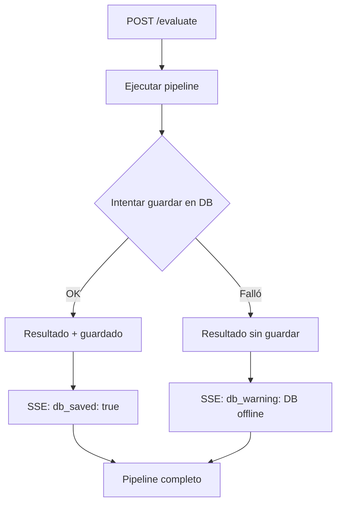

> **Documento histórico — julio de 2026.** Escrito para el árbol anterior del
> proyecto (`moldesign-app`) y traído aquí por trazabilidad. Puede describir un
> estado que ya no es el vigente: la versión 1.0.0 es una aplicación de
> escritorio y no tiene componente en la nube. No se ha reescrito su contenido.

# Cloud Run Deployment — Guia Pendiente

> Ultima actualizacion: Julio 2026
> Estado: **Configuracion lista, deploy pendiente de billing en GCP**

---

## Resumen

MolDesign puede correr en Cloud Run ($0/mes con free tier) usando un solo contenedor
Docker sin sidecars, sin Redis, sin Celery. La arquitectura unificada ya esta lista.

---

## Arquitectura Target

```
┌──────────────────────────────────────────────────────────┐
│  Vercel (gratis)                                         │
│  Frontend Next.js → NEXT_PUBLIC_API_URL = Cloud Run URL   │
└────────────┬─────────────────────────────────────────────┘
             │
┌────────────▼─────────────────────────────────────────────┐
│  Cloud Run (Google, $0 free tier)                        │
│  2 vCPU + 4 GB RAM                                       │
│  ┌──────────────────────────────────────────────────┐   │
│  │  Dockerfile.cloudrun — 1 solo contenedor          │   │
│  │  ├── FastAPI :8080                                │   │
│  │  ├── ThreadPoolExecutor (reemplaza Celery)        │   │
│  │  ├── Rescoring inline (sin sidecar :8001)          │   │
│  │  ├── Cache in-memory (reemplaza Redis)             │   │
│  │  └── Storage: temp files (reemplaza MinIO)         │   │
│  └──────────────────────────────────────────────────┘   │
│                                                          │
│  Free tier: 180K vCPU-s/mes (~450 evaluaciones PRO)      │
│             360K GiB-s/mes (~2,200 evaluaciones EDU)     │
│             2M requests/mes                              │
└──────────────────────────────────────────────────────────┘
             │
             │ (opcional, via Cloudflare Tunnel)
┌────────────▼─────────────────────────────────────────────┐
│  Laptop Ubuntu (192.168.1.64)                            │
│  PostgreSQL + MinIO + Redis (solo persistencia)          │
│                                                          │
│  Si esta online: resultados se guardan en DB             │
│  Si esta offline: resultados se retornan sin persistir   │
│                   (degradacion limpia)                   │
└──────────────────────────────────────────────────────────┘
```

---

## Archivos Preparados

| Archivo | Proposito |
|---------|-----------|
| `Dockerfile.cloudrun` | Dockerfile unificado para Cloud Run |
| `.env.cloud` | Variables de entorno para produccion |
| `POST /evaluate` | Endpoint sincrono con SSE + fallback sin DB |
| `POST /rescore` | Rescoring inline (sin sidecar separado) |

---

## Pasos de Deploy

### 1. Habilitar billing en GCP

```
https://console.cloud.google.com/billing
→ Link billing account al proyecto "moldesign"
```

No cobra si se mantiene dentro del free tier.

### 2. Habilitar APIs

```powershell
gcloud services enable run.googleapis.com cloudbuild.googleapis.com artifactregistry.googleapis.com
```

### 3. Build y Push de la imagen

```powershell
cd D:\moldesign-app

gcloud builds submit `
  --tag gcr.io/moldesign/moldesign-api `
  --file Dockerfile.cloudrun .
```

Tiempo estimado: ~10 min (primera vez), ~3 min (subsiguientes)

### 4. Deploy a Cloud Run

```powershell
gcloud run deploy moldesign-api `
  --image gcr.io/moldesign/moldesign-api `
  --platform managed `
  --region us-central1 `
  --memory 4Gi `
  --cpu 2 `
  --timeout 3600 `
  --allow-unauthenticated `
  --set-env-vars APP_MODE=CLOUD,ENVIRONMENT=production,VINA_EXECUTABLE_PATH=/usr/local/bin/vina,DATABASE_URL=postgresql+asyncpg://<DB_USER>:<DB_PASSWORD>@<DB_HOST>:5432/<DB_NAME>
```

### 5. Configurar Vercel

En el dashboard de Vercel, cambiar variable de entorno:

```
NEXT_PUBLIC_API_URL = https://moldesign-api-xxxxx-uc.a.run.app
```

(La URL exacta la muestra Cloud Run al terminar el deploy)

### 6. Probar

```bash
curl https://moldesign-api-xxxxx-uc.a.run.app/health
# {"status":"healthy","environment":"production"}

curl -X POST https://moldesign-api-xxxxx-uc.a.run.app/evaluate \
  -H "Content-Type: application/json" \
  -d '{"smiles":"CC(=O)Oc1ccccc1C(=O)O","target_pdb_id":"7E2Y"}'
# SSE stream: data: {"type":"start"} ... data: {"type":"done",...}
```

---

## Gradacion con DB offline



El pipeline **nunca se rompe** por falta de DB.

---

## Costos Mensuales Estimados

| Servicio | Free Tier | Costo si excede |
|----------|-----------|-----------------|
| Cloud Run | 180K vCPU-s, 360K GiB-s, 2M req | ~$15-30 |
| Cloud Build | 120 min/dia | $0 |
| Artifact Registry | 0.5 GB | $0 |
| Vercel | Ilimitado (Hobby) | $0 |
| **TOTAL** | | **$0/mes** |

---

## Troubleshooting

### Error: "Billing account not found"
→ Ir a https://console.cloud.google.com/billing y asignar cuenta al proyecto

### Error: "Image not found"
→ Verificar que el build se completo: `gcloud builds list`

### Timeout > 3600s
→ Cloud Run maximo es 3600s (1 hora). Si una evaluacion tarda mas, considerar:
- Reducir exhaustiveness (ya esta en 8)
- Desactivar ADMET-AI (toggle en UI)
- Usar menos anti-targets

### Cold start lento (5-10s)
→ Configurar `min-instances=1` en Cloud Run (~$15/mes extra)
