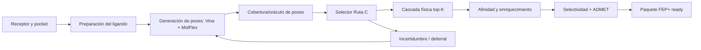

# Programa experimental científico de MolDesign

**Fecha:** 2026-08-15  
**Estado:** plan maestro activo  
**Prioridad:** ciencia primero; instalación y release permanecen diferidos por decisión del maintainer.  
**Objetivo central:** mejorar conjuntamente MolFlex, selección de poses, rescoring de afinidad y la confiabilidad científica end-to-end de MolDesign.

## 1. Resultado que buscamos

MolDesign debe convertirse en una plataforma que distinga tres preguntas que hoy suelen confundirse:

1. **¿Generamos una pose útil?** MolFlex, Vina flexible, preparación del receptor y definición del pocket.
2. **¿Elegimos la pose correcta?** Ruta C / pose selector, cascadas físicas y estimación de incertidumbre.
3. **¿La molécula es prometedora?** afinidad, enriquecimiento, selectividad, ADMET y preparación FEP+.

La meta inmediata de Ruta C continúa siendo `Top-1 global, RMSD <=2 Å, >=0.70`, pero el programa no sacrificará validez para cruzar un número. El objetivo de madurez es demostrar una mejora reproducible en un conjunto confirmatorio nuevo, no sólo superar 33/47 en el test histórico ya observado.



El bucle `incertidumbre → generación` es deliberado: un complejo indecidible no debe producir una confianza falsa; debe solicitar más muestreo, otra estrategia o revisión humana.

## 2. Reglas del laboratorio

- Producción y research permanecen separados. Ningún script experimental reemplaza modelos, thresholds o manifests operativos.
- Cada experimento cambia una dimensión principal: receptor, generación, features, objetivo o regla de decisión; no todas simultáneamente.
- Hipótesis, cohorte, métricas, gate y presupuesto se escriben antes de ejecutar.
- Los negativos se preservan. No se cambia el gate después de ver el resultado.
- Los complejos se agrupan; ninguna pose del mismo complejo puede cruzar train/evaluación.
- Scaffold, identidad de receptor, fuente de poses y series con ligandos relacionados se auditan contra leakage.
- La métrica canónica de pose es `rmsd_pose_pocket`, sin alineamiento rígido.
- Top-1 global y cobertura/oráculo se reportan por separado. Abstención condicionada nunca sustituye Top-1 global.
- Toda comparación usa los mismos casos, prueba pareada e intervalo de confianza.
- Una mejora debe incluir costo: wall time, CPU-hours, memoria, tasa de timeout y porcentaje de degradación.

## 3. Escalera de madurez experimental

| Nivel | Nombre | Evidencia mínima | ¿Puede afectar producción? |
|---|---|---|---|
| E0 | Hipótesis | Mecanismo, activo reutilizado y riesgo | No |
| E1 | Smoke | Contrato y ejecución determinista en 1–3 casos | No |
| E2 | Desarrollo OOF | CV agrupada, artefacto y comparación pareada | No |
| E3 | Validación | Una sola lectura de `val`, gate preregistrado | No |
| E4 | Confirmación externa | Cohorte sellada, disjunta, hashes previos | Candidato |
| E5 | Integración shadow | Resultado calculado pero no decide la respuesta | No todavía |
| E6 | Producción | No-regresión, manifest, rollback y documentación | Sí |

Un experimento que llega a E3 es prometedor, no “científicamente validado”. Los claims públicos requieren E4.

## 4. Contratos de datasets

### D-RC-HIST — Ruta C histórica

- Train: 116 complejos / 2,739 poses.
- Val: 40 complejos / 730 poses.
- Test histórico: 47 complejos / 831 poses.
- El test de 47 ya influyó en múltiples decisiones; sólo sirve como benchmark histórico y atlas de errores. No se usará para escoger nuevas variantes.

### D-RC-CONFIRM — confirmatorio nuevo

Holdout confirmatorio interno independiente con secuestro procedimental de
etiquetas (mismo corpus PDBbind que el desarrollo; el cegamiento es
procedimental, no por control de acceso). Debe construirse antes de probar el
candidato final:

- mínimo deseado de 100 complejos con pose cristalográfica y candidatos reproducibles;
- disjunción por scaffold del ligando y homología/identidad del receptor respecto de desarrollo;
- balance por componentes de similitud de cadena (proxy de familia), flexibilidad, tamaño, metales y fuente de poses;
- hashes, lista de PDB/ligandos y reglas de exclusión sellados antes de inferencia;
- no reutilizar complejos vistos durante depuración manual.

Contrato de denominadores (FND-05, cohorte de 112):

- **Gate confirmatorio PRIMARIO**: los **102 complejos drug-like** (`gate_primary=true`), punto estimado >=0.70 + bootstrap pareado vs v0.6.
- **Resultado global OBLIGATORIO (ITT)**: los **112 complejos**, contando los fallos técnicos como fallos.
- **Análisis SECUNDARIO**: los **10 complejos no drug-like** (fragment 1, peptide 6, oligo 1, xl 2), descriptivo, sin inferencia fuerte por tamaño.

### D-MF-HARD — cohorte MolFlex difícil

Ligandos con `rotatable_bonds >=15`, timeouts o baja cobertura del generador flexible. Debe incluir controles fáciles para medir regresiones y no sólo casos seleccionados por fracaso.

#### Resultado sellado del entregable 7 — curva K=5/15/30 y validación piloto

Estado al 2026-08-16: **K=15 fijado y sellado como política de costo/cobertura; MolFlex permanece NO_GO científico en el estrato hard**. El GO del manifest congela la decisión operacional y sus artefactos, no afirma que el generador haya resuelto D-MF-HARD.

Train utilizó 17 complejos hard y 17 controles. Se generaron 689 corridas de docking y 4,329 poses, con cero fallos ITT. Las geometrías crudas se materializaron en `curve_candidates_train.jsonl` como bloques PDBQT byte-fieles; el sello no depende solamente de métricas derivadas.

| K | Hard cobertura | Hard mediana min-RMSD | Control cobertura | Control mediana min-RMSD |
|---:|---:|---:|---:|---:|
| 5 | 1/17 (5.9%) | 5.278 Å | 14/17 (82.4%) | 1.080 Å |
| **15** | **3/17 (17.6%)** | **4.024 Å** | **15/17 (88.2%)** | **1.041 Å** |
| 30 | 4/17 (23.5%) | 4.011 Å | 15/17 (88.2%) | 1.041 Å |

La regla preregistrada eligió el menor K de `{5,15}` que, respecto de K=30, perdiera como máximo un hard cubierto, degradara la mediana hard como máximo 0.1 Å, perdiera como máximo un control cubierto y degradara la mediana control como máximo 0.1 Å. K=15 cumplió: perdió 1/4 hard cubiertos, degradó 0.013 Å la mediana hard y no perdió controles ni degradó su mediana.

Caveats que forman parte del sello:

- **No se declara saturación.** K=30 añadió `1b2h` como cuarto hard cubierto y mejoró varios casos, aunque la mayoría no cambió.
- La mediana pareada de 15→30 fue 0.000 Å, mientras la media fue −0.289 Å: la mejora estuvo concentrada en pocos complejos y no fue uniforme.
- La cobertura hard de K=15, 3/17, es un **NO_GO científico** para afirmar que MolFlex resuelve ligandos con `rotatable_bonds >=15`.
- K=15 es una decisión Pareto para el siguiente comparador; no es equivalencia científica con K=30 ni una política universal de producción.

La validación piloto se ejecutó una única vez con K=15 inmutable sobre 5 hard y 5 controles:

| Estrato val | Cobertura | Wilson CI95 | Mediana min-RMSD |
|---|---:|---:|---:|
| Hard | 2/5 (40%) | [0.118, 0.769] | 2.912 Å |
| Control | 4/5 (80%) | [0.376, 0.964] | 1.367 Å |

Fueron 121 corridas, 949 poses, cero fallos ITT, cero desviaciones y cero retries. Los intervalos contienen los valores observados en train; con `n=5` por estrato no existe potencia para concluir mejora, regresión o generalización. Este resultado es **descriptivo**, no confirmatorio. K=30 no se abrió después de observar val.

Provenance resumida:

- curva train: `47f9efd` código → `6a208e0` resultados → `7b6122f` preparación → `f31bfeb` sello, 1 dataset + 15 assets;
- val única: `ed39cc6` ejecución → `67817ee` sello, 1 dataset + 12 assets;
- artefactos canónicos: [`D-MF-HARD-CURVE`](../scripts/artifacts_science/D-MF-HARD-CURVE/) y [`D-MF-HARD-CURVE-VAL`](../scripts/artifacts_science/D-MF-HARD-CURVE-VAL/).

### D-POCKET — pocket/receptor

Conservar los 200 complejos de desarrollo y 150 de holdout de MolPocket. Añadir una cohorte APO externa y separar explícitamente HOLO, APO, cofactors/metales y receptores subidos por usuarios.

### D-AFFINITY — afinidad y screening

Reentrenar/evaluar el modelo universal con el holdout de 327 complejos realmente excluido. Las métricas contaminadas históricas no se rehabilitan cambiando su etiqueta.

### D-METAL — metaloenzimas

Mantener Zn-chelating y controles no quelantes separados; UMS/ZnCoord no se evalúan como si fueran universales. Los negativos PDE5A/CYP3A4 siguen siendo controles de especificidad.

## 5. Métricas comunes

| Área | Primaria | Secundarias obligatorias |
|---|---|---|
| Pocket | distancia top-1 al centro nativo | best-of-3, hotspot containment, tamaño de grid, tasa de fallo |
| Generación | cobertura/oráculo `min RMSD <=2 Å` | curvas top-K, mediana min-RMSD, diversidad, costo y timeout |
| Selección | Top-1 global `RMSD <=2 Å` | mediana RMSD, Top-3, Spearman intra-complejo, aciertos recuperados/degradados |
| Incertidumbre | risk–coverage / error detectado | Brier, ECE, abstención, falsos confiados |
| Afinidad | Spearman en holdout limpio | Pearson, RMSE/MAE, bootstrap, análisis por familia |
| Screening | EF@1%, BEDROC y PR-AUC | ROC-AUC, EF@5/10%, survival de docking |
| Selectividad | ranking del target correcto / delta | calibración, falsos seguros, consistencia por familia |
| Robustez | tasa de cambio de decisión | delta de score, fallos ante perturbación, determinismo |
| Eficiencia | costo por complejo válido | P50/P95 wall, CPU-hours, RAM/GPU, caché y tasa de fallback |

### 5.1. Contrato de la métrica de pose, y un sesgo detectado el 2026-08-18

La métrica de pose del programa es `rmsd_pose_pocket` (`scripts/molflex.py`):
átomos pesados, **marco del pocket**, **sin alineamiento**. La auditoría del
2026-08-14 la impuso al descubrir que `GetBestRMS` **alinea** y puede reportar
~0 Å para una pose desplazada 4 Å del bolsillo. Esa decisión sigue siendo
correcta y no se revisa.

**Lo que la auditoría de `MF-10` (2026-08-18) añade:** `GetBestRMS` hacía **dos**
cosas —corregir simetría y alinear— y al descartarlo se descartaron las dos.
`rmsd_pose_pocket` compara átomo *i* contra átomo *i* por índice de fichero, de
modo que un grupo simétrico intercambiado (un fenilo girado 180°, un carboxilato,
un *tert*-butilo) se penaliza aunque la pose sea físicamente idéntica.

Medido sobre las 878 poses de `MF-10` (48 complejos), comparando el RMSD ingenuo
contra el **mínimo sobre automorfismos, igualmente sin alinear**:

| | Valor |
|---|---:|
| Ligandos con automorfismos topológicos | **37 de 48** |
| Sesgo mediano (ingenuo − corregido) | 0.004 Å |
| Sesgo medio | 0.050 Å |
| Poses con sesgo > 0.5 Å / > 1.0 Å | 18 / 10 |
| Sesgo máximo | **3.04 Å** |
| Poses que cruzan 2.0 Å sólo por corregir | **13** (92 → 105) |
| Complejos que ganan cobertura sólo por corregir | **1** (`1l83`, estrato COLOCACION) |

El caso testigo es `1l83` —lisozima T4 L99A con un ligando pequeño y muy
simétrico—: su mejor pose mide **2.106 Å** con la métrica ingenua y **0.498 Å**
corrigiendo simetría. Se contabiliza como fallo de cobertura una pose
esencialmente perfecta.

**La distribución tiene cola pesada:** la mediana es despreciable (0.004 Å) y por
eso el sesgo pasó inadvertido, pero se concentra íntegramente en los ligandos
simétricos, que son justo los pequeños y rígidos del estrato de control.

**Dirección del sesgo, y qué invalida.** Corregir simetría sólo puede **bajar** el
RMSD, nunca subirlo. Por tanto toda cifra de cobertura del programa es una **cota
inferior**, y todo `NO_GO` sellado que se apoye en «no hay cobertura suficiente»
es **conservador**: corregir no lo puede voltear. Lo que sí queda subestimado son
las coberturas absolutas y los márgenes de los gates que se pasan por poco.

**Métrica correcta a partir de ahora:** mínimo sobre automorfismos del RMSD **sin
alinear**. Conserva la propiedad que el programa exige —medir colocación en el
marco del pocket— y elimina la penalización por etiquetado de átomos.

**Acotado sobre el conjunto v2 (`RC-F0-SYM`, 2026-08-18).** La pregunta que importa
es si el defecto mueve la **cobertura del oráculo**, que es el denominador de todo el
programa. Recomputadas las **32,215 poses** de fuente `molflex` de los tres splits
—reproduciendo el RMSD ingenuo almacenado con error máximo de 0.0005 Å—:

| Split | Cobertura ingenua | Cobertura corregida | Complejos que ganan |
|---|---:|---:|---:|
| train | 79.31% (92) | **79.31% (92)** | **0** |
| val | 87.50% (35) | **87.50% (35)** | **0** |
| test | 97.87% (46) | **97.87% (46)** | **0** |

**Ni un complejo cambia de estado.** Las cifras de `RC-F0-V2`, el denominador de
`RS-14` y la tabla de factibilidad de la §9 **se sostienen exactamente**.

**Pero a nivel de pose las etiquetas sí están mal**: las positivas (`rmsd <= 2 Å`)
pasan de 357 a **432 en train (+21.0%)**, de 187 a 196 en val (+4.8%) y de 216 a
**252 en test (+16.7%)**. Una de cada cinco poses positivas de train estaba etiquetada
como negativa, con tasas de corrupción **distintas por split**. Detalle en
[`RC-F0-SYM`](../scripts/artifacts_science/RC-F0-SYM/LECTURA.md).

**Confirmado en la cohorte difícil (`MF-09-SYM`, 2026-08-18).** El sesgo se remidió sobre las
**21,692 poses** de los 48 complejos de la cohorte, no sólo sobre las 878 de `MF-10`.
Sólo **14 poses (0.06%)** cruzan el umbral al corregir, y la conclusión de `MF-09`
sobrevive —«30 de 33» pasa a «29 de 33»—, pero el efecto cae donde más pesa: el
**top-1 de Vina** acierta en 9 de 15 controles en vez de 7, y el **margen del
selector** del control baja de **8 a 6 de 15**. Detalle en
[`MF-09-SYM`](../scripts/artifacts_science/MF-09-SYM/LECTURA.md).

**Prohibiciones.** No se recalculan artefactos ya sellados: la inmutabilidad
post-seal lo impide y el sesgo es de signo conocido. La métrica corregida rige
desde el siguiente prerregistro, y **todo experimento nuevo debe declarar cuál de
las dos usa**. Comparar una cifra corregida contra una ingenua sin decirlo sería
repetir el error de `MF-02B-R1` con otro signo.

## 6. Cartera A — fundamentos científicos

| ID | Hipótesis / pregunta | Experimento | Gate | Prioridad |
|---|---|---|---|---|
| FND-01 | Los resultados pueden reconstruirse sin memoria de sesión | Registro único por experimento con config, hashes, código, ambiente y salida | 100% de experimentos nuevos con manifest y salida atómica | P0 |
| FND-02 | Los splits actuales no contienen duplicados ocultos | Deduplicar por PDB, scaffold, InChIKey, secuencia/familia y origen | Cero fuga train↔confirm; excepciones justificadas | P0 |
| FND-03 | El baseline es estable entre ejecuciones | Repetir scoring determinista y docking con semillas registradas | Selector idéntico; docking reporta varianza por seed | P0 |
| FND-04 | Podemos cuantificar incertidumbre estadística correctamente | Biblioteca común de bootstrap pareado, Wilson, McNemar/DeLong y FDR | Sanity tests perfect/random y uso uniforme | P0 |
| FND-05 | El confirmatorio se custodia con secuestro procedimental de etiquetas (holdout interno independiente; sin control de acceso de máquina no se afirma cegamiento real) | Crear D-RC-CONFIRM y custodiar etiquetas/evaluación | Manifest sellado antes de puntuar | P0 |
| FND-06 | Provenance de poses explica parte del error | Persistir `source`, seed, conformer, exhaustiveness, box y preparación | 100% de poses experimentales trazables | P0 |
| FND-07 | Los costos son comparables | Perfil CPU/RAM/wall por etapa con hardware fingerprint | P50/P95 y fallos en cada artefacto | P1 |

## 7. Cartera B — receptor y pocket

| ID | Hipótesis / pregunta | Reutilización | Experimento | Gate |
|---|---|---|---|---|
| REC-01 | ~~Los 12 grids problemáticos~~ → **son 57 (14.7%)** | `audit_grid_hotspots.py`, MolPocket | Reauditar 387 targets por batches, HOLO/APO separados | **SELLADO GO 2026-08-17** — ver abajo |
| REC-02 | Ejecutar top-3 pockets mejora cobertura APO | MolPocket top-3 | Docking presupuestado sobre top-1 vs top-3 | Ganancia pareada de cobertura superior al costo acordado |
| REC-03 | ~~Grid adaptado evita recortes~~ → **repara 6 rotos pero pierde 2 sanos** | radio, hotspots y box actuales | Ablación center fijo vs tamaño adaptativo | **SELLADO NO_GO 2026-08-17** — ver abajo |
| REC-04 | Protonación del receptor cambia ranking materialmente | PDBFixer/OpenMM/Meeko existentes | pH/His/protómeros en cohorte estratificada | Política estable o warning; no elegir caso por caso con test |
| REC-05 | Los metales del receptor pueden ser necesarios para la colocación de novo | `REC-08-EXT`, `REC-11`, `REC-12-R1` | Ablación pareada CON/SIN todos los metales sobre los 29 complejos que los tienen | **RE-ALCANCE SELLADO en `REC-05-PRE`**: metales agrupados; aguas y cofactores fuera; sin reglas por familia |
| REC-06 | Receptor ensemble recupera induced fit | múltiples estructuras locales | Dock contra 2–3 conformaciones y fusionar candidatos | Mejora de oráculo y costo reportado |
| REC-07 | ~~El grid APO 5TUN puede corregirse~~ → **el defecto geométrico no rompe el docking** | doc. 35 + MolPocket | Validación visual/cuántica antes de actualizar catálogo | **SELLADO NO_GO 2026-08-17** — ver abajo |
| REC-08 | Chain/assembly altera pockets | parser/assembly local | biounit vs chain aislada en receptores multiméricos | Política reproducible por clase |
| REC-10 | El déficit de MolPocket es de conversión/ranking dentro de sus propios candidatos | candidatos completos de MolPocket, `PAPER_MOLPOCKET`, REC-01-R1 | Separar `coverage@K` de `conversion@K` y comparar el ranking actual contra persistencia sobre el mismo conjunto | Mejora confirmatoria de selección y docking end-to-end; subir el oráculo sin convertirlo no pasa |
| REC-13 | Detectores distintos aportan candidatos complementarios bajo un presupuesto útil | MolPocket + fpocket/P2Rank/Lacuna, según licencia y reproducibilidad | Unión de detectores con presupuestos emparejados `B=5/15/20` | Frontera cobertura→conversión→docking domina al detector único al mismo presupuesto total |
| REC-14 | Un precedente estructural recuperado ayuda a cualificar una hipótesis de sitio | LEN-Seek + ProBiS + baseline geométrico | Recuperación de templates sin homólogos cercanos y ablación de su uso en grid/docking | Mejora downstream en holdout; `recall@K` aislado no basta |
| REC-15 | Un ensemble dinámico abre sitios que el muestreo estático no puede proponer | NMA, MD convencional y GaMD | Comparación por GPU-hora sobre pares apo/holo crípticos con réplicas independientes | Ganancia reproducible de cobertura y docking; el mejor de varias réplicas no es gate |

### Resultado sellado de REC-01 — el catálogo está peor calibrado de lo que asumía el plan

Estado al 2026-08-17: **GO del instrumento** (los cinco gates pasan). El GO
significa que la auditoría es válida y reproducible, **no** que el catálogo esté
sano. Artefactos: [`REC-01`](../scripts/artifacts_science/REC-01/), lectura en
[`LECTURA.md`](../scripts/artifacts_science/REC-01/LECTURA.md).

Cobertura 387/387 sin fallos, clasificación determinista en tres estratos
derivados del PDB —283 HOLO (73.1%), 99 APO (25.6%), 5 HOLO_COFACTOR_ONLY— y
determinismo byte-idéntico verificado incluso tras reconstruir el directorio.

La mediana de `d_centro` en HOLO es 0.004 Å: la mayoría de los grids está
calibrada exactamente contra el ligando nativo. Pero la cola es larga.

| Banda `d_centro` (HOLO, n=283) | n | % |
|---|---:|---:|
| ≤ 4 Å | 240 | 84.8% |
| ≤ 15 Å | 258 | 91.2% |
| **> 15 Å** | **25** | **8.8%** |

**57 de 387 targets (14.7%) disparan al menos un código de excepción**, frente a
los «12 grids problemáticos» que asumía la hipótesis original: ~4.75× más. En
**11 targets la caja no contiene ni un solo átomo del ligando nativo**
(`contencion_ligando = 0.00`, hasta 77.5 Å de desalineamiento en `8UBR`) y en
otros 12 el ligando está parcialmente recortado (contención 0.16–0.91). Para los
11 primeros ningún generador de poses puede acertar: el sitio de unión está
fuera de la caja, y el fallo no es de muestreo ni de selector.

> **Corrigendum 2026-08-17 (REC-01-R1).** La lectura original de REC-01 atribuyó
> los 23 casos de `E2_LIGANDO_RECORTADO` a contención nula. `E2` significa
> contención **< 1.0**, no `== 0.00`: son 11 nulos + 12 parciales. El dato
> sellado de REC-01 era correcto; el error estuvo en la prosa que lo interpretó,
> y `REC-01/LECTURA.md` lo conserva por estar sellado. Citar **11**.

Caveats que forman parte del sello:

- **El caso testigo `5TUN` (doc. 35) NO fue capturado por el criterio
  preregistrado.** Tiene `contencion_hotspots = 0.800`, exactamente en la
  frontera del umbral `< 0.80`, y al ser APO su ground truth es débil, así que
  `E1` no aplica — pese a tener un hotspot **5.147 Å fuera de la caja**. El
  criterio de contención por fracción no ve desalineamientos concentrados en
  pocos residuos.
- Conforme al preregistro («no se ajustará tras ver la distribución») **el umbral
  no se tocó**. La corrección va a `REC-01-R1` con un código
  `E8_HOTSPOT_FUERA_DE_CAJA` (`margen_min_hotspots < 0`), que capturaría 52
  targets hoy invisibles: 57 → 109 excepciones (14.7% → 28.2%).
- Las métricas del estrato APO usan ground truth débil (centroide de CA de
  hotspots) y son **descriptivas**, sin inferencia fuerte.
- REC-01 no corrige ningún grid ni afirma que un target excepcional produzca peor
  docking: eso exige el experimento pareado de REC-03, con docking.

### Resultado sellado de REC-01-R1 — falso negativo cerrado y cohorte accionable

Estado al 2026-08-17: **GO**, seis gates. Corrigendum de REC-01; artefactos en
[`REC-01-R1`](../scripts/artifacts_science/REC-01-R1/), lectura en
[`LECTURA.md`](../scripts/artifacts_science/REC-01-R1/LECTURA.md).

El código nuevo `E8_HOTSPOT_FUERA_DE_CAJA` (`margen_min_hotspots < 0`) **cierra
el falso negativo**: `5TUN` queda capturado con severidad `S4_LEVE`. `E8` no
tiene umbral calibrable —«el residuo está fuera de la caja» es geometría
exacta—, que es justo el modo de fallo corregido: REC-01 usó un umbral
fraccional donde bastaba una condición binaria, y `5TUN` cayó en la frontera
exacta (`0.800`).

Excepciones: **57 (14.7%) → 109 (28.2%)**, +52 targets. Los conteos `E1…E7` se
reproducen exactamente; R1 sólo añade. El 28.2% **no es un hallazgo
independiente**: es el mismo dato con el criterio corregido.

Triaje preregistrado por accionabilidad («¿puede un docking en esta caja
producir una pose correcta?»):

| Nivel | n | % |
|---|---:|---:|
| `S0_SIN_EXCEPCION` | 278 | 71.8% |
| `S1_CRITICO` (caja sin ningún átomo del ligando) | **11** | 2.8% |
| `S2_GRAVE` (sitio mayoritariamente fuera) | **14** | 3.6% |
| `S3_MODERADO` | 9 | 2.3% |
| `S4_LEVE` (sólo hotspots en/fuera del borde) | 69 | 17.8% |
| `S5_METADATO` (defecto de datos) | 6 | 1.6% |

Los **25 targets de `S1`+`S2`** son la cohorte de entrada de REC-03. Tres
proteasomas (`3MG0`, `3HYE`, `3GPT`) y cuatro estructuras de la serie `3N8*`
aparecen juntos, lo que sugiere un defecto sistemático de curación por familia
en vez de 25 errores independientes — hipótesis que REC-03 puede probar y que
R1 **no** afirma.

Caveats del sello:

- **R1 no es una prueba ciega**: el desenlace de `E8` ya estaba declarado en
  `REC-01/LECTURA.md` §4 antes de ejecutarlo.
- La escala de severidad es una **hipótesis de accionabilidad**, no una medición
  de impacto. Afirmar que un target `S1` produce peor docking exige el
  experimento pareado de REC-03, con docking.
- R1 no re-deriva geometría: consume el `per_complex.jsonl` sellado de REC-01
  verificando su SHA-256, y REC-01 permanece intacto (`validate` OK).

Orden sucesor: `REC-07` (`5TUN` como caso testigo, evidencia ya cuantificada) →
`REC-03` (política de centro/tamaño sobre la cohorte `S1`+`S2`, con control de
no degradar los 278 `S0`) → auditoría del posible defecto sistemático por
familia.

### Resultado sellado de REC-07 — el grid «roto» de 5TUN no estaba roto donde importa

Estado al 2026-08-17: **NO_GO**. Artefactos:
[`REC-07`](../scripts/artifacts_science/REC-07/), lectura en
[`LECTURA.md`](../scripts/artifacts_science/REC-07/LECTURA.md).

Tres brazos sobre el mismo receptor y el mismo ligando (E64c extraído del
homólogo 1ITO), única variable la caja; 15/15 corridas válidas:

| Brazo | hotspots dentro | `margen_min` | contacto top-1 ≤5 Å de Cys25 | mediana d | score mediano |
|---|---:|---:|---:|---:|---:|
| `G_DB` (catálogo) | 12/15 | **−5.15 Å** | **5/5** | 0.773 Å | −5.095 |
| `G_MP` (MolPocket) | 15/15 | +2.78 Å | **5/5** | 0.777 Å | **−6.182** |
| `G_ADAPT` (adaptativo) | 15/15 | +4.00 Å | 4/5 | 0.933 Å | −5.666 |

Seis de siete gates pasan; **G5 (no regresión) falla**: el candidato `G_ADAPT`
pierde una semilla frente al 5/5 del catálogo. La regla congelada exige los
siete, así que **no se recomienda cambio de grid para 5TUN**.

Lo sustantivo es el resultado contrario al que buscaba la hipótesis: **el
defecto geométrico no se traduce en fallo de docking**. El grid del catálogo,
con tres hotspots recortados, pone el ligando en contacto con el nucleófilo
catalítico en las cinco semillas. El único fallo de contacto de la tabla es
fluctuación de muestreo, no del grid: en esa misma corrida el mejor de los 9
modos queda a 2.09 Å.

`G_MP` tiene el mejor score, y aun así no se recomienda: el prerregistro
prohíbe elegir el grid por score de docking, porque eso invertiría la dirección
de la validación.

**Consecuencia para la cartera**: los 57 targets con excepción de REC-01 son una
lista **a verificar**, no una lista de targets rotos. REC-03 debe medir docking
—no cajas— y su claim no puede ser «la geometría está mal» sino «el docking
mejora».

### Resultado sellado de REC-03 — la reparación automática del catálogo no es viable

Estado al 2026-08-17: **NO_GO** por dos gates. Artefactos:
[`REC-03`](../scripts/artifacts_science/REC-03/), lectura en
[`LECTURA.md`](../scripts/artifacts_science/REC-03/LECTURA.md); prerregistro
sellado antes de ejecutar en [`REC-03-PRE`](../scripts/artifacts_science/REC-03-PRE/).

372 corridas de Vina, 4 cajas por target (catálogo + los 3 pockets de MolPocket,
todas con el **tamaño** del catálogo para aislar el efecto del centro) × 3
semillas. El brazo `G_MP_SCORE` elige entre los tres pockets por **mejor score**,
nunca por posición del ligando.

| Brazo | accionables reparados | control |
|---|---:|---:|
| `G_CAT` (catálogo) | **0/21** | **6/8** |
| `G_MP_SCORE` (pocket + score) | **6/19 evaluables** | 4/8 |

- **G3 reparación PASS**: 6 reparados, y de los 19 accionables evaluables el techo
  geométrico declarado por adelantado era 9 — alcanza el **67% de lo que la
  geometría permitía**. Se repara donde el catálogo contenía *parcialmente* el
  ligando (5 de 6 son `S2_GRAVE`), no donde la caja estaba del todo fuera.
- **G4 no regresión FAIL**: pierde 2 de los 6 targets sanos, y no por poco —
  en `2H02` el pocket predicho manda el ligando a **61 Å** del sitio real.
- **G1 validez FAIL** (87.1%): 4 targets perdieron sus 12 corridas cada uno —
  boro sin tipo en Vina (`3MG0`) y tres timeouts por 20–43 torsiones. Los otros
  27 dieron 324/324. El prerregistro obliga a **repetir, no interpretar**, así
  que no hay claim: haría falta un REC-03-R1 con criterio de elegibilidad por
  coste declarado por adelantado y un control mayor que 8.

**Calibración no buscada, y valiosa**: con la caja **exacta** del catálogo
—centrada a 0.00 Å del ligando nativo— el re-docking solo acierta en **6 de 8**
targets sanos. Ese 75% es techo del motor de docking, no del catálogo, y hay que
descontarlo antes de atribuir a un grid cualquier fallo de pose.

**Consecuencia para la cartera**: sustituir grids por predicción de pocket no es
una política viable; los 25 targets accionables de REC-01-R1 son **deuda de
curación por target**. Junto con REC-07, el programa acumula dos evidencias en la
misma dirección: **la geometría del grid no predice la calidad del docking**, ni
para condenar un grid ni para reemplazarlo.

## 8. Cartera C — MolFlex y generación de poses

| ID | Hipótesis / pregunta | Experimento | Métrica/gate |
|---|---|---|---|
| MF-01 | MolFlex añade candidatos que Vina flexible no genera | Unir candidatos actuales por fuente antes de redockear | +3 complejos o +5 pp de cobertura en D-MF-HARD |
| MF-02 | ~~El número óptimo de conformeros~~ → **el eje conformacional está agotado; faltaba aplicar el generador** | Curvas 5/15/30/60/90 conformeros por estrato | **SELLADO 2026-08-17** — MF-02A medición, MF-02B GO, ver abajo |
| MF-03 | Multi-seed cubre modos ausentes en seed 42 | Misma cuenta total, una seed vs varias | Ganancia pareada de cobertura, no sólo diversidad |
| MF-04 | ETKDGv3/macrociclos requieren políticas distintas | Ablación de parámetros RDKit por clase | Mejora sólo en clase objetivo, sin regresión global |
| MF-05 | Pruning debe basarse en cobertura geométrica, no torsión/energía | Reusar R2/R2b y probar reglas simples predefinidas | Mantener >=95% del oráculo con menos docks |
| MF-06 | Vina flexible exh=4 y MolFlex son complementarios | Ruta A exh4 vs MolFlex vs unión | Mejor oráculo/costo por estrato; exh2 queda cerrado |
| MF-07 | Más modos por conformero superan más conformeros con un modo | Presupuesto fijo: `n_conf × num_modes` | Mayor cobertura bajo CPU igual |
| MF-08 | ~~La caja limita poses de MolFlex~~ → **el mecanismo es real y un orden de magnitud corto** | 20/25/30 Å sólo en cohorte preparada | **SELLADO NO_GO 2026-08-17** — ver abajo |
| MF-09 | ~~El score puede detener muestreo secuencialmente~~ → **es muestreo, no puntuación** | Lectura del material sellado de MF-02D + MF-02F, sin cómputo nuevo | **SELLADO 2026-08-18** (medición, sin gates) — ver abajo |
| MF-10 | ~~El relax local actual no aporta; un FF bien parametrizado podría~~ → **tampoco** | Relajación in situ amber14 + Sage 2.2.1 + NAGL en el contenedor | **SELLADO NO_GO 2026-08-18** — ver abajo |
| MF-13 | ¿La función de Vina prefiere la pose nativa cuando se la entregan? | `score_only` y `local_only` sobre el cristal en su propio receptor y caja | **SELLADO INCONCLUSIVE 2026-08-18** (diagnóstico MIXTO) — ver abajo |
| MF-11 | Duplicados consumen presupuesto y distorsionan densidad | Cluster de poses por RMSD pocket-frame | Menos candidatos conservando oráculo |
| MF-12 | La política debe activar MolFlex sólo donde ayuda | Clasificar por rotables, timeout, margen y cobertura histórica | Mayor cobertura/costo que MolFlex universal |

### Resultado sellado de MF-02 — la cobertura del oráculo era el cuello de botella

Estado al 2026-08-17. Artefactos: [`MF-02-PRE`](../scripts/artifacts_science/MF-02-PRE/)
(prerregistro maestro), [`MF-02A`](../scripts/artifacts_science/MF-02A/) (medición),
[`MF-02B`](../scripts/artifacts_science/MF-02B/) (**GO**, lectura en
[`LECTURA.md`](../scripts/artifacts_science/MF-02B/LECTURA.md)).

**La descomposición obligatoria de la §9, calculada por primera vez:**

| | Train (116) | Test (47) |
|---|---:|---:|
| Cobertura del oráculo | **67.2%** | **87.2%** |
| Top-1 por `vina_score` | 41.4% | 53.2% |
| **Precisión condicional** | **61.5%** | **61.0%** |

El selector rinde prácticamente idéntico en train y test: **toda** la diferencia de
Top-1 la explica la cobertura del oráculo. En 38 de 116 complejos no existía pose
que seleccionar.

**MF-02A — el eje *conformacional* está agotado.** La curva de RMSD mínimo alineado
del ensemble ETKDG satura entre 60 y 90 confórmeros: pasar de 30 a 150 compra 2.6
puntos. De los 38 sin cobertura, **32 ya tenían la conformación bioactiva
disponible** con los 30 del protocolo; solo 1 se rescata con 150 y 5 tienen techo
duro. El grupo sin cobertura tiene *mejor* disponibilidad conformacional que el
cubierto (84% vs 74%): **no discrimina**.

> **Corrección del 2026-08-17.** La redacción original de este párrafo decía que
> «añadir confórmeros es la palanca equivocada». **Es demasiado fuerte y el
> registro sellado lo contradice.** En MolFlex **cada confórmero es una corrida de
> docking independiente**, de modo que `n_conf` no es sólo diversidad
> conformacional: es también el **número de reinicios de búsqueda**. MF-02A midió
> únicamente el primer papel.
>
> `D-MF-HARD-CURVE` (sellado) mide el segundo, con docking: cobertura en el estrato
> hard **5.9% → 17.6% → 23.5%** para K5/K15/K30, ganancia pareada K15→K30 de
> **−0.289 Å con CI95 BCa [−1.01, −0.099]** —excluye el cero— y el propio artefacto
> declara que «NO se declara saturación completa». Los controles sí saturan en K15;
> los hard no.
>
> Conclusión corregida: añadir confórmeros es la palanca equivocada **para la
> conformación**, y una palanca **no probada** para la colocación — que es el modo
> de fallo dominante (33 de 50). Nadie ha medido K60/K90 con docking.

**MF-02B — la causa real: MolFlex se había aplicado a 13 de los 116 complejos.**
En los otros 103 la cobertura era la de `flexible_redock`. Ejecutando el pipeline
**congelado** sobre los 38 sin cobertura:

| | Antes | Después |
|---|---:|---:|
| Cobertura del oráculo (train) | 67.2% (78/116) | **79.3%** (92/116) |
| Complejos recuperados de los 38 | — | **14** |

> **Corrigendum `MF-02B-R1` (sellado GO).** Las cifras originales de MF-02B
> —30 de 38, cobertura 93.1%— estaban **infladas al doble**: se midieron con
> `GetBestRMS`, que **alinea** las moléculas, contra un umbral que el dataset
> aplica a `rmsd_pose_pocket`, **sin alinear**. El sesgo mediano es 1.00 Å y
> tiene signo conocido: 16 complejos pierden el estatus de recuperados y
> ninguno lo gana. El gate preregistrado (≥10 de 38) se reevaluó **sin tocar el
> umbral** y sigue pasando con 14, así que **la decisión GO se sostiene y lo
> corregido es la magnitud**. La ganancia real es de **+12 puntos**, no +26.

Coste del material: ~13.4 h de CPU para los 116, 1.35 h de reloj con 10 procesos
(`MF-02D`, sellado **NO_GO** por fallar su propio gate de cobertura ≥90% bajo la
métrica correcta, tras entregar las 17,596 poses y reproducir MF-02B 38/38).

**Consecuencia para el programa**: el conjunto de poses sobre el que se evaluaron
`RS-01`, `RS-04-OOF` y `RS-08` se construyó sin la salida de MolFlex en el 89% de
los complejos; esos experimentos midieron Top-1 **global** sobre un universo con un
tercio inganable por construcción. No se reabren —cada uno tiene su gate sellado—
pero **antes de volver a evaluar ningún selector hay que reconstruir el conjunto de
poses**, y eso es precisamente el cambio de denominador que la §19.1 exige para
reabrir la cartera D. La precisión condicional sobre el conjunto ampliado **sigue
sin medirse**.

### Resultado sellado de MF-08 — el mecanismo es real y un orden de magnitud corto

Estado al 2026-08-17: **NO_GO**. Artefactos: [`MF-08`](../scripts/artifacts_science/MF-08/),
lectura en [`LECTURA.md`](../scripts/artifacts_science/MF-08/LECTURA.md); prerregistro
en [`MF-08-PRE-R1`](../scripts/artifacts_science/MF-08-PRE-R1/).

144 corridas sobre los 33 complejos dominados por colocación y 15 controles, con
cuatro tamaños de caja:

| Brazo | Margen de deslizamiento | Cohorte (33) | Mediana del oráculo | Control (15) | Coste mediano |
|---|---:|---:|---:|---:|---:|
| `B_ADAPT` (~18.2 Å) | 2.83 Å | **3/33** | **3.18 Å** | 15/15 | 425 s |
| `B20` | 3.62 Å | 1/33 | 3.224 Å | 15/15 | 399 s |
| `B25` (actual) | 6.12 Å | 0/33 | 3.746 Å | 15/15 | — |
| `B30` | 8.6 Å | 1/33 | 4.004 Å | 15/15 | 554 s |

- **G2 recuperación FAIL**: 3 recuperados (`1d7i`, `1ew9`, `1l83`) frente a los ≥7 exigidos.
- **G4 no regresión PASS**: 0 pérdidas del control en los cuatro brazos, incluido el más estrecho.
- **El mecanismo existe y va en la dirección predicha**: sobre los tres brazos que
  **no** intervinieron en definir la cohorte, la mediana del oráculo es monótona en
  el margen de deslizamiento (3.18 → 3.224 → 4.004 Å). De `B30` a `B_ADAPT` mejora **0.82 Å**.
- **Y es insuficiente por un orden de magnitud**: las poses se quedan en 3.18 Å y
  necesitan bajar de 2.0. No hay caja más pequeña que probar sin recortar la pose nativa.

**Defecto de diseño declarado en el propio sello**: la cohorte se definió como los
complejos que fallan bajo `B25`, así que `B25 = 0/33` es **tautológico** y G3
(monotonía) queda parcialmente invalidado. La decisión no depende de ello: G2 falla
por sí solo y no tiene sesgo de selección.

**Ahorro real pero no cobrable todavía**: `B_ADAPT` cuesta 23% menos que `B30`, pero
la caja está centrada en el ligando cristalográfico y `REC-03` midió el top-1 de
MolPocket a 8 Å de mediana del ligando. Con ese error de centro una caja ajustada
perdería la pose nativa.

### Resultado sellado de MF-02F — pasa por el mínimo exacto, y el dosis-respuesta no acompaña

Estado al 2026-08-17: **GO marginal**. Artefactos: [`MF-02F`](../scripts/artifacts_science/MF-02F/),
lectura en [`LECTURA.md`](../scripts/artifacts_science/MF-02F/LECTURA.md); prerregistro
en [`MF-02F-PRE`](../scripts/artifacts_science/MF-02F-PRE/).

Los confórmeros como **reinicios de búsqueda** —la palanca que `MF-02A` no había
medido—, con anidamiento verificado (el ensemble K30 es prefijo exacto del K90):

| Brazo | Confórmeros efectivos | Recupera | Mediana del oráculo | Control |
|---|---:|---:|---:|---:|
| `K30` | 29 | 0/33 | 3.746 Å | 15/15 |
| `K60` | 58 | 0/33 | 3.664 Å | 15/15 |
| `K90` | 86 | **3/33** | **2.961 Å** | 15/15 |

Tres advertencias que forman parte del sello:

1. **Pasa por el mínimo exacto**: el gate pedía ≥3 y salieron 3 (`1ela`, `1fkg`,
   `1mu8`). Un complejo menos y sería NO_GO; con n=3 sobre 33 el intervalo no
   soporta ninguna afirmación de tamaño de efecto.
2. **`K30 = 0/33` es tautológico**, mismo defecto de cohorte que `MF-08`, arrastrado
   al reutilizarla.
3. **El dosis-respuesta no es suave**: duplicar de 29 a 58 confórmeros no recuperó
   nada y movió la mediana 0.08 Å; de 58 a 86 recuperó 3 y movió 0.70 Å. Con estos n
   no se distingue un mecanismo con umbral de ruido de muestreo.

**La convergencia que sí importa.** Dos intervenciones ortogonales sobre la misma
cohorte dan el mismo resultado: `MF-08` (menos espacio) mueve la mediana 0.82 Å y
convierte 3; `MF-02F` (más intentos) mueve 0.79 Å y convierte 3. Los conjuntos
recuperados son disjuntos, pero **eso no es evidencia de complementariedad**: la
probabilidad de que dos conjuntos de 3 extraídos de 33 sean disjuntos por azar es
**0.744**. Sumarlos a 6/33 está prohibido por el prerregistro y por la aritmética.

**No justifica subir K a 90 en producción**: duplica el coste por complejo para
recuperar el 9% de una cohorte difícil, con un gate que pasa por un complejo de margen.

### Resultado sellado de MF-09 — es muestreo, no puntuación

Estado al 2026-08-18. **Tipo: medición**, sin prerregistro propio ni gates: es lectura
del material ya sellado de `MF-02D` + `MF-02F`, sin parámetros libres y sin cómputo
nuevo. Artefactos: [`MF-09`](../scripts/artifacts_science/MF-09/), lectura en
[`LECTURA.md`](../scripts/artifacts_science/MF-09/LECTURA.md).

`MF-08` y `MF-02F` agotaron las dos palancas geométricas sin convertir. Quedaban dos
causas: **(A) muestreo** —no existe ninguna pose ≤2 Å entre las generadas— o
**(B) puntuación** —existe pero el score no la rankea arriba—.

| | Dominados por colocación (33) | Control cubiertos (15) |
|---|---:|---:|
| Poses por complejo (mediana) | **751** | 80 |
| Oráculo (mejor RMSD disponible) | 2.961 Å | 0.956 Å |
| RMSD del top-1 por score | 7.683 Å | 2.097 Å |
| **Existe pose ≤2 Å** | **3 de 33** | **15 de 15** |
| El top-1 por score acierta | **0** | 7 |
| Acierta en top-5 / top-9 / top-20 | 1 / 1 / 2 | 14 / 14 / 15 |
| **Margen de selección** | 3 | **8** |
| Spearman(score, RMSD) | 0.186 | 0.483 |

**En 30 de los 33 complejos difíciles no existe pose a ≤2 Å entre ~751 candidatas.**
Es muestreo, no puntuación: ningún selector puede elegir lo que no está. El
generador no visita la región correcta con 86 confórmeros, 9 modos cada uno y tres
tamaños de caja probados.

**El hallazgo colateral vale más que la respuesta.** En el control, **8 de 15**
complejos tienen la pose correcta disponible y el score de Vina no la pone primera
pero sí entre las cinco primeras (7/15 → 14/15 con sólo mirar el top-5). Ahí un
selector tiene recorrido real sin generar una sola pose nueva. Es la descomposición
de la §9 medida por primera vez **a nivel de pose**, y reparte el esfuerzo al revés
de como venía haciéndose: mejorar el **generador** donde no hay material y el
**selector** donde lo hay.

**Incidencia de análisis declarada**: la primera versión leía sólo el directorio de
`MF-02F` —que contiene únicamente los confórmeros posteriores al prefijo K30— y
perdía la mitad de las poses (495 medianas, oráculo 4.01 Å, 38 de 48 complejos). Al
unir ambos directorios el oráculo mediano pasa a 2.961 Å, que **coincide exactamente**
con el que `MF-02F` reportó por su propia vía; esa coincidencia es la verificación.

### Resultado sellado de MF-02A-EXT — el techo conformacional generaliza

Estado al 2026-08-17. **Tipo: medición**, declarada en `MF-02-PRE` §4 antes de
ejecutar. Artefactos: [`MF-02A-EXT`](../scripts/artifacts_science/MF-02A-EXT/),
lectura en [`LECTURA.md`](../scripts/artifacts_science/MF-02A-EXT/LECTURA.md).

El techo conformacional de `MF-02A` —RMSD mínimo **alineado** (`GetBestRMS`) entre
cualquier confórmero ETKDG y el ligando cristalográfico— sobre **5,316 complejos de
PDBBind** en vez de los 116 de train. 6.9 h en el contenedor. Aquí alinear es
**correcto a propósito**: la pregunta es sobre conformación interna, no colocación.

| `n_conf` | Mediana | ≤1.0 Å | ≤2.0 Å |
|---:|---:|---:|---:|
| 5 | 1.175 Å | 43.0% | 75.2% |
| 15 | 0.943 Å | 52.1% | 81.2% |
| **30** (protocolo) | 0.871 Å | 56.0% | **83.9%** |
| 60 | 0.806 Å | 59.3% | 86.2% |
| 90 | 0.781 Å | 60.9% | 87.2% |
| 150 | 0.761 Å | 62.5% | **88.1%** |

1. **El techo generaliza**: ~12% de PDBBind no tiene la conformación bioactiva en el
   ensemble ETKDG ni con 150 confórmeros. Es propiedad del método de embebido, no de
   la cohorte de 116.
2. **Corrige a `MF-02A`**: sobre 4,636 complejos la curva **no satura** —86.2 → 87.2
   → 88.1%—, ~1 punto por duplicación más allá de K60. El plateau que `MF-02A` declaró
   con n=116 era en parte artefacto del tamaño de muestra. La conclusión cualitativa
   se mantiene (rendimientos decrecientes: 5× el coste para 4.2 puntos), pero
   «satura» era demasiado fuerte.
3. **El train es más difícil que PDBBind**: a K30, disponibilidad conformacional
   **83.9% en PDBBind frente a 77.6% en los 116 de train**. Los 116 no son muestra
   representativa; es coherente con el gradiente `train < val < test` de `RC-F0-V2` y
   sugiere que el sesgo viene de cómo se armó la cohorte, no del generador.

**Límite operativo**: 680 de 5,316 (12.8%) no se pudieron medir —677 por fallo de
embebido de RDKit— así que **el 13% de PDBBind no pasa ni la primera fase**. Hay que
tenerlo presente antes de plantear cualquier ampliación de cohorte.

**Prohibición heredada**: la disponibilidad conformacional medida aquí no puede
usarse como filtro para construir cohortes futuras sin declararlo — sería
seleccionar complejos por una propiedad correlacionada con el éxito del docking.

### Resultado de MF-09-SYM — «30 de 33» sobrevive, el margen del selector encoge un 25%

Estado al 2026-08-18. **Tipo: medición**, relectura del mismo material sellado de
`MF-02D` + `MF-02F` con la métrica corregida de la §5.1, sin cómputo nuevo.
Artefactos: [`MF-09-SYM`](../scripts/artifacts_science/MF-09-SYM/), lectura en
[`LECTURA.md`](../scripts/artifacts_science/MF-09-SYM/LECTURA.md).

Reproduce `MF-09` **línea a línea** bajo la métrica ingenua (751 poses medianas,
oráculo 2.961 Å, 3 de 33 cubiertos, top-1 0/33 y 7/15) antes de cambiar nada; sin esa
reproducción cualquier diferencia posterior sería indistinguible de un error de
lectura.

| | COLOCACION (33) | | CONTROL (15) | |
|---|---:|---:|---:|---:|
| | ingenuo | corregido | ingenuo | corregido |
| Oráculo mediano | 2.961 Å | 2.905 Å | 0.956 Å | 0.849 Å |
| Existe pose ≤2 Å | 3 | **4** | 15 | 15 |
| Top-1 por score acierta | 0 | **1** | 7 | **9** |
| **Margen de selección** | 3 | 3 | **8** | **6** |

**Lo que no cambia**: «30 de 33 sin pose buena» pasa a «29 de 33» —gana `1l83`, cuya
mejor pose mide 2.106 Å ingenua y 0.942 Å corregida—. Sigue siendo **muestreo, no
puntuación**, y el oráculo mediano se mueve 0.056 Å.

**Lo que sí cambia, y afecta a la cartera D**: el baseline `vina_score` es **mejor de
lo que se midió**. Tres complejos cambian de veredicto en el top-1 (`1l83`, `188l`,
`1bcd`), y el «hallazgo colateral» de `MF-09` —8 de 15 controles con margen para un
selector— es en realidad **6 de 15**. Una cuarta parte de ese margen no era margen:
era la métrica penalizando un anillo girado.

**Consecuencia sobre `RS-14`, en la dirección incómoda**: su NO_GO se midió contra un
baseline subestimado, así que **es más robusto de lo que se selló**. Nota abierta: las
etiquetas del conjunto v2 se calcularon con la métrica ingenua; re-etiquetarlo exige
su propio prerregistro y volvería a cambiar el denominador de la cartera D.

### Resultado sellado de MF-10 y MF-10-CAL — el campo de fuerza no convierte, y el instrumento sí medía

Estado al 2026-08-18: `MF-10` **NO_GO**, `MF-10-CAL` **GO**. Artefactos:
[`MF-10`](../scripts/artifacts_science/MF-10/) (lectura y `AUDITORIA.md`),
[`MF-10-CAL`](../scripts/artifacts_science/MF-10-CAL/).

878 poses top-20 por score de 48 complejos, relajadas con amber14 + Sage 2.2.1 y
cargas NAGL, proteína restringida a k=100 kcal/mol/Ų.

| Gate | Resultado |
|---|---|
| G2 validez | **FAIL — 81.3%** (fallo de preparación, §abajo) |
| G3 mejora | **FAIL — Δ mediano +0.007 Å** |
| G4 conversión | PASS — 9 poses de 64 |

**Cero complejos convertidos.** Las 9 poses que cruzan pertenecen a 7 complejos que ya
tenían pose bajo el umbral, y 8 de las 9 son del estrato CONTROL. Ningún complejo que
fallaba pasó a acertar. La magnitud lo explica: **ninguna pose se mueve más de 0.725 Å**
y sólo 11 de 714 pasan de 0.5 Å, frente al ~1 Å necesario.

El fallo de G2 es de **preparación**, no del campo de fuerza: 9 complejos fallaron
20/20 con el mismo error de plantilla de OpenMM en cortes de cadena. No sesga la
decisión — los 8 COLOCACION perdidos estaban *más lejos* de convertir (4.450 Å frente a
4.024 Å de los retenidos).

**`MF-10-CAL` cerró los dos controles que faltaban**, y ambos refuerzan el NO_GO:

| Control | Resultado |
|---|---|
| **Suelo del instrumento** | el cristal minimizado se desplaza **0.401 Å** — muy por debajo del ~1 Å necesario: había resolución de sobra |
| **Convergencia** | multiplicar el presupuesto por **20** mejora el Δ mediano sólo **0.061 Å** |

Matiz que forma parte del sello: el efecto del presupuesto **no es cero**, es pequeño.
Aun a 10,000 iteraciones el Δ llega a −0.111 Å: un orden de magnitud corto.

### Resultado sellado de MF-13 — los dos fallos coexisten, ~70% búsqueda y ~30% puntuación

Estado al 2026-08-18: **INCONCLUSIVE**, diagnóstico **MIXTO**. Artefactos:
[`MF-13`](../scripts/artifacts_science/MF-13/), prerregistro en
[`MF-13-PRE`](../scripts/artifacts_science/MF-13-PRE/).

`MF-09` midió que el buscador no **produce** la pose nativa. `MF-13` pregunta lo
complementario: **¿la reconocería si se la entregaran?** Se puntúa la pose
cristalográfica con `score_only` y `local_only` en su propio receptor y caja, sobre los
116 de train.

| Estrato | n | Cristal local gana | Ventaja mediana | Percentil del cristal | Deriva local |
|---|---:|---:|---:|---:|---:|
| COLOCACION | 33 | **23 (0.697)** | **+2.39 kcal/mol** | 0.0 | 0.322 Å |
| CONTROL | 15 | 8 (0.533) | +0.64 | 0.0 | 0.304 Å |
| RESTO | 68 | 45 (0.662) | +0.86 | 0.0 | 0.253 Å |

Los umbrales preregistrados eran ≥0.70 → BÚSQUEDA, ≤0.30 → PUNTUACIÓN. El resultado
—**0.6970**— queda tres milésimas por debajo del corte. Se predijo BÚSQUEDA y **no se
acertó**; el prerregistro prohíbe mover el umbral, así que queda MIXTO.

**MIXTO aquí no es «no sabemos»**: la banda existía para el caso en que los dos modos
conviven, y eso es lo que se midió.

- **~70% fallo de búsqueda, y flagrante.** El percentil mediano del cristal es **0.0 en
  los tres estratos**: en el complejo mediano la pose cristalográfica puntúa mejor que
  **todas** las dockeadas. Y la deriva local de 0.32 Å confirma que el cristal es un
  **mínimo local estable** de la función. El óptimo está donde debe; el buscador no llega.
- **~30% el decoy gana**, y ahí ninguna búsqueda ayuda: `1fkh` (−7.62), `1eld` (−4.58),
  `1afl` (−3.94), `1jq8` (−3.03), `1ew8` (−2.51) y cuatro más.

**Pista registrada como hipótesis, no como conclusión:** un cristal que puntúa −1.63
(`1fkh`) o −2.18 (`1ew8`) kcal/mol no es un fallo de la función de puntuación, es un
**sistema mal montado** — cofactor, metal o agua estructural ausente, o protonación
incorrecta. Eso no es cartera C: apunta a **`REC-04` y `REC-05`**.

**Prohibición que forma parte del sello:** un componente de búsqueda **no** autoriza
reabrir `MF-03`, `MF-04`, `MF-05`, `MF-07` ni `MF-12`. Esos ajustan **parámetros del
mismo buscador**, y `MF-02F` ya mostró que triplicar los reinicios no basta. Justifica un
**buscador distinto**, no más parámetros del mismo.

### Estado de la cartera C al 2026-08-18 — las tres palancas de la hipótesis original están cerradas

La hipótesis original del maintainer sobre por qué MolFlex no coloca —tensión in
situ, multi-modo, flexibilidad de receptor— ya no tiene palancas sin probar:

| Palanca | Experimento | Resultado |
|---|---|---|
| Multi-modo | — | ya estaba saturado (`num_modes=9`) |
| Flexibilidad de receptor | — | apuntaba a complejos cuyo fallo es conformacional |
| Geometría de la caja | `MF-08` | NO_GO — 3/33, mediana −0.82 Å |
| Reinicios de búsqueda | `MF-02F` | GO marginal — 3/33, mediana −0.79 Å |
| **Relajación in situ con FF** | `MF-10` | **NO_GO preliminar — 0 complejos convertidos** |

Y `MF-09` explica por qué ninguna converge: en **30 de 33** complejos difíciles no
existe pose ≤2 Å entre ~751 candidatas. El fallo no está en la caja, ni en el
presupuesto de muestreo, ni en el refinamiento local, ni en el score: **el generador
no visita la región correcta del espacio**. `MF-02A-EXT` lo acota por el otro lado
—la conformación sí suele estar disponible, 83.9% a K30—, de modo que el cuello es
la búsqueda de **posición y orientación**, no la generación de formas.

**Consecuencia**: `MF-03`, `MF-04`, `MF-05`, `MF-07` y `MF-12` asumen que la vía de
mejora es afinar MolFlex. Junto con el entregable 8 —`vina_exh4` iguala a la unión de
tres fuentes con 119 poses frente a 802—, la evidencia sellada dice que en el estrato
objetivo esa vía está agotada. Antes de ejecutar cualquiera de ellos hay que
preregistrar qué cambia en el **generador**, no en sus parámetros.

## 9. Cartera D — pose rescoring / Ruta C

| ID | Hipótesis / pregunta | Reutilización | Gate |
|---|---|---|---|
| RS-01 | v0.6 puede seleccionar mejor sobre la unión Vina+MolFlex | E-REUSE-1 del doc. 48 | +3 aciertos OOF, mediana no peor >0.1 Å; luego val >=25/40 |
| RS-02 | La procedencia sólo debe auditar, no decidir, salvo evidencia | leave-one-source-out y source-blind/source-aware | Mejor generalización a fuente no vista; sin shortcut |
| RS-03 | MM-GBSA puede desempatar top-K de margen bajo | `compute_mmgbsa_from_pose` | Mejora OOF/val, `charge_source` explícito, budget top-K |
| RS-04 | Strain de la pose distingue falsos mínimos | MMFF/xTB existentes: energía docked vs mínimo aislado | Señal OOF incremental; no usar score SMILES constante |
| RS-05 | ZnCoord resuelve una rama que Vina no modela | UMS + `compute_zn_features` | Gate exclusivo Zn; mejora pareada por pose |
| RS-06 | Interacciones con residuos clave ayudan donde conteos ProLIF fallaron | ProLIF ya existente, indexado por residuo | Sólo avanzar con hipótesis de familia y OOF leave-target-out |
| RS-07 | Distancia a hotspots/pocket aporta contexto explicable | hotspots y MolPocket existentes | Incremento fuera de los receptores usados para definirlos |
| RS-08 | Decidibilidad debe disparar más muestreo, no sólo abstención | Fase 3.5 existente | Reduce errores globales al reingresar a MolFlex |
| RS-09 | Un selector debe ser robusto a rotación, orden y perturbación | R-RC5/metamorphic tests | Invarianza rígida exacta; sensibilidad localizada |
| RS-10 | Modelos pequeños por familia ayudan sólo con datos suficientes | quality gate por N/familia | Mejora leave-family-out o fallback universal |
| RS-11 | Ensembles sólo son útiles con señales nuevas | v0.6 + MM-GBSA/ZnCoord/strain | No reabrir blend v0.6–Vina ya refutado |
| RS-12 | Una arquitectura GNN necesita más datos/poses, no otra seed | datasets gráficos existentes | Reabrir sólo tras multiplicar complejos y baseline CPU fuerte |
| RS-13 | Features nuevas podrían ser necesarias al final | farmacóforo direccional/solvatación | Sólo después de RS-01…RS-07; ablation y contrato propio |

### Gate final de Ruta C

El candidato debe superar en D-RC-CONFIRM (holdout confirmatorio interno
independiente con secuestro procedimental de etiquetas):

- **Gate confirmatorio PRIMARIO** — los **102 complejos drug-like** (`gate_primary=true`): Top-1 global punto estimado `>=0.70` y diferencia pareada frente a v0.6 con bootstrap 95% que no incluya cero;
- **Resultado global OBLIGATORIO (ITT)** — los **112 complejos**, contando los fallos técnicos como fallos;
- no degradar sustancialmente mediana RMSD, robustez o tasa de fallo;
- reportar resultados por fuente, familia y flexibilidad;
- no depender de labels cristalográficas en inferencia;
- **Análisis SECUNDARIO** — los **10 complejos no drug-like** (fragment 1, peptide 6, oligo 1, xl 2), descriptivo, sin inferencia fuerte por tamaño.

### Descomposición obligatoria: oráculo × precisión condicional

Añadido 2026-08-17 tras revisión de los artefactos sellados. El Top-1 global **no es una métrica del selector**: es un producto de dos factores independientes.

```text
Top-1 global  =  cobertura del oráculo  ×  precisión condicional
                 (¿existe pose <=2 Å?)     (¿el selector la elige?)
                      GENERADOR                  SELECTOR
```

Descomponiendo la evidencia sellada de v0.6 (oráculos de train/val en `MF-01/metrics.json`, medidos sobre la unión, que para train y val coincide con los conjuntos originales de 2,739 y 730 poses; oráculo de test del atlas del doc. 47; Top-1 OOF de train del control `continuo_pairwise` de H-C1.1, misma capacidad que v0.6):

| Split | Top-1 v0.6 | Oráculo (generador) | Precisión condicional (selector) |
|---|---:|---:|---:|
| train (116) OOF | 51/116 = 0.440 | 78/116 = **0.672** | 51/78 = 0.654 |
| val (40) | 23/40 = 0.575 | 30/40 = **0.750** | 23/30 = 0.767 |
| test histórico (47) | 31/47 = 0.660 | 41/47 = **0.872** | 31/41 = 0.756 |

El Top-1 recorre 22 puntos; la precisión condicional recorre 11, y entre val y test —los dos splits medidos fuera de entrenamiento— sólo 1 punto (0.767 vs 0.756). La cobertura recorre 20 puntos.

**Lectura:** el selector v0.6 se comporta de forma casi constante en los tres splits; lo que varía es la calidad de las poses que recibe. El número de referencia del proyecto (v0.6 = 0.66) procede del split con el generador más favorable. Los NO_GO acumulados de la cartera D (H-C1.1, H-C4.1, RS-01B, RS-04, RS-08) son consistentes con un selector cerca de su techo dado el espacio de features y el tamaño muestral, no con cinco hipótesis equivocadas.

**Consecuencia sobre la factibilidad del gate.** Como `Top-1 = oráculo × precisión`, el objetivo `>=0.70` impone al selector una exigencia que depende enteramente del generador:

| Si el oráculo de D-RC-CONFIRM resulta ser… | …la precisión condicional necesaria es | Veredicto |
|---|---:|---|
| 0.672 (como train) | > 100% | **Imposible**: un selector perfecto se queda en 0.672 |
| 0.750 (como val) | 93.3% | Muy por encima del ~76% observado |
| 0.872 (como test) | 80.2% | Alcanzable: v0.6 ya hace 75.6% ahí |

La cobertura de `D-RC-CONFIRM` es **hoy desconocida**: FND-05 selló la cohorte de 112 complejos pero aún no se han generado poses para ella. Los tres splits existentes difieren en 20 puntos de cobertura, por lo que no son muestras intercambiables y nada garantiza que el confirmatorio se parezca al test.

**Consecuencia sobre la potencia.** El gate primario exige simultáneamente punto estimado `>=0.70` (+4 pp sobre 0.66 ≈ 4 complejos netos de 102) y bootstrap pareado 95% que no incluya cero. Con la discordancia observada en los propios experimentos (RS-01B b=11/c=7; RS-04 9 recuperaciones/8 degradaciones; d≈18), excluir el cero exige `b−c >= 10`, es decir **+9.8 pp**: un efecto ~2.5× mayor que el que persigue la otra mitad del gate. Un candidato que mejore exactamente lo buscado llegaría a 0.70 y fallaría el intervalo.

**Regla derivada (obligatoria desde 2026-08-17).** Todo experimento de las carteras C y D reporta los tres números por separado —cobertura del oráculo, precisión condicional y Top-1 global— y **el gate se evalúa sobre la precisión condicional**, con el oráculo declarado como covariable del brazo y el Top-1 global conservado como resultado ITT obligatorio. Un NO_GO debe poder distinguir «el selector no mejoró» de «el generador no dio material»; hoy ambos producen el mismo número y son indistinguibles.

Esta regla no relaja ningún gate existente: añade la condición de que el denominador sea explícito. El objetivo de producto `Top-1 >= 0.70` permanece, pero deja de ser el criterio con el que se juzga al selector.

### Resultado sellado de RC-F0-V2 — el conjunto de poses reconstruido

Estado al 2026-08-17: **GO**, los siete gates pasan. Artefactos:
[`RC-F0-V2`](../scripts/artifacts_science/RC-F0-V2/), lectura en
[`LECTURA.md`](../scripts/artifacts_science/RC-F0-V2/LECTURA.md); prerregistro en
[`RC-F0-V2-PRE`](../scripts/artifacts_science/RC-F0-V2-PRE/).

Es el **cambio de denominador** que la §19.1 exigía para reabrir la cartera D:
aplicar el generador a los tres splits, no al 11% de los complejos.

| Split | Poses | Complejos | Oráculo v1 | Oráculo v2 |
|---|---:|---:|---:|---:|
| train | 18,812 | 116 | 67.2% | **79.3%** |
| val | 7,493 | 40 | 75.0% | **87.5%** |
| test | 7,997 | 47 | 87.2% | **97.9%** |

**34,302 poses** con 224 features: 2,087 conservadas de v1 y 32,215 nuevas de
`molflex`. Los porcentajes coinciden **exactamente** con los medidos por vía
independiente sobre el material crudo (`MF-02D`/`MF-02E`): dos caminos de código
distintos, el mismo número.

**Por qué el gate de reproducción era el más importante**: antes de añadir una sola
pose se reprodujo el conjunto v1 **línea a línea** desde los registros intermedios
(2,739/730/831 idénticos, split por scaffold reproducido). Y las 2,087 poses
heredadas se **recalcularon** en vez de copiarse del caché, coincidiendo 2,087/2,087.
Reusar el caché habría sido más barato; recalcular permite **demostrar** que el
extractor sigue produciendo lo mismo.

Tres cosas que cambian y hay que decir:

- **La tarea es distinta**: de rankear ~9 candidatos por complejo a ~169. v2 no es
  «v1 ampliado». Queda **prohibido** comparar cifras de v0.6 entre v1 y v2 sin
  re-entrenar bajo el mismo protocolo.
- **El gradiente entre splits persiste**: train (79.3%) < val (87.5%) < test (97.9%).
  El split se hizo por grupo de scaffold y los difíciles quedaron en train. Un
  selector entrenado ahí y evaluado en test tiene el generador a favor, y esa ventaja
  **no es del selector**.
- **Test queda casi saturado** (46 de 47 con pose buena disponible): lo que quede por
  ganar ahí es puramente selección.

No aplica la deduplicación de `MF-11-R1`: su umbral de 1.5 Å se derivó sobre una
unión 6.9× menos densa, y reusar el *umbral* sin re-derivarlo sería extrapolarlo a
otro régimen. La re-derivación merece su propio prerregistro.

### Resultado sellado de RS-14 — el selector aprende señal real, y aun así no supera a Vina

Estado al 2026-08-18: **NO_GO**. Artefactos: [`RS-14`](../scripts/artifacts_science/RS-14/),
lectura en [`LECTURA.md`](../scripts/artifacts_science/RS-14/LECTURA.md); prerregistro
en [`RS-14-PRE`](../scripts/artifacts_science/RS-14-PRE/).

Primera medición de la descomposición obligatoria sobre el denominador corregido de
`RC-F0-V2`:

| | Selector | Baseline `vina_score` |
|---|---:|---:|
| Cobertura del oráculo | 79.3% (covariable, idéntica para ambos) | — |
| **Precisión condicional** | **0.4312** | **0.4783** |
| Top-1 global (ITT) | 0.3420 | 0.3793 |

Diferencia pareada sobre los 92 complejos cubiertos: **−0.0471, CI95 [−0.1522, +0.0617]**.

Tres matices que el NO_GO no debe ocultar:

1. **El selector sí aprende.** El nulo por permutación (200 réplicas barajando
   etiquetas **dentro** de cada complejo) tiene p95 en 0.163 y el selector alcanza
   0.431, casi 3× por encima, con p empírico 0.0. En el régimen `p > n` el modelo no
   está memorizando ruido.
2. **El CI cruza el cero.** No es que el selector pierda: **empata dentro del ruido**,
   y el gate exigía superioridad demostrada.
3. **Lo que aprende no añade nada sobre el score de Vina.**

**El límite de potencia es el hallazgo operativo.** Con 92 complejos cubiertos, la
diferencia de −0.047 equivale a 4.3 complejos y el intervalo de ±0.10 a ±9. **Este
diseño no puede detectar diferencias menores a ~10 puntos porcentuales**, y más
semillas, features o árboles no lo arreglan: la incertidumbre viene del **número de
complejos**. Harían falta **~4× más complejos** para resolver 5 puntos. El rango
entre semillas (0.467 / 0.380 / 0.446) es casi el doble de la diferencia medida.

**Contraste con `MF-09`**: existe un margen de selección de 8 de 15 complejos en el
control cubierto, y el selector **no lo captura**. El material está ahí, la señal que
extrae es real, y aun así la conversión a Top-1 no llega.

**Consecuencia para el programa.** La cartera D se reabrió con el denominador
corregido —la condición que la §19.1 exigía— y el resultado es que **el problema no
era el denominador**: con cobertura al 79.3% en vez del 67.2%, el selector sigue sin
superar al baseline. **El espacio de features actual está agotado frente a
`vina_score`.** Val y test intactos: un NO_GO en train no consume el confirmatorio.

### Resultado de RC-F0-SYM — la cobertura aguanta, las etiquetas no

Estado al 2026-08-18. **Tipo: medición** (relectura del material de `RC-F0-V2` con la
métrica corregida de la §5.1; sin cómputo nuevo y sin evaluar ningún selector, por lo
que no consume la lectura única de `val`). Artefactos:
[`RC-F0-SYM`](../scripts/artifacts_science/RC-F0-SYM/), lectura en
[`LECTURA.md`](../scripts/artifacts_science/RC-F0-SYM/LECTURA.md).

La cobertura del oráculo de los tres splits **no se mueve ni un complejo** (§5.1). Lo
que sí se mueve son las **etiquetas de pose**: +21.0% de positivas en train, +4.8% en
val, +16.7% en test.

**`RS-14` entrenó con el 21% de sus positivas de train marcadas como negativas**, y
evaluó contra un baseline que `MF-09-SYM` mostró subestimado. Los dos efectos van en
direcciones opuestas y el neto no se puede predecir sin medirlo.

**Encaje con la §19.1, y es la parte importante.** La condición 2 de la regla de
futilidad dice que un `NO_GO` no cuenta si **se explica por un defecto de
implementación ya corregido**, y que un corrigendum reinicia el contador **sólo si
cambia la decisión**. Re-etiquetar es una corrección de defecto, no una arquitectura
nueva, una pérdida nueva ni una seed nueva. Por tanto:

> **`RS-14-R1` con etiquetas corregidas es preregistrable sin violar la regla de
> futilidad.** Su prerregistro debe declarar por adelantado que un `NO_GO` repetido
> cierra la cartera D de forma definitiva.

Lo que **no** cambia es el límite de potencia: con 92 complejos cubiertos el diseño
sigue sin resolver diferencias menores a ~10 puntos, y eso ninguna etiqueta lo
arregla. `RS-14-R1` sólo se justifica como corrección de defecto, nunca como un
segundo intento de ganar el gate.

## 10. Cartera E — afinidad, MolGraph y screening

| ID | Experimento | Pregunta/gate |
|---|---|---|
| AF-01 | Réplica sellada de Fase A (holdout 328 scaffold-disjoint, NO 327) + auditoría de solapamiento por receptor | Reproducir Spearman 0.6094 con inputs/código/seed congelados; reportar estratificado por receptor (visto / near-identity ≥0.90 / no relacionado); retirar cifras contaminadas. Gate: GO=REPRODUCED_WITH_SCOPE_LIMITATION (documenta solapamiento de receptor; el resultado NO es receptor-disjoint), NO_GO=P0 si no reproduce |
| AF-02 | Split conjunto por scaffold de ligando + similitud de receptor | Medir transferencia química y proteica, no sólo aleatoria |
| AF-03 | Benchmark multi-familia con métricas por target | Evitar que 5-HT1A o una familia domine el claim |
| AF-04 | Evaluar EF@1%, BEDROC, PR-AUC y docking survival | Separar ranking temprano de AUC global |
| AF-05 | Calibrar binder probability | Brier/ECE y bins de confiabilidad; no sólo ROC-AUC |
| AF-06 | Ablation Shell/ECIF/1D/pose | Confirmar que el contrato actual sigue siendo óptimo en split limpio |
| AF-07 | Leave-one-target/family-out de MolGraph/GNN | Distinguir domain shift de límite arquitectónico |
| AF-08 | Deduplicar piscina global y series químicas | Evitar enriquecimiento por vecinos casi idénticos |
| AF-09 | Auditoría de confounders | MW, logP, warheads, source, target prevalence |
| AF-10 | Baselines simples fuertes | Vina, RF/ECIF, Morgan, nearest-neighbor antes de DL |
| AF-11 | Active learning retrospectivo con control NN | Claim sólo si supera su techo/NN en cohortes no tautológicas |
| AF-12 | Robustez de explicación | Estabilidad SHAP/residuo entre seeds, poses y receptores |

## 11. Cartera F — UMS, MolChamb y metales

| ID | Experimento | Decisión buscada |
|---|---|---|
| MET-01 | Reproducir UMS standalone, SMARTS-only y full | Mantener el detector simple si donor/MolChamb no agregan valor |
| MET-02 | Prospectivo/externo con decoys que también contienen warhead | Medir falsos positivos químicos reales, no sólo DUD-E enriquecido |
| MET-03 | ZnCoord por pose y múltiples centros metálicos | Validar geometría, ion correcto y receptor curado |
| MET-04 | Familia-gating negativa en no-metales | Confirmar delta exactamente cero fuera del alcance |
| MET-05 | Nuevos warheads/Fe/Mg/Mn/hemo | Cada metal como protocolo separado; nada “universal” sin evidencia |
| MET-06 | MolChamb en pose ranking/regresión continua | Reabrir sólo la pregunta que el paper actual no respondió |
| MET-07 | xTB vs Gasteiger | Medir valor incremental, costo y `charge_source`; corregir semántica de fallback |
| MET-08 | Funciones metal-specific existentes/literatura | Comparación sobre mismo dataset antes de claims competitivos |

## 12. Cartera G — selectividad, ADMET y seguridad de decisión

| ID | Experimento | Gate |
|---|---|---|
| SEL-01 | Panel de anti-targets con ligandos conocidos | Ranking correcto y falsos “seguros” cuantificados |
| SEL-02 | Series con afinidad cruzada | Correlación del delta entre targets, no sólo score absoluto |
| SEL-03 | Sensibilidad a receptor/box por anti-target | Selectividad no puede ser artefacto de grids desiguales |
| SEL-04 | Calibración del veredicto selectivo | Umbrales derivados de desarrollo y confirmados externamente |
| AD-01 | Manifest de cada modelo ADMET | Dataset, licencia, endpoint, métrica, dominio y versión trazables |
| AD-02 | Benchmark externo por endpoint | AUROC/PR o RMSE según tarea, calibración y CI |
| AD-03 | Applicability domain | Advertir química fuera de dominio; no fabricar certeza |
| AD-04 | Checks fisicoquímicos/metamórficos | Sales, estereo, tautómeros y SMILES equivalentes consistentes |
| AD-05 | Contradicciones entre endpoints | Regla explícita para señales incompatibles y missing values |

## 13. Cartera H — FEP+ ready y validación prospectiva

MolDesign no intentará reemplazar FEP+. Su éxito es entregar candidatos y estructuras cuya preparación sea auditable.

| ID | Experimento | Criterio |
|---|---|---|
| FEP-01 | Integridad química del ligando | estereo, tautómero, protonación, carga y atom mapping explícitos |
| FEP-02 | Integridad del receptor | chain/assembly, residuos, disulfuros, metales, cofactors y aguas documentados |
| FEP-03 | Congeneric series | relaciones MCS y perturbaciones razonables; errores identificados |
| FEP-04 | Calidad de pose inicial | pose seleccionada, alternativas top-K y confianza incluidas |
| FEP-05 | Export reproducible | SDF/PDB/JSON, hashes, versiones, box, seeds y warnings |
| FEP-06 | Dry-run de transferencia | un tercero reconstruye el paquete sin conocer la sesión |
| PROS-01 | Challenge retrospectivo ciego | etiquetas bloqueadas hasta cerrar el pipeline |
| PROS-02 | Evaluación por expertos | calidad de preparación y tasa de corrección manual |
| PROS-03 | Ensayo experimental pequeño | hits priorizados con negativos/control y protocolo previo |
| PROS-04 | Impacto de decisión en contexto de uso | comparación prospectiva y pareada entre reporte automatizado básico y dossier MolDesign; adjudicación independiente | Mejora de decisiones y reproducibilidad sin costo operativo inaceptable; satisfacción o confianza subjetiva no bastan |

## 14. Orden de ejecución por campañas

### Campaña 0 — base válida

1. FND-01 registro/manifest experimental.
2. FND-02 auditoría de duplicados y leakage.
3. FND-05 diseño y sellado de D-RC-CONFIRM.
4. FND-06 provenance de poses.
5. AF-01 retrain limpio del modelo universal.

### Campaña 1 — cerrar MolFlex↔Ruta C

1. MF-01 inventario/oráculo por fuente con poses ya existentes.
2. RS-01 puntuar la unión existente con v0.6, sin entrenar.
3. MF-02 curvas de conformeros en cohorte pequeña estratificada.
4. MF-06 comparar Vina exh4, MolFlex y unión bajo presupuesto igual.
5. MF-11 deduplicar poses preservando el oráculo.
6. Repetir RS-01 sobre la mejor política fijada y usar `val` una sola vez.

### Campaña 2 — cascada física

1. Auditar `charge_source` y probe xTB/OpenMM.
2. RS-03 MM-GBSA sólo en top-2/top-3 de margen bajo.
3. RS-04 strain MMFF/xTB como scorer separado.
4. RS-08 usar decidibilidad para solicitar más poses.
5. MET-03/RS-05 en rama Zn, sin mezclar con el global.

### Campaña 3 — receptor/pocket

1. REC-01 auditoría por lotes de 387 targets.
2. REC-07 resolver 5TUN como caso testigo.
3. REC-02 top-3 pockets APO.
4. REC-03 tamaño/containment.
5. REC-04 preparación/protonación y REC-05 metales agrupados; aguas y cofactores quedan fuera del alcance de REC-05.
6. REC-10 cobertura/conversión y persistencia sobre candidatos idénticos.
7. REC-13 consenso bajo presupuesto sólo después de fijar el baseline de REC-10.
8. REC-14 recuperación de precedentes en shadow mode.
9. REC-15 dinámica sólo si REC-10/13 dejan una fracción compatible con ausencia del candidato estático.

### Campaña 4 — afinidad y decisión clínica temprana

1. AF-02/03 splits limpios y multi-familia.
2. AF-04/05 enriquecimiento y calibración.
3. SEL-01/02 selectividad.
4. AD-01/02 inventario y benchmark ADMET.
5. AF-07 GNN/MolGraph sólo después de baselines y datos limpios.

### Campaña 5 — confirmación y FEP+ ready

1. Congelar el candidato completo.
2. Ejecutar D-RC-CONFIRM una sola vez.
3. Shadow integration E5.
4. FEP-01…06.
5. Challenge ciego/prospectivo.
6. PROS-04 impacto de decisión frente a un flujo automatizado básico.

## 15. Primera tanda concreta

La siguiente ejecución debe limitarse a diez entregables, en este orden:

1. Manifest/schema experimental común.
2. Auditoría de duplicados de los splits Ruta C.
3. Tabla de cobertura por fuente y flexibilidad sobre train/val.
4. Unión de poses existentes sin re-docking.
5. v0.6 sobre conjunto original vs unido.
6. Cohorte D-MF-HARD y controles fáciles.
7. Curva MolFlex 5/15/30 conformeros en esa cohorte.
8. Comparación Vina flexible exh4 vs MolFlex vs unión.
9. Deduplicación de poses y rescoring repetido.
10. Decisión GO/NO-GO para ampliar MolFlex; sólo después evaluar MM-GBSA top-K.

Esta tanda maximiza aprendizaje con los activos actuales y evita comenzar por el componente más caro.

Estado de ejecución al 2026-08-18:

| Entregable | Estado | Lectura vigente |
|---:|---|---|
| 1–4 | Completos | Fundamentos, provenance, cobertura por fuente y unión operacional sellados |
| 5 | **Completo** | `RC-F0-V2` reconstruyó el conjunto y `RS-14` lo puntuó: **NO_GO**, el selector empata con `vina_score` dentro del ruido |
| 6 | Completo | D-MF-HARD + controles sellada operacionalmente |
| 7 | Completo | K=15 sellado; val única descriptiva; hard permanece NO_GO |
| 8 | Completo | `D-MF-HARD-EXH4` + `-VAL` sellados GO (`0fc0881`). Ver lectura abajo |
| 9 | Parcial | `MF-11-R1` selló GO el umbral de 1.5 Å sobre la unión v1; **queda re-derivarlo** sobre v2, 6.9× más densa (`RC-F0-V2`), con su propio prerregistro |
| 10 | **Respondible ya** | `MF-08`, `MF-02F`, `MF-09`, `MF-02A-EXT` y `MF-10` sellados o ejecutados; ver «Estado de la cartera C al 2026-08-18» en la §8 |

#### Bloqueador del entregable 8: resuelto el 2026-08-18 — la inversión no es un fenómeno

El sello del 2026-08-17 dejó abierto que la val única dio hard 2/5 y control 2/5 con
mediana de control **4.143 Å** frente a 2.324 Å en hard —peor en controles que en
hard—, y lo marcó como algo que debía resolverse antes de construir encima.

Releyendo `D-MF-HARD-EXH4-VAL/per_complex.jsonl`, la inversión **es un artefacto de la
mediana con n=5**, y el diseño pareado lo demuestra:

| `pair_id` | hard | min RMSD | control | min RMSD | Resultado del par |
|---|---|---:|---|---:|---|
| P-06 | `1b32` | 0.804 ✓ | `1bgq` | 4.143 ✗ | gana hard |
| P-11 | `1cny` | 4.153 ✗ | `1fki` | 4.960 ✗ | ambos fallan |
| P-15 | `1hms` | 1.328 ✓ | `1bm7` | 1.151 ✓ | ambos aciertan |
| P-16 | `1hmt` | 2.324 ✗ | `1ejn` | 7.349 ✗ | ambos fallan |
| P-19 | `1jlr` | 4.784 ✗ | `1nvq` | 0.276 ✓ | gana control |

**La comparación pareada está exactamente empatada: b=1, c=1, McNemar p=1.0.** Ambos
estratos cubren 2 de 5. Con n=5 la mediana **es la tercera observación**, es decir un
único complejo: en control cae en `1bgq` (4.143) y en hard en `1hmt` (2.324). No hay
ningún fenómeno que explicar — hay un estadístico que no debió reportarse por estrato
con ese tamaño.

**Regla derivada:** con n=5 por estrato se reporta la **comparación pareada**, no la
mediana por estrato. La mediana de cinco valores no es un resumen de la distribución,
es una observación disfrazada de resumen.

**Hallazgo colateral, éste sí real:** dos complejos emitieron muchos menos de los 9
modos pedidos —`1nvq` **1 pose** y `1b32` **4 poses**— y ambos están entre los
cubiertos. La cobertura de `1nvq` descansa sobre **una sola pose**. Está dentro del
gate de validez (`1<=n_models<=9`), pero conviene registrarlo: un brazo puede parecer
que cubre por un único modo emitido.

**El entregable 8 queda desbloqueado**: `vina_exh4` iguala a la unión en train y en
val no hay evidencia de diferencia entre estratos en ninguna dirección.

#### Resultado sellado del entregable 8 — exh4 vs MolFlex K=15 vs unión

Estado al 2026-08-17: **en el estrato hard, `vina_exh4` es superior a `molflex_k15` y equivalente a la unión completa, con una fracción de los candidatos y del coste.**

Train, 17 hard + 17 controles, cobertura operacional (`min rmsd_pose_pocket <= 2 Å` sobre todos los candidatos del brazo):

| Brazo | Hard | Control | Poses hard | CPU-h hard |
|---|---:|---:|---:|---:|
| MolFlex K=15 | 3/17 (17.6%) | 15/17 (88.2%) | 1,450 | 2.214 *(forecast)* |
| **Vina flexible exh=4** | **11/17 (64.7%)** | 13/17 (76.5%) | **119** | **0.670** *(medida)* |
| Unión (todas las fuentes) | 11/17 (64.7%) | 13/17 (76.5%) | 802 | coste histórico no estimable |

Comparaciones pareadas en hard (McNemar exacto bilateral, n=17):

- `vina_exh4` vs `molflex_k15`: b=8, c=0, **p=0.0078** → superioridad de `vina_exh4`;
- `molflex_k15` vs unión: b=0, c=8, **p=0.0078** → superioridad de la unión;
- `vina_exh4` vs unión: b=1, c=1, **p=1.0** → **INCONCLUSO**, no hay evidencia de diferencia.

Caveats que forman parte del sello:

- **exh4 no supera a la unión: la iguala.** El resultado no es «exh4 es el mejor generador», sino que **exh4 solo recupera toda la cobertura hard que aporta la unión de tres fuentes**, con 119 poses frente a 802 y sin coste histórico acumulado.
- La CPU de `molflex_k15` es un **forecast** (`FORECAST.md §6(b)`), no una medición; la de `vina_exh4` sí es medida. La razón ~3.3× no es una comparación homogénea.
- En controles ningún par alcanza significación (`exh4` vs `K15`: b=0, c=2, p=0.5, INCONCLUSO). No se declara regresión de MolFlex en controles.
- Con n=17 por estrato la potencia es baja; el propio artefacto anota que el nivel inferencial «describe el ruido, no declara superioridad por sí solo».
- La val única (5+5) dio hard 2/5 y control 2/5, con mediana de control 4.143 Å — **peor en controles que en hard**, inversión que no está explicada y que debe resolverse antes de construir encima.

Implicación para la cartera C: MF-02…MF-12 asumen que la vía de mejora es afinar MolFlex. La evidencia sellada dice que en el estrato objetivo el baseline barato ya alcanza el techo de la unión. Antes de ejecutar más experimentos de MolFlex debe responderse si el margen restante está en el generador flexible o en receptor/pocket (cartera B).

## 16. Definición de éxito del programa

El programa habrá madurado la ciencia de MolDesign cuando:

- el Top-1 >=0.70 se replique en D-RC-CONFIRM y no sólo en desarrollo;
- MolFlex demuestre en qué estratos mejora cobertura y cuánto cuesta;
- los fallos se atribuyan a pocket, generación, selección o afinidad;
- el modelo universal tenga una evaluación holdout limpia;
- MolPocket tenga validación APO externa y política top-K;
- UMS/ZnCoord estén limitados a dominios respaldados;
- ADMET/selectividad incluyan calibración y applicability domain;
- cada paquete FEP+ ready contenga preparación, provenance, alternativas y advertencias;
- ningún resultado experimental pueda reemplazar producción sin E4/E5 y rollback.

## 17. Artefactos y nomenclatura

Cada experimento futuro debe producir, como mínimo:

```text
scripts/artifacts_science/<EXPERIMENT_ID>/
  manifest.json
  metrics.json
  per_complex.jsonl
  failures.jsonl
  README.md
```

El manifest debe registrar: hipótesis, protocolo, fecha, git/worktree state, hashes de dataset/modelos/binarios, sistema operativo, CPU/GPU/RAM, seeds, dependencias, duración, gate y decisión. Los artefactos de producción permanecen fuera de este árbol.

Política operativa derivada del incidente de `D-MF-HARD-CURVE`: **un archivo sellado no se edita, ni siquiera para una extensión aparentemente compatible**. Cambios de fin de línea por `autocrlf` también alteran el SHA-256. Una ejecución posterior debe importar el módulo sellado y extenderlo por composición/wrapper, como `run_molflex_curve_val.py`, o crear un nuevo experimento; nunca debe reescribir el asset original. Si ocurre una modificación accidental, se restaura el blob byte-exacto del commit sellado antes de continuar y se registra el incidente.

## 18. Cartera I — dinámica aprendida, keyframes físicos y MolYOLO

### 18.1. Propósito y límite del claim

Esta cartera evaluará si una representación visual multivista del grid de docking puede servir como **sensor rápido de estados y eventos moleculares**, y si ese sensor puede ayudar a proponer keyframes útiles para MolFlex y rescoring. No se declarará que una secuencia de imágenes es dinámica molecular (MD), ni que sustituye fuerzas, termodinámica, cinética o FEP+.

La analogía operativa es:

- una MD física actúa como el estudio que genera la trayectoria bajo un Hamiltoniano y un integrador;
- MolYOLO actuaría inicialmente como un radiólogo rápido: reconoce estados, cambios y señales de alarma en snapshots ya generados;
- en una fase posterior podría actuar como generador de hipótesis: propone el siguiente estado y una capa física lo acepta, corrige o rechaza;
- nunca será la autoridad física sólo porque produzca un video visualmente continuo.

La evidencia sellada de D-MF-HARD justifica explorar esta rama, pero no la valida: en train, K=15 cubrió 3/17 ligandos hard y K=30 cubrió 4/17, mientras los controles alcanzaron 15/17. La val única observó 2/5 hard y 4/5 controles, pero sus Wilson CI95 fueron amplios y contienen los valores de train. Esto sugiere rendimientos decrecientes de añadir conformeros estáticos en el estrato difícil y motiva estudiar relajación local o transición coordinada; no demuestra que una dinámica aprendida vaya a resolverlos. El caso `1njs` —de 7.36 Å en K=15 a 2.04 Å en K=30— es un candidato de investigación, no prueba causal.

### 18.2. Qué representan realmente las seis caras

Las seis imágenes de las caras del cubo son seis proyecciones ortogonales alineadas con los ejes `+X/-X`, `+Y/-Y` y `+Z/-Z`. Reducen puntos ciegos, pero **no equivalen a observar desde todas las direcciones**: faltan ángulos diagonales y cada proyección puede perder profundidad u ocultar átomos.

Por ello no se usarán fotografías RGB decorativas. Cada vista será un tensor científico multicanal con, como mínimo:

- densidad/ocupación separada por tipo atómico o elemento;
- identidad receptor/ligando/agua/cofactor;
- carga parcial o potencial electrostático;
- donor, acceptor, hidrofobicidad y aromaticidad;
- ocupación de van der Waals, solapamientos y clashes;
- profundidad respecto a la cara, idealmente en varios bins y no sólo el átomo más cercano;
- máscara de enlaces y, cuando existan, metales y coordinación;
- para predicción temporal: masa, velocidad y fuerza por componente, o una ventana de snapshots que permita inferir movimiento.

Dos configuraciones con las mismas coordenadas y velocidades opuestas producen futuros diferentes. Por tanto, **un solo instante posicional no determina el siguiente femtosegundo**. El experimento de detección puede operar sobre un snapshot; el de predicción deberá recibir velocidades/fuerzas o una historia temporal explícita.

El grid de Vina se reutilizará como marco espacial de la pocket, pero no como frontera física cerrada. Debe añadirse una corona de contexto o campos de frontera, porque solvente, iones y residuos externos al cubo pueden influir dentro de él.

#### 18.2.1. Escaneo topográfico: cuatro representaciones distintas

“Escanear todo el cubo” puede significar cuatro cosas con distinta capacidad reconstructiva. No deben confundirse durante el diseño:

| Representación | Contenido | Reconstrucción 3D | Riesgo principal |
|---|---|---|---|
| Seis siluetas/RGB | color o presencia integrada por rayo | No única | oclusión, concavidades y profundidad perdida |
| Seis mapas RGB-D de primer impacto | primer átomo/superficie y su profundidad | superficie visible aproximada | átomos internos ocultos |
| Seis rayos multi-hit por píxel | todas las intersecciones ordenadas con profundidad y canales químicos | casi completa a la resolución elegida | matching entre vistas, cuantización y coste |
| Volumen directo/point cloud/grafo | coordenadas 3D y features originales | referencia canónica; no requiere reconstrucción | memoria, resolución y coste del modelo |

La opción recomendada es mantener el volumen directo o grafo como **ground truth** y generar desde él las seis vistas como compresión. El camino inverso `3D → seis imágenes → IA → 3D` no debe convertirse en la fuente de verdad, porque añadiría una pérdida y la posibilidad de alucinación a coordenadas que MolDesign ya conoce exactamente.

Si cada rayo registra todas sus intersecciones, profundidad, tipo atómico y pertenencia a receptor/ligando, la representación deja de ser una fotografía convencional: es una serialización dispersa del volumen. Eso es válido y potencialmente eficiente, pero debe medirse contra almacenar directamente átomos/voxels.

#### 18.2.2. Definición del snapshot topográfico 3D

Para cada instante `t`, el estado de referencia será:

```text
S(t) = {posición xyz, elemento/tipo, topología, masa, carga,
        receptor|ligando|agua|cofactor, velocidad opcional, fuerza opcional}
```

El rasterizador determinista producirá dos vistas del mismo estado:

```text
S(t)
 ├── V(t): volumen Nx × Ny × Nz × C
 └── P(t): 6 × H × W × C' + capas de profundidad/multi-hit
```

Los canales de `V(t)` podrán ser densidades gaussianas por tipo atómico, signed-distance/ocupación, potencial electrostático y propiedades de interacción. Los canales de `P(t)` serán proyecciones de esas mismas cantidades más profundidad. La transformación pocket→grid, resolución, kernel de densidad, orden de canales, clipping y unidades formarán parte del manifest.

Los índices globales de PDB o identidad del complejo no se entregarán como features aprendibles. El índice topológico local puede conservar correspondencia temporal para etiquetado y evaluación, pero el modelo no podrá usarlo como shortcut de identidad.

#### 18.2.3. Video topográfico 4D

Repetir el snapshot produce una secuencia volumétrica:

```text
T = {V(t0), V(t1), ..., V(tN)}  ≡  X × Y × Z × tiempo
```

Esto es un **video molecular 3D** en sentido representacional. No es automáticamente una trayectoria MD: los frames deben proceder de un motor físico, de datos experimentales compatibles o de un generador cuya salida sea marcada como propuesta.

MolYOLO no cargará necesariamente cientos de volúmenes de una vez. La estrategia preferida será streaming:

1. codificar cada snapshot con un encoder espacial pequeño;
2. conservar una ventana de 4–8 estados o un estado recurrente/latente;
3. detectar eventos y decidir si el frame merece convertirse en keyframe;
4. descartar frames redundantes preservando provenance y tiempo;
5. pedir física adicional cuando la incertidumbre o el cambio excedan el gate.

No se presupone que el intervalo óptimo sea 1 fs. Frames consecutivos pueden ser casi idénticos y producir autocorrelación extrema. El muestreo se comparará por tiempo fijo, cambio torsional, cambio de interaction fingerprint, energía y transición de cluster.

#### 18.2.4. Presupuesto ilustrativo de representación

Para un box cúbico de 25 Å a resolución de 0.5 Å, el volumen contiene `50³ = 125,000` voxels. Con 16 canales `float32` serían aproximadamente 8 MB por snapshot y 800 MB por 100 snapshots, antes de overhead. Seis vistas `50×50` con 16 canales ocuparían aproximadamente 0.96 MB por snapshot, unas ocho veces menos.

Estas cifras son ilustrativas, no una configuración congelada. MDS-01 comparará:

- resolución de 1.0, 0.5 y, sólo si aporta, 0.25 Å;
- `float32`, `float16` y cuantización calibrada;
- grid denso, sparse voxels y point cloud/grafo;
- un solo depth hit frente a múltiples capas por rayo;
- seis vistas frente al volumen completo bajo igual presupuesto de parámetros y CPU.

El criterio no será sólo reducir MB. Una compresión es aceptable únicamente si preserva centros atómicos, distancias, contactos, quiralidad, torsiones e interaction fingerprints dentro de tolerancias preregistradas.

#### 18.2.5. Reconstruir no es predecir

Hay dos tareas que requieren gates separados:

1. **Round-trip del presente:** `S(t) → P(t) → Ŝ(t)`. Mide cuánto 3D puede recuperarse de las vistas. Puede entrenarse/evaluarse sin afirmar dinámica.
2. **Predicción temporal:** `{S(t-k)...S(t)} → propuesta S(t+Δt)`. Exige historia o velocidades/fuerzas y validación física.

Una reconstrucción perfecta del instante actual no proporciona automáticamente el siguiente instante. Dos sistemas con posiciones idénticas y velocidades opuestas comparten el mismo scan posicional y divergen inmediatamente. Por eso el scanner puede ser lossless y, aun así, el predictor temporal ser científicamente inválido.

La IA no deberá “rellenar” átomos o interacciones invisibles y tratarlos como observados. Toda parte inferida se etiquetará como propuesta con incertidumbre; sólo después de corrección/minimización física podrá convertirse en candidato MolFlex.

#### 18.2.6. Arquitectura híbrida recomendada

```text
coordenadas/estado físico S(t)
        │
        ├── volumen 3D de referencia V(t) ──► baseline 3D/equivariante
        │
        └── scanner determinista ──► seis vistas topográficas P(t)
                                      │
                                      ▼
                              encoder MolYOLO-6V
                                      │
                         memoria temporal / estado latente
                            ├─────────┼──────────┐
                            ▼         ▼          ▼
                         eventos   confianza   propuesta ΔS
                                                   │
                                                   ▼
                                  filtro/minimización/integrador físico
                                                   │
                                  aceptar ─────────┴──────── rechazar
```

La ventaja potencial de las seis vistas es computacional: reducir el volumen antes del modelo temporal. La ventaja potencial del baseline equivariante es científica: operar directamente sobre átomos respetando rotaciones y traslaciones. La decisión se tomará por evidencia; `MolYOLO-6V` no ganará por nombre o velocidad aislada.

### 18.3. Riesgos de representación que deben probarse

1. **Oclusión y pérdida de profundidad.** Se medirá cuánta geometría y cuántos contactos se recuperan con 1, 3 y 6 vistas, con y sin canales de profundidad.
2. **Orientación arbitraria.** El mismo complejo rotado no debe cambiar la decisión. Se comparará orientación canónica por ejes de la pocket, augmentation rotacional y modelos equivariantes.
3. **Resolución.** La rasterización debe distinguir contactos y clashes relevantes sin hacer inviable CPU/RAM. La resolución se fijará por experimento, no por estética.
4. **Identidades ambiguas.** Proyecciones similares pueden corresponder a estructuras 3D distintas. El modelo debe reportar incertidumbre y abstenerse cuando la representación no sea identificable.
5. **Continuidad visual falsa.** Interpolar imágenes puede crear un video suave que atraviese barreras imposibles, rompa enlaces o viole estereoquímica.
6. **Entorno incompleto.** El grid de docking no contiene necesariamente la física de proteína, membrana, solvente, iones o cofactors fuera del box.
7. **Leakage temporal y estructural.** Frames vecinos y complejos homólogos no pueden repartirse al azar entre train y test.

### 18.4. Arquitectura candidata y baselines obligatorios

`MolYOLO` es un nombre de trabajo para un modelo pequeño de percepción molecular multivista; no implica copiar YOLO literalmente. YOLO inspira la detección rápida en imágenes, pero el problema molecular exige geometría 3D, invariancias, temporalidad y restricciones físicas.

Antes de elegir arquitectura se compararán, con el mismo split y presupuesto:

1. reglas y features existentes de contactos, torsiones, clashes y energía;
2. CNN pequeña con seis vistas y fusión tardía (`MolYOLO-6V`);
3. CNN 3D sobre voxels del box;
4. red de grafos E(3)/SE(3)-equivariante sobre átomos y enlaces;
5. modelo híbrido: vistas rápidas para screening y grafo/physics checker sólo en casos inciertos.

La primera salida no será una coordenada futura. Será un vector interpretable de eventos y estado:

- pose estable/inestable y probabilidad calibrada;
- escape de la pocket;
- aparición o ruptura de puente de hidrógeno, contacto hidrofóbico, salt bridge o coordinación metálica;
- clash o geometría inválida;
- transición torsional o cambio de cluster conformacional;
- incertidumbre y decisión de abstención.

Sólo después de validar esa percepción se probará generación temporal. La ruta preferida será **teacher–student**: trayectorias físicas cortas producen ejemplos; MolYOLO aprende a proponer estados o keyframes; una minimización, energía o integrador físico acepta, corrige o rechaza las propuestas.

### 18.5. Cohorte inicial y unidad experimental

La cohorte de desarrollo reutilizará activos existentes antes de generar una colección nueva:

- near-misses de MolFlex, especialmente poses entre 2 y 3 Å;
- fallos moderados entre 3 y 5 Å;
- fallos severos mayores de 5 Å;
- controles fáciles menores o iguales a 2 Å;
- estratos D-MF-HARD y controles ya definidos, preservando sus splits;
- geometrías y provenance de MF-01-UNION cuando su contrato sea compatible.

El primer smoke usará 12–20 complejos balanceados. El split será por complejo/receptor y scaffold, nunca por frame. Todos los frames de una trayectoria pertenecerán a un solo split. `D-RC-CONFIRM` permanecerá sellado y sólo se tocará cuando arquitectura, representación, umbrales y política de abstención estén congelados.

No se guardará necesariamente cada femtosegundo. Se muestrearán keyframes por cambio de torsión, contactos, RMSD/IFP, energía o cluster, porque frames adyacentes casi idénticos inflan el dataset sin añadir información independiente.

### 18.6. Programa experimental preregistrable

| ID | Experimento | Pregunta primaria | Gate mínimo antes de avanzar |
|---|---|---|---|
| MDS-01 | Fidelidad/round-trip de silueta, RGB-D, multi-hit, seis vistas y volumen | ¿Qué representación preserva geometría, profundidad, química y contactos con menor coste? | Error 3D, colisiones representacionales y pérdida de IFP cuantificados; seis vistas sólo avanzan si ofrecen un Pareto real |
| MDS-02 | Canonicalización y rotaciones metamórficas | ¿La predicción es estable al rotar/trasladar el mismo sistema? | Variación dentro de tolerancia preregistrada; sin flips clínicamente relevantes |
| MDS-03 | Detección de eventos en snapshots | ¿MolYOLO detecta contactos, clashes, escape y transiciones? | Mejora frente a reglas/features en AUPRC o aporta velocidad con calibración y abstención válidas |
| MDS-04 | Ablación temporal 1/2/4/8 frames + velocidades/fuerzas | ¿Basta un snapshot o qué información mínima determina el siguiente estado útil? | El input elegido demuestra ganancia fuera de muestra; ningún claim causal desde posición única |
| MDS-05 | Distillation teacher–student | ¿Puede proponer keyframes cercanos a trayectorias físicas cortas? | Mejora cobertura de estados sin aumentar geometrías inválidas |
| MDS-06 | Corrección/rechazo físico | ¿Minimización o energy filter elimina propuestas imposibles? | Cero roturas/enlaces o estereo inválidos aceptados; tasa de rechazo y coste reportados |
| MDS-07 | Benchmark nano en CPU | ¿El surrogate ahorra tiempo de pared de forma útil? | Speed-up extremo a extremo, memoria, latencia p50/p90 y accuracy/calibración reportados |
| MDS-08 | Aporte a MolFlex y rescoring | ¿Los keyframes mejoran oráculo y Top-1 bajo igual presupuesto? | Comparación pareada contra K=15, Vina y unión; mejora no explicada sólo por más evaluaciones |
| MDS-09 | Generalización externa | ¿Funciona en receptores/scaffolds no vistos y estratos difíciles? | Resultado por receptor/familia y CI; política de abstención preservada |
| MDS-10 | Decisión de claim | ¿Es detector, proposal engine o surrogate dinámico válido? | Claim limitado exactamente a los gates superados; NO_GO explícito para lo demás |

### 18.7. Métricas y controles científicos

Las métricas dependerán del nivel del claim:

- **Percepción:** AUPRC/F1 por evento, sensibilidad a eventos raros, calibración, Brier/ECE y cobertura selectiva al abstenerse.
- **Reconstrucción topográfica:** precisión/recall de centros atómicos por tipo y tolerancia espacial, error de matriz de distancias, recuperación de enlaces/quiralidad/torsiones, IFP agreement y tasa de escenas 3D distintas que colisionan en la misma codificación.
- **Geometría:** RMSD, torsiones, interaction fingerprints, clashes, quiralidad, enlaces y coordinación metálica.
- **Generación:** cobertura y diversidad de estados, tasa de propuestas inválidas, energía antes/después de corrección y coste por estado aceptado.
- **Uso en MolFlex:** cobertura <=2 Å, mediana min-RMSD, ganancia hard/control y docks/CPU-hour bajo presupuesto igual.
- **Uso en rescoring:** Top-1, Top-3, MRR, decidibilidad y calibración, sin entrenar con labels del conjunto evaluado.
- **Dinámica/termodinámica:** distribución estacionaria, poblaciones de estados, tiempos de transición y consistencia de Chapman–Kolmogorov sólo si se intenta un claim cinético. Una película plausible no satisface estos gates.

Controles obligatorios:

- etiquetas obtenidas de geometría/teacher sin mirar el resultado del modelo;
- split por receptor/scaffold/trayectoria;
- baseline estático con igual número de estados propuestos;
- baseline de ruido/interpolación para demostrar que continuidad visual no basta;
- pruebas metamórficas de rotación, traducción, permutación atómica y vistas faltantes;
- round-trip contra las coordenadas originales, nunca contra una reconstrucción aprendida usada como pseudo-ground-truth;
- evaluación separada de proteína rígida, flexible, aguas, metales y ligandos muy flexibles;
- determinismo, seeds, provenance, hashes y versiones del motor físico y del renderer.

### 18.8. Secuencia de decisión

1. Terminar la caracterización generator-versus-selector de MF-01/RS-01 y fijar el mapa de fallos que esta rama intentará resolver.
2. Ejecutar MDS-01/MDS-02 sin docking nuevo y decidir si las seis vistas conservan información suficiente.
3. Entrenar MDS-03 como detector de eventos; detener la rama visual si no supera o acelera de forma útil a los baselines existentes.
4. Sólo con GO de percepción, generar trayectorias físicas cortas y ejecutar MDS-04/MDS-05.
5. Añadir el corrector físico MDS-06 antes de integrar propuestas en MolFlex.
6. Comparar contra K=15, Vina y MF-01-UNION con presupuesto igual en MDS-08.
7. Congelar y validar externamente antes de cualquier uso de `D-RC-CONFIRM` o claim público.

El primer paso ejecutable de esta cartera será un **MDS-01-SMOKE sin docking ni MD nuevos**: tomar 12–20 estados existentes, construir las cuatro representaciones de 18.2.1, medir round-trip y rotaciones, y estimar CPU/RAM. Sólo si la compresión seis-vistas conserva información se justificará generar teacher trajectories.

### 18.9. Política de comunicación

Claims permitidos según evidencia:

- tras MDS-03: “detector multivista rápido de estados/eventos moleculares”;
- tras MDS-05/MDS-06/MDS-08: “proposal engine de keyframes con verificación física”;
- “surrogate de dinámica molecular” sólo si reproduce fuera de muestra observables estructurales y temporales preregistrados;
- nunca “MD equivalente”, “energía libre” o “precisión FEP+” a partir de imágenes sin la validación física correspondiente.

La formulación de producto más honesta para la hipótesis inicial es: **MolDesign aprende a proponer y priorizar estados moleculares relevantes; la física conserva el derecho de aceptarlos o rechazarlos.**

### 18.10. Referencias conceptuales externas

- [Laurentini (1994), *The Visual Hull Concept for Silhouette-Based Image Understanding*](https://doi.org/10.1109/34.273735): muestra por qué siluetas multivista no recuperan de forma única toda geometría no convexa.
- [De Rosier y Klug (1968), *Reconstruction of Three Dimensional Structures from Electron Micrographs*](https://www.nature.com/articles/217130a0): precedente de reconstrucción volumétrica a partir de múltiples proyecciones.
- [McNutt et al. (2021), *GNINA 1.0: molecular docking with deep learning*](https://pmc.ncbi.nlm.nih.gov/articles/PMC8191141/): baseline establecido de densidades atómicas sobre grid 3D para docking/scoring.
- [Batzner et al. (2022), *E(3)-equivariant graph neural networks for interatomic potentials*](https://www.nature.com/articles/s41467-022-29939-5): baseline directo sobre geometría, energías y fuerzas con simetrías físicas.
- [Mardt et al. (2018), *VAMPnets for molecular kinetics*](https://www.nature.com/articles/s41467-017-02388-1): referencia para aprender estados lentos y evaluar dinámica más allá de continuidad visual.

## 19. Reglas de parada y contingencias

Añadido 2026-08-17. Hasta ahora cada **experimento** tenía su gate, pero ninguna **cartera** tenía criterio de cierre y el conjunto confirmatorio no tenía plan alternativo. Ambas cosas se preregistran aquí, antes de conocer los resultados que las activarían.

### 19.1. Regla de futilidad por cartera

Una línea de investigación se cierra —sin necesidad de nueva deliberación— cuando se cumplen simultáneamente:

1. **tres NO_GO consecutivos** sobre el mismo espacio de features, el mismo n y la misma unidad de agrupamiento;
2. ninguno de esos NO_GO se explica por un defecto de implementación ya corregido (un corrigendum reinicia el contador sólo si cambia la decisión);
3. no hay evidencia sellada de que el factor limitante haya cambiado — por la §9, esto significa que la **cobertura del oráculo** del brazo no ha mejorado materialmente entre los tres experimentos.

Al cerrarse, la cartera pasa a estado `SUSPENDIDA` y su presupuesto se reasigna. Reabrirla exige un preregistro nuevo que declare **qué cambió en el denominador**: más complejos, un generador distinto o una unidad de inferencia distinta. No basta con una arquitectura, una pérdida, una seed o un peso nuevos.

**Estado de aplicación al 2026-08-17.** La cartera D acumula cinco negativos —H-C1.1, H-C4.1 (doc. 47), RS-01B, RS-04-OOF y RS-08— sobre las mismas 233 features y los mismos 116 complejos. La regla está satisfecha. En consecuencia:

- **RS-11, RS-12 y RS-13 quedan bloqueados** hasta que exista un preregistro que declare el cambio de denominador. En particular RS-13 («features nuevas al final») es la dirección contraria a la que indica la evidencia: con 233 features y n=116 complejos como unidad de inferencia, el régimen es p > n y la palanca es multiplicar complejos, no señales. RS-12 ya lo enuncia para la línea GNN; se extiende a toda la cartera.
- Los experimentos ya autorizados y en curso (RS-03-PARAM y sus sub-experimentos) **no se ven afectados**: miden parametrización de cargas, no reordenamiento del selector.
- La prioridad de ejecución pasa a la **cartera B (receptor y pocket)**, coherente con el entregable 8: en el estrato hard el margen apareció por la vía del generador y por el camino más barato disponible.

**Actualización al 2026-08-18 — la cartera D se reabrió, y el denominador no era el problema.**
`RC-F0-V2` entregó el cambio de denominador que esta regla exigía (cobertura de train
67.2% → 79.3%, la tarea pasa de ~9 a ~169 candidatos por complejo) y `RS-14` midió el
selector sobre él: **NO_GO**, precisión condicional 0.4312 frente a 0.4783 del
baseline, con CI95 que cruza el cero. En consecuencia:

- **La reapertura se agotó y la cartera D vuelve a estado suspendido.** El
  prerregistro declaró el cambio de denominador exigido, se ejecutó y el resultado es
  que el factor limitante no era ése: **el espacio de features actual está agotado
  frente a `vina_score`**. `RS-11`, `RS-12` y `RS-13` siguen bloqueados.
- **La regla queda cuantificada.** `RS-14` puso el número que la §19.1 sólo enunciaba:
  con 92 complejos cubiertos el diseño **no resuelve diferencias menores a ~10 puntos
  porcentuales**, y harían falta **~4× más complejos** para resolver 5. Cualquier
  reapertura futura de la cartera D debe declarar un denominador en **número de
  complejos**, no en número de poses ni de features — reabrir con más poses por
  complejo ya se probó y no mueve la potencia.
- **La cartera C también cierra sus palancas.** `MF-08` (NO_GO), `MF-02F` (GO
  marginal), `MF-09` (medición) y `MF-10` (NO_GO preliminar) agotan las tres palancas
  de la hipótesis original sobre la misma cohorte, y `MF-09` explica por qué: en 30 de
  33 complejos difíciles **no existe** pose ≤2 Å que seleccionar. La condición 3 de
  esta regla —«no hay evidencia de que el factor limitante haya cambiado»— se cumple
  también aquí, con la diferencia de que el factor limitante está **identificado**: la
  búsqueda de posición y orientación del generador.
- **La prioridad de ejecución sigue siendo la cartera B**, ahora por dos vías
  independientes en vez de una.

**Cierre definitivo de la cartera D (2026-08-18, `RS-14-R1`).** La condición 2 de esta
regla admitía una excepción: un `NO_GO` no cuenta si se explica por un **defecto de
implementación corregido**, y el corrigendum reinicia el contador **sólo si cambia la
decisión**. `RC-F0-SYM` documentó ese defecto (+21.0% de positivas mal etiquetadas en
train) y `RS-14-R1` lo corrigió con todo lo demás congelado. Resultado: precisión
condicional 0.4601 frente a **0.5543** del baseline, diferencia pareada **−0.0942** con
CI95 [−0.2138, +0.0217]. **La brecha se duplicó**, porque el baseline ganó +7.6 pp y el
selector sólo +2.9 pp.

El corrigendum **no cambió la decisión**, así que no reinicia el contador. La cartera D
queda **cerrada de forma definitiva**: `RS-11`, `RS-12` y `RS-13` bloqueados
permanentemente bajo este diseño, y cualquier reapertura debe declarar un denominador
en **número de complejos** (~4× según `RS-14`), no más features, más semillas ni
etiquetas más limpias — las tres vías se han probado y ninguna movió la aguja.

### 19.2. Contingencia para un D-RC-CONFIRM negativo

`D-RC-CONFIRM` se usa una sola vez y no existe un segundo conjunto. El pool elegible ya se redujo de 3,815 a 440 candidatos, de los que se seleccionaron 112: construir un confirmatorio equivalente y disjunto no es barato ni inmediato. Se preregistra:

1. **Un NO_GO confirmatorio se publica y cierra el claim.** No se reintenta con otro candidato sobre la misma cohorte, no se reajusta el gate y no se reclasifica el resultado como «exploratorio» a posteriori.
2. **Reserva desde ahora.** De los 440 elegibles, los 328 no seleccionados quedan marcados como pool de reserva `D-RC-CONFIRM-2`. Su composición no se congela hoy —hacerlo sin necesidad gastaría opciones—, pero se prohíbe usarlos para desarrollo, depuración o selección de variantes, de modo que sigan siendo elegibles si algún día se requiere un segundo confirmatorio.
3. **Precondición de disparo.** Antes de consumir el confirmatorio debe estar documentada su **cobertura del oráculo** bajo la política de generación congelada (§9). Si esa cobertura hace aritméticamente imposible el gate de `>=0.70`, el gate se redefine **antes** de puntuar, y la redefinición se sella como enmienda con su justificación. Medir la cobertura es una medición del generador y se ejecuta una sola vez; queda expresamente prohibido ajustar la generación en función de su resultado.
4. **Si el candidato no está listo, no se dispara.** Un confirmatorio consumido sobre un candidato inmaduro destruye el activo. Preferible declarar el programa incompleto que gastarlo.

### 19.3. Contabilidad de multiplicidad del programa

El plan contiene aproximadamente 88 IDs de experimento entre las nueve carteras, con **63 artefactos sellados al 2026-08-18** (48 registran `GO`, 14 `NO_GO`, 1 `INCONCLUSIVE`). `FND-04` aplica corrección de multiplicidad **dentro** de cada experimento, pero no entre ellos. Se registra explícitamente que:

- todo resultado distinto del confirmatorio es **exploratorio**, independientemente de que su gate sea preregistrado;
- el `README.md` de `scripts/artifacts_science/` mantiene el contador acumulado de gates evaluados y GO obtenidos, para que la tasa de aciertos del programa sea auditable;
- **ese 48/63 NO es una tasa de aciertos y no debe citarse como tal.** El denominador mezcla tres cosas distintas: prerregistros —que se sellan con `GO` por convención al declararse, no por haber superado nada—, mediciones sin gates de aceptación (`MF-09`, `MF-02A-EXT`) y experimentos con gates reales. Separar las tres poblaciones y publicar la tasa sólo sobre la tercera es deuda abierta del contador;
- ningún claim externo se apoya en un GO exploratorio aislado.

## 20. Transferencia desde otras disciplinas — cómo mejorar MolFlex, MolPocket, MolGraph, MolChamb, MolYOLO y MolChat

Añadido 2026-08-18. Las cinco tecnologías con nombre propio del proyecto han llegado a
un punto en el que **el cuello de botella está medido**, no supuesto. Esta sección
recoge, para cada una, un préstamo metodológico de otra disciplina que ataca ese cuello
concreto.

### 20.0. Regla de admisión de analogías

Una analogía interdisciplinar es decorativa por defecto. Para entrar aquí debe traer
las cuatro cosas:

1. **el modo de fallo medido** de nuestro sistema, con el artefacto sellado que lo mide;
2. **el método real** del otro campo, con referencia concreta y no una metáfora;
3. **por qué la correspondencia es estructural** y no verbal — qué objeto matemático es
   el mismo;
4. **el experimento que la falsifica**, con su gate.

Si falta la (4), no se escribe. «La naturaleza se autoorganiza» no es un método.

> **Advertencia sobre las citas.** Las referencias externas de esta sección se anotan
> por autor y año como pistas de búsqueda. **Deben verificarse contra la fuente antes
> de aparecer en cualquier material publicable**; ninguna se ha comprobado dentro de
> este repositorio.

### 20.1. Los modos de fallo, medidos

| Componente | Modo de fallo | Artefacto |
|---|---|---|
| MolFlex (búsqueda) | el confórmero correcto **está disponible en 24 de 30 fallos** y la búsqueda flexible lo descarta | `MF-21`, `MF-19` |
| MolFlex (paisaje) | **no hay embudo** en el estrato difícil: ρ(rmsd, score) = 0.21 vs 0.51 en controles | `MF-15`, `MF-15-EXT` |
| MolFlex (cuenca) | cuenca de captura r50 ≈ 2 Å y **rugosa**: 22% escapa desde 0.5 Å | `MF-14` |
| MolPocket | el bolsillo correcto se genera pero **el ranking no lo pone primero**: top-1 a 8 Å de mediana | `REC-03`, `PAPER_MOLPOCKET` |
| MolGraph | la propagación por GNN colapsa a la media (oversmoothing) y no mejora EF@1% | `PAPER_MOLGRAPH` §1.3 |
| MolChamb | el descriptor cuántico **no añade señal** sobre seis patrones SMARTS | `PAPER_UMS`, `21/22_ABLATION` |
| MolYOLO | sin artefactos: el riesgo es que un vídeo continuo se lea como física | §18 |
| MolChat | resuelto lo factual; queda la **trazabilidad** de cada número que responde | `34_MOLCHAT_V3` |

---

### 20.2. MolFlex ← ingeniería estructural: subestructuración y síntesis modal

**Modo de fallo.** Vina busca sobre 6 grados de libertad rígidos **más uno por torsión
rotable** (15–16 en nuestra cohorte). `MF-21` mostró que el ensemble ETKDG ya contiene
un confórmero a ≤2 Å del bioactivo en **24 de los 30 complejos que fallan** —en `1l83`
a 0.014 Å— y aun así ninguna de ~751 poses baja de 2 Å. La búsqueda tiene el material
y lo descarta al explorar el espacio torsional.

**El método prestado.** El análisis estructural resolvió este problema exacto hace
cincuenta años. Un edificio no se resuelve dejando libres todos los grados de libertad
del continuo: se parte en **subestructuras rígidas** cuyos modos internos se calculan
por separado y se ensamblan por unos pocos grados de libertad de interfaz. Es la
**síntesis modal de componentes** (Craig & Bampton, 1968) y la **reducción de Guyan**
(1965). La ganancia no viene de buscar mejor: viene de **eliminar dimensiones antes de
buscar**.

**Por qué la correspondencia es estructural.** El objeto es el mismo: un problema de
optimización sobre un espacio producto (posición rígida × configuración interna) donde
la parte interna admite una base discreta precalculada. Un confórmero es literalmente
una subestructura rígida; el ensemble ETKDG es la base modal; el docking rígido es el
ensamblaje sobre los 6 grados de interfaz.

Hay un segundo préstamo del mismo campo, más prosaico y quizá más útil: **la ingeniería
civil no busca en geometrías continuas de viga, selecciona de un catálogo discreto de
perfiles normalizados**. El coste de estandarizar se paga con creces en fiabilidad de
cálculo. Un ensemble conformacional es un catálogo; la pregunta de ingeniería es cuál
es el catálogo mínimo que cubre el espacio bioactivo.

**Experimento.** `MF-19` (en curso) es exactamente esto: dockear rígido el confórmero
frente a dockearlo con torsiones libres. **Gate**: el brazo rígido acierta en ≥70% de
los complejos donde el flexible falla. **Lo falsifica**: si el rígido no supera al
flexible, la reducción dimensional no es la palanca y la analogía se descarta.

**Extensión declarada si `MF-19` pasa**: `MF-22`, dockear rígido **los K confórmeros
del ensemble** y quedarse con el mejor por score. Coste: K docking rígidos —cada uno
mucho más barato que uno flexible— frente a un docking flexible. La comparación debe
ser **a CPU igual**, no a número de corridas igual, o no significa nada.

---

### 20.3. MolFlex ← física del plegamiento: el paisaje se rediseña, no se busca mejor

**Modo de fallo.** `MF-15-EXT` midió ρ(rmsd, score) = **0.186** en el estrato difícil
frente a 0.507 en controles, y **débil a todos los radios**. `MF-14` midió que la cuenca
nativa existe (r50 ≈ 2 Å) pero es rugosa. Es un pozo sin señalización en una meseta.

**El método prestado.** Esto es la **paradoja de Levinthal** (1969) trasladada: una
proteína no puede plegarse por búsqueda aleatoria en tiempo biológico, y sin embargo se
pliega. La respuesta del campo no fue un buscador mejor, fue entender que **el paisaje
está embudado** — el principio de mínima frustración (Bryngelson & Wolynes, 1987;
Leopold, Montal & Onuchic, 1992). Cuando el paisaje no coopera, la química física
computacional lo **deforma**: el *diffusion equation method* suaviza el potencial y va
recuperando la rugosidad progresivamente (Piela, Kostrowicki & Scheraga, 1989), y el
**basin-hopping** transforma el paisaje en una escalera de cuencas minimizando desde
cada punto propuesto (Wales & Doye, 1997).

**Por qué la correspondencia es estructural.** Basin-hopping sustituye la energía
E(x) por la energía del mínimo local alcanzado desde x. Eso convierte una superficie
rugosa en una escalonada, y es **precisamente lo que `MF-16-R1` midió sin proponérselo**:
el potencial físico **relajado** ordena mejor que el de punto único (ρ 0.199 vs −0.110)
y supera a Vina en el estrato difícil (Δ pareado +0.107, mejor en 16 de 25). Relajar
antes de puntuar *es* basin-hopping aplicado al rescoring.

**Experimento.** `MF-23`: búsqueda con paisaje transformado — cada pose propuesta se
minimiza localmente antes de aceptarse o rechazarse, en vez de puntuarse tal cual.
**Gate**: ρ(rmsd, score) del paisaje transformado supera al de Vina crudo con CI95
pareado que excluya el cero. **Lo falsifica**: si el ρ no mejora, la rugosidad no era el
obstáculo.

**Advertencia**: relajar cada pose cuesta ~20 s (medido en `MF-10`). Un buscador que
minimice en cada paso es inviable a escala de cribado. El experimento mide el
mecanismo; la viabilidad es otra pregunta y debe reportarse con CPU-hora.

---

### 20.4. MolPocket ← hidrología y topología computacional: cuencas y persistencia

**Modo de fallo.** `REC-03` midió el top-1 de MolPocket a **8 Å de mediana** del ligando
—y en `2H02` a 61 Å—, mientras el oráculo best-of-3 del propio paper llega a 3.68 Å.
Traducido: **el bolsillo correcto se genera, el ranking no lo pone primero.**

**Los métodos prestados, dos y del mismo objeto matemático.**

**(a) Hidrología.** Delimitar cuencas hidrográficas sobre un modelo digital de elevación
es un problema resuelto con décadas de literatura y modos de fallo bien tipificados —
terreno plano, ruido, sumideros espurios— (O'Callaghan & Mark, 1984; Jenson & Domingue,
1988; *priority-flood*, Barnes et al., 2014). Un bolsillo **es** una cuenca de la
superficie molecular. Las alfa-esferas son un detector de cuencas bastante crudo
comparado con lo que hace un hidrólogo.

**(b) Homología persistente.** La topología computacional ordena estructuras por
**persistencia**: cuánto dura una característica al barrer un umbral (Edelsbrunner,
Letscher & Zomorodian, 2002). Un bolsillo profundo y estable persiste sobre un rango
amplio de radios de sonda; una hendidura superficial aparece y desaparece. **Eso es
exactamente el criterio de ranking que a MolPocket le falta**: hoy ordena por una
puntuación logística con coeficientes heredados de fpocket, cuya correlación con la
proximidad al ligando es r = −0.12 según el propio paper — la más débil de todas las
features que midió.

**Por qué la correspondencia es estructural.** Alfa-esferas, cuencas y clases de
persistencia son el mismo objeto: componentes conexas de un conjunto de subnivel al
variar un parámetro de escala. MolPocket ya calcula la triangulación de Delaunay, que es
el complejo simplicial sobre el que se computa la persistencia. **La infraestructura ya
está**; falta el criterio de orden.

**Experimento.** `REC-10`: reordenar los bolsillos de MolPocket por persistencia
topológica en vez de por la logística de fpocket, sobre los mismos 200 complejos de
PDBbind del paper y sobre los 25 accionables de `REC-01-R1`. **Gate**: mediana de
distancia top-1 ≤ 4.0 Å —el oráculo best-of-3 dice que 3.68 Å es alcanzable— sin perder
ninguno de los targets sanos de `REC-03`. **Lo falsifica**: si la persistencia no supera
a la función empírica actual (5.97 Å), el ranking no es un problema de criterio
topológico.

> **Actualización del 2026-08-22:** este planteamiento queda como antecedente y señal de
> instrumentación. El diseño vigente de `REC-10` es el de §21.2: separa cobertura de
> conversión, compara rankings sobre candidatos idénticos y exige una cohorte confirmatoria
> separada. La mediana ≤ 4.0 Å, por sí sola, ya no autoriza promoción.

**Techo declarado, de fisiología.** Parte del error de top-1 **no es del algoritmo**:
existen **bolsillos crípticos** que sólo se abren en algunas conformaciones (Vajda,
Beglov et al., 2018). Sobre una estructura apo estática hay un techo intrínseco, y
`REC-10` no puede superarlo. Ese techo debe estimarse antes de fijar el gate, o
mediremos el algoritmo contra un imposible.

---

### 20.5. MolGraph ← epidemiología de redes y estadística conforme

**Modo de fallo.** La propagación por GNN colapsa a la media por *oversmoothing*, ya
diagnosticado y correctamente abandonado. Y el resultado titular de la Fase C —EF@1% en
su techo teórico— está limitado por seis sesgos que el propio §4.5 enumera, entre ellos
que **el AL no supera a Tanimoto-kNN**.

**Préstamo (a): epidemiología de redes.** Propagar etiquetas sobre un grafo de similitud
es la misma matemática que un contagio sobre una red homófila, y ahí se sabe desde hace
tiempo que la propagación recupera el campo medio salvo que se preserve la
**heterogeneidad**. La literatura de GNN lo formalizó como el problema de la
**heterofilia** (Zhu et al., 2020): las redes que asumen que vecino ≈ misma etiqueta
fallan justo donde la etiqueta cambia entre vecinos. En química medicinal eso tiene
nombre desde antes: los **activity cliffs** (Maggiora, 2006) — pares casi idénticos con
actividad muy distinta. **La señal está en las aristas donde la similitud falla, y la
propagación las trata como ruido.**

**Experimento.** `MG-D1`: modelar el *cliff* como etiqueta de arista en vez de como
outlier — predecir, para cada par emparejado (matched molecular pair), si es cliff, y
usar esa predicción para **bloquear** la propagación por esa arista. **Gate**: mejora de
EF@1% sobre kNN-Tanimoto en un conjunto externo (DUD-E o ChEMBL), que es la Fase D que
el paper ya declara pendiente. **Lo falsifica**: si bloquear aristas cliff no mejora
sobre kNN, la heterofilia no era el mecanismo.

**Préstamo (b): predicción conforme.** La afirmación más fuerte de MolGraph es
**0% de falsos negativos sobre 7,642 moléculas**. Hoy es una observación retrospectiva;
su propio §4.5 punto 7 lo admite. La **predicción conforme** (Vovk, Gammerman & Shafer,
2005) da garantías de cobertura **libres de distribución** bajo intercambiabilidad: en
vez de «observamos 0 FN», permite afirmar «FN ≤ α con confianza 1−α sobre datos no
vistos». Es exactamente la forma que debería tener un gate de *early-exit* que decide no
gastar docking.

**Experimento.** `MG-D2`: recalibrar `predict_early_exit` como predictor conforme con
α = 0.01 y medir la cobertura empírica en un conjunto de calibración disjunto. **Gate**:
cobertura observada dentro del intervalo nominal. Coste: bajo, es post-procesado.

---

### 20.6. MolChamb ← ingeniería de fiabilidad: catálogo de modos, no descriptor global

**Modo de fallo.** Ya está resuelto y el resultado fue negativo: **seis patrones SMARTS
igualan o superan al UMS completo en 10 de 12 celdas**, y el descriptor GFN2-xTB no
aportó señal discriminativa. El único positivo fuerte —ACE, Vina 0.406 → M5 0.671— vino
del invariante químico, no de la maquinaria cuántica.

**El método prestado.** La ingeniería de fiabilidad no busca un indicador global de
salud: enumera **modos de fallo** y asigna a cada uno su detector, con una taxonomía
mantenida (FMEA, MIL-STD-1629A). Un catálogo de invariantes de mecanismo *es* una FMEA
química: quelación de Zn por hidroxamato, por tiol, por carboxilato, y así.

**Por qué esto es la lección correcta y no una más.** El experimento ya dijo que la
complejidad del descriptor no transfiere y el invariante sí. La mejora no es añadir un
descriptor mejor: es **ampliar el catálogo de invariantes de forma sistemática y
declarar su cobertura**, sabiendo qué familias quedan fuera.

**Experimento.** `MET-09`: extender de 6 a N patrones cubriendo las clases de
coordinación documentadas, y medir **cobertura** (qué fracción de metaloenzimas cae en
alguna clase) y **AUC por clase**, no global. **Gate**: cada clase nueva debe mejorar su
propia rama sin degradar las existentes. **Lo falsifica**: si añadir clases no mejora
cobertura, el catálogo ya estaba saturado a 6 y hay que decirlo.

**Prohibición.** Queda prohibido reintroducir descriptores cuánticos en esta rama sin un
prerregistro que declare **qué modo de fallo concreto** no cubre ningún SMARTS. `PAPER_UMS`
ya gastó ese cartucho.

---

### 20.7. MolYOLO ← gemelos digitales: la reconciliación es obligatoria, no opcional

**Riesgo, no modo de fallo**: la cartera no tiene artefactos. El peligro declarado en
§18.1 es que una secuencia de imágenes visualmente continua se lea como dinámica.

**El método prestado.** La ingeniería civil y aeroespacial trabajan con **gemelos
digitales** desde hace dos décadas, y su regla dura es que **un gemelo no tiene autoridad
por sí mismo**: sólo vale mientras se **reconcilia** continuamente con sensores reales, y
la métrica de reconciliación se define **antes** de construirlo (Farrar & Worden, 2007,
sobre monitorización de salud estructural). Un modelo que predice bonito y no se
reconcilia es una animación.

**Traducción operativa.** §18 ya dice que «una capa física acepta, corrige o rechaza».
Falta la parte dura: **cuál es la métrica de reconciliación, cuál es su umbral, y qué
pasa cuando falla**. Sin eso, el diseño describe una intención, no un control.

**Experimento previo a cualquier entrenamiento.** `DYN-00`: definir y preregistrar la
métrica de reconciliación —por ejemplo, energía del campo de fuerza del keyframe
propuesto frente a la del keyframe aceptado, y fracción de propuestas rechazadas— junto
con el umbral de rechazo. **Gate**: el sistema debe rechazar ≥X% de propuestas
deliberadamente corrompidas (control negativo con perturbaciones inyectadas). **Lo
falsifica**: si no distingue propuestas corrompidas de válidas, la capa física es
decorativa y la cartera no debe avanzar.

---

### 20.8. MolChat ← aviación y práctica clínica: comunicación en circuito cerrado

**Estado.** Resuelto lo importante: el código determinista responde lo factual y el LLM
sólo explica. 43/43 en la suite, de 2,500 ms a 60–90 ms.

**El método prestado.** Aviación y medicina redujeron el error de traspaso con dos
herramientas baratas: **listas de verificación** con funciones forzadas (Gawande, 2009) y
**comunicación en circuito cerrado** — quien recibe una instrucción la **repite** antes
de ejecutarla. La v3 ya implementa la función forzada; falta el read-back.

**Traducción operativa.** Antes de responder un número, MolChat debería declarar de
forma estructurada **qué entendió y de dónde sale el dato**: intención interpretada,
target, molécula, y **procedencia del valor** (qué experimento, qué corrida, qué fecha).
Hoy la respuesta es rápida y correcta pero su trazabilidad no es explícita para el
usuario.

**Experimento.** `AI-05`: extender la suite de 43 casos con **casos de procedencia**, en
los que la respuesta correcta exige citar el artefacto de origen, y con **casos
ambiguos** en los que la respuesta correcta es pedir aclaración en vez de contestar.
**Gate**: 100% de procedencia correcta y 0 respuestas confiadas ante entradas ambiguas.

---

### 20.9. El programa ← ensayos clínicos: lo que ya tomamos prestado y lo que falta

El diseño de este documento —prerregistro, gates declarados antes, sellos inmutables,
reglas de futilidad, corrigenda— **ya es un préstamo de los ensayos clínicos**, y es
probablemente el activo metodológico más fuerte del proyecto. Pero está a medias, y
faltan tres piezas que ese campo tiene resueltas:

1. **Cálculo de potencia prospectivo.** `RS-14` descubrió **después de ejecutar** que con
   92 complejos cubiertos el diseño no resuelve diferencias menores a ~10 puntos. Un
   ensayo clínico calcula el efecto mínimo detectable **antes** de reclutar. Haberlo
   hecho habría ahorrado el ciclo `RS-14` → `RS-14-R1` entero, o lo habría rediseñado.
   **Regla propuesta**: ningún prerregistro de gate comparativo se sella sin declarar su
   efecto mínimo detectable al n disponible. `FND-04` ya tiene la maquinaria.
2. **Diseños secuenciales con gasto de alfa.** §19.3 reconoce que la multiplicidad entre
   experimentos no se corrige. Los ensayos secuenciales lo resuelven con fronteras de
   parada y gasto de alfa (Pocock, 1977; O'Brien & Fleming, 1979). Con ~88 IDs de
   experimento, esto no es cosmético.
3. **Revisión independiente.** Un comité de monitorización (DSMB) mira los datos con
   independencia de quien los produce. Aquí el proponente, el ejecutor y el auditor son
   la misma persona. La mitigación realista no es un comité: es **verificación
   independiente por reimplementación**, que es justo lo que hizo `FND-04` al recomputar
   los CI de `RS-14` con código distinto y confirmarlos. **Regla propuesta**: todo gate
   confirmatorio se recomputa con una implementación independiente antes de sellarse.

### 20.11. Los enlaces rotables ← robótica, geometría de variedades y optimización polinómica

Añadido 2026-08-18, después de `MF-24`/`MF-26`/`MF-27` y con `MF-25` en curso.

**El diagnóstico que condiciona todo lo demás.** Antes de importar matemáticas conviene
saber qué hace falta importar. Tres mediciones lo acotan:

| Medición | Resultado |
|---|---|
| `MF-13` | la función de Vina **prefiere** la pose nativa en ~70% de los complejos difíciles |
| `MF-15-EXT` | **no hay embudo** que lleve hasta ella: ρ(rmsd, score) = 0.186 |
| `MF-25` (parcial, 12/48) | subir el presupuesto **16×** baja el coste 0.94 Å y convierte **0** |

Es decir: **el mínimo global está donde debe estar, y lo que falta es gradiente que
lleve hasta él.** Eso descarta de entrada las familias de métodos que asumen un paisaje
cooperativo, y señala las que funcionan **sin gradiente**.

Y fija el límite duro: **un optimizador mejor no arregla un objetivo equivocado.** En el
~30% donde la función prefiere un decoy (`MF-13`), ninguna matemática de búsqueda ayuda.

#### (a) Robótica: el ligando **es** una cadena cinemática

**La correspondencia no es analógica, es literal.** Un ligando con *n* enlaces rotables
es una cadena serial con *n* articulaciones de revolución, y su espacio de
configuración es **SE(3) × Tⁿ** — el mismo objeto que el de un manipulador. La
planificación de movimientos lleva décadas resolviendo «hallar una configuración de una
cadena de *n* articulaciones que cumpla restricciones espaciales sin colisión».

Métodos: **roadmaps probabilísticos, PRM** (Kavraki, Švestka, Latombe & Overmars, 1996)
y **RRT** (LaValle, 1998). Aplicado ya a este problema exacto por **Singh, Latombe &
Brutlag (1999)**, *A motion planning approach to flexible ligand binding*. Para el
cierre de cadena existe además solución **analítica**: **KIC** (Coutsias, Seok, Jacobson
& Dill, 2004), que reduce el cierre de 6 GDL a las raíces de un polinomio de grado 16 y
es lo que Rosetta usa para loops.

**Por qué encaja con lo medido, y no con otra cosa.** PRM está diseñado precisamente
para espacios **sin gradiente útil**: construye conectividad del espacio libre por
muestreo y después busca sobre el grafo. Es la única familia de esta sección que no
presupone embudo. Y aporta algo que el pipeline actual desperdicia: el roadmap es
**reutilizable**, mientras que hoy la exploración se rehace desde cero para cada
confórmero y cada corrida. `MF-27` midió que lo que predice el éxito en ligandos
flexibles es el **volumen efectivo de búsqueda** (ocupación de caja, cociente 0.55
entre los que convierten y los que no); un roadmap es exactamente una representación
comprimida de ese volumen libre.

**Experimento `MF-28`.** Construir un roadmap del espacio libre del bolsillo por
complejo —muestreo de configuraciones sin colisión, aristas por interpolación local
válida— y medir si la cuenca nativa es **alcanzable** desde el grafo, comparado contra
el muestreo de Vina a igual número de evaluaciones de energía. **Gate**: fracción de
complejos en los que el roadmap alcanza ≤2 Å superior a la de Vina, con CI95 pareado
que excluya el cero **y con el efecto mínimo detectable declarado antes** (§20.9).
**Lo falsifica**: si el roadmap no alcanza la cuenca con el mismo presupuesto de
evaluaciones, el problema no es la estrategia de exploración.

#### (b) Optimización polinómica: un oráculo, no un motor

La energía torsional **es** una serie de Fourier —así la definen los campos de fuerza—,
así que sustituyendo cos/sen el problema se vuelve **polinómico**, y la **jerarquía de
Lasserre** (2001) da relajaciones SDP con **certificado de optimalidad global**.

El tamaño del SDP explota con la dimensión, de modo que **no sirve como motor de
docking**. Sirve para algo que al programa le falta: con ≤6 torsiones daría el **mínimo
global verdadero** de la función de puntuación, y eso zanjaría de forma definitiva si
sus fallos son de búsqueda o de objetivo. `MF-13` sólo pudo aproximarlo puntuando el
cristal, que es una cota inferior de la calidad del óptimo, no el óptimo.

**Experimento `MF-29`.** Sobre los complejos de ≤6 torsiones, obtener el mínimo global
certificado y compararlo con lo que Vina encuentra a `exhaustiveness=8`. **Gate**:
descriptivo, sin umbral — la cantidad de interés es la fracción de complejos en los que
Vina **no** alcanza el óptimo global certificado. **Valor**: es la única medición del
programa que puede separar búsqueda de objetivo **sin depender de la pose cristalina**.

#### (c) Modelos generativos sobre variedades: cambiar el objetivo, no la búsqueda

**Torsional Diffusion** (Jing, Corso, Chang, Barzilay & Jaakkola, 2022) define difusión
sobre el **toro de torsiones**; **DiffDock** (Corso, Stärk, Jing, Barzilay & Jaakkola,
2023) formula el docking como modelado generativo sobre **SE(3) × Tᵐ** — literalmente
traslación × rotación × torsiones. No optimizan una función hecha a mano: **aprenden la
distribución** de poses nativas.

Si el fallo es de paisaje —y `MF-15` más `MF-25` apuntan ahí— **reemplazar el paisaje
es la jugada, no recorrerlo mejor**. Es la familia que ataca el objetivo en vez de la
búsqueda.

**Reservas declaradas.** El rendimiento publicado de DiffDock ha sido cuestionado por
fuga de datos y por generalización a proteínas no vistas; requiere GPU y datos de
entrenamiento; y evaluarlo con nuestra métrica exigiría cuidado para no repetir el
error de `MF-02B-R1` (comparar cifras medidas con convenciones distintas).

**Experimento `MF-30`.** Evaluar un modelo generativo preentrenado sobre la cohorte de
48, con **la métrica del programa** (`rmsd_pose_pocket`) y **sin reentrenar**. **Gate**:
cobertura ≤2 Å superior al 3/33 de `MF-09` con CI95 que excluya el cero. **Control
obligatorio**: verificar solapamiento entre la cohorte y el conjunto de entrenamiento
del modelo — sin ese control el resultado no es interpretable.

> **Nota del 2026-08-20 — el alcance de `MF-30` cambió; este párrafo NO se reescribe.**
> `MF-30` pasa a **benchmark externo opcional** y sale de la cartera pesada. El registro con
> las tres razones medidas y las condiciones de reapertura está en `MF-30-ALCANCE`. En corto:
> el gate de arriba —batir el 3/33 de `MF-09`— está **caducado 8.67×**, porque `MF-33` midió
> después que el ensemble flexible propio alcanza **26/33**; la premisa de «mayor techo» la
> contradice PoseBusters (*Chem. Sci.* 15, 3130, 2024), que sobre 308 complejos y exigiendo
> validez física da **Vina 58%, Gold 55% y DiffDock 12%**; y un modelo de difusión como motor
> convertiría la GPU en requisito, que la restricción de producto prohíbe.


#### (d) Bajo rango sobre el toro, y optimización riemanniana

**Tensor trains** (Oseledets, 2011) comprimirían la energía sobre Tⁿ si tuviera
contenido de Fourier de orden bajo, permitiendo minimizar analíticamente en vez de
muestrear. **Reserva seria**: los choques estéricos son bruscos y probablemente **no**
son de bajo rango, así que la premisa puede fallar. Es contrastable en un paso —ajustar
y medir el error de reconstrucción— **antes** de construir nada encima.

**Optimización riemanniana** (Absil, Mahony & Sepulchre, 2008): el espacio es una
variedad, no ℝ⁶⁺ⁿ, y el BFGS local de Vina trata los ángulos como euclidianos. Es una
mejora barata pero de segundo orden; se registra por completitud, no como prioridad.

#### Orden de prioridad, y por qué

1. **`MF-29` (Lasserre como oráculo)** — el más barato en riesgo: no propone mejorar
   nada, propone **medir** si hay algo que mejorar. Y responde la pregunta que ningún
   experimento del programa ha respondido sin usar la respuesta.
2. **`MF-28` (roadmap)** — la única familia que no presupone embudo, que es justo lo que
   falta según `MF-15`.
3. **`MF-30` (generativo)** — el de mayor techo y el de mayor riesgo de medir mal.
4. **(d)** — sólo si (1) dice que el objetivo está bien y (2) dice que la exploración es
   el cuello.

**Prohibición.** Ninguna de estas cuatro se preregistra antes de que `MF-25` cierre. Si
el barrido de presupuesto resultara convertir —contra lo que apunta el parcial—, el
diagnóstico sería «presupuesto» y el orden de arriba cambiaría por completo.

### 20.12. Prohibiciones de esta sección

- Prohibido citar una analogía de esta sección como evidencia. Son **hipótesis de
  diseño**; la evidencia la da el experimento con su gate.
- Prohibido usar el vocabulario prestado en material externo sin el resultado que lo
  respalde. Decir «embudo de plegamiento» o «gemelo digital» sin el número medido es
  exactamente el tipo de sobreventa que el §20.0 quiere evitar.
- Prohibido añadir préstamos que no traigan experimento falsable. La lista de campos de
  los que se podría tomar algo es infinita; la de los que traen un gate, no.

## 21. Actualización por literatura externa — sitio, templates, dinámica y utilidad

**Estado al 2026-08-22:** diseño de cartera, **no prerregistro**. `REC-10` ya estaba
reservado pero no tenía artefacto; por tanto puede ampliarse antes de sellarlo. `REC-13`,
`REC-14`, `REC-15` y `PROS-04` son IDs candidatos y no autorizan cómputo, integración ni
claims hasta tener hipótesis, cohorte, potencia, presupuesto y gate en un manifest sellado.

Las cuatro investigaciones técnicas citadas son preprints `v1` y no han pasado revisión
por pares. El artículo de Nature es una *Perspective*: gobierna el tipo de pregunta de
producto que conviene hacer, pero no es evidencia de que MolDesign ya mejore decisiones.

### 21.1. Hallazgo transferible: cobertura no es conversión

Moore separa dos capacidades que la literatura de pockets suele sumar dentro de top-n:

- **cobertura:** existe al menos un candidato que coincide con el sitio conocido;
- **conversión:** ese candidato queda dentro del presupuesto que se presenta o ejecuta.

Sobre el fold test de CryptoBench común a cuatro detectores (`n`=178), fpocket cubre
74.2% pero convierte 43.8% en top-5; P2Rank cubre 66.3% y convierte 63.5%; la unión llega
a 92.1% de cobertura. El mismo trabajo muestra que añadir candidatos puede empeorar la
selección cuando compiten por un presupuesto pequeño. Fuente:
[Moore, *Cryptic binding sites are detected but not ranked*, bioRxiv v1](https://www.biorxiv.org/content/10.64898/2026.08.11.743381v1)
y [código/benchmarks de Lacuna](https://github.com/mooreneural/lacuna).

Esto es externamente coherente con el modo de fallo ya medido por MolPocket —top-1 peor
que best-of-3—, pero **no lo confirma de forma independiente**: el programa debe medirlo
con sus candidatos, sus cajas y su docking. La consecuencia metodológica es obligatoria:
todo experimento de pocket reportará por separado
`generación → cobertura → conversión → pose físicamente válida`, bajo presupuesto.

### 21.2. `REC-10` ampliado — ranking sobre candidatos idénticos

**Pregunta.** ¿El pocket correcto ya está en los candidatos de MolPocket y se pierde al
ordenarlos, y la persistencia topológica mejora esa conversión sin cambiar la generación?

**Diseño que debe sellarse:**

1. Persistir la lista completa de candidatos antes de truncar top-n, con geometría,
   residuos, score crudo, versión y orden.
2. Congelar un criterio de recuperación de sitio que no pueda ganarse produciendo un
   pocket enorme: Jaccard de residuos del sitio y distancia de centro se reportan juntos.
3. Medir `coverage@K` y `conversion@K` para `K={1,3,5,10,15}` con el ranking actual.
4. Reordenar **la misma lista** por persistencia. Si cambia el conjunto de candidatos, ya
   no es una prueba de ranking y pertenece a `REC-13`.
5. Ejecutar docking sobre los candidatos seleccionados con protocolo y presupuesto
   congelados; reportar cobertura RMSD top-1/top-K y validez física.

**Cohortes.** Los 200 PDBBind de desarrollo, los 150 de holdout ya inspeccionados y los 25
accionables de `REC-01-R1` sirven para instrumentación y estimación de potencia, no para
afirmar confirmación ciega. Antes del manifest final se fijará una cohorte
homology-separated no usada para escoger radio, features, pesos ni cutoff.

**Gate.** La mediana top-1 ≤4.0 Å prevista en §20.4 se conserva como objetivo candidato,
pero deja de ser suficiente por sí sola. `GO` exige que la mejora de conversión sobreviva
en la cohorte confirmatoria y produzca una mejora downstream de docking bajo presupuesto
predefinido, sin degradar los controles sanos. Elevar el best-of-K/oráculo sin entregar el
candidato correcto dentro del presupuesto es `NO_GO` para producto.

**Prohibido:** llamar “sitio confirmado” al top-1; elegir K después de mirar; mezclar el
efecto del detector y del ranker; o usar el ligando nativo para seleccionar pocket en una
ruta presentada como APO.

### 21.3. `REC-13` — consenso de detectores bajo candidate budget

**Pregunta.** ¿La complementariedad MolPocket + detectores externos aumenta el número de
sistemas que terminan con una pose útil, o solo infla un oráculo que el ranking no puede
convertir?

**Brazos candidatos:** MolPocket solo; el mejor detector externo reproducible solo;
unión MolPocket+externo. fpocket, P2Rank y Lacuna son candidatos, no componentes fijados:
antes de sellar se verifican licencia, instalación offline, versión, determinismo y
capacidad de conservar la salida completa.

**Presupuesto:** curvas `B={5,15,20}` de candidatos de sitio y costo total de docking. La
comparación primaria se hace a igual límite de CPU-hora/wall y con la misma política de
preparación. No se otorga al consenso más docking y luego se atribuye la mejora al
detector.

**Métricas:** cobertura y conversión del sitio; diversidad y duplicación entre detectores;
top-1/top-K RMSD de pose; PoseBusters; abstención; P50/P95 de costo; contribución marginal
de cada detector.

**Gate.** `GO` solo si la unión domina al mejor detector único en la frontera
`cobertura → conversión → docking válido` bajo el presupuesto fijado y replica en el
holdout. Si mejora cobertura pero no docking, queda como atlas diagnóstico, no política de
producción.

### 21.4. `REC-14` — precedentes estructurales con LEN-Seek, en shadow

LEN-Seek representa un sitio como grafo de residuos con features de un protein language
model y geometría SE(3)-invariante; busca vecinos en el espacio latente mediante distancia
de Chamfer. El claim publicado es acelerar la búsqueda de templates conservando una parte
sustancial de los vecinos de ProBiS, no descubrir el pocket desde una proteína completa.
Fuente: [Yeo et al., *LEN-Seek*, bioRxiv v1](https://www.biorxiv.org/content/10.64898/2026.08.14.744759v1)
y [repositorio de los autores](https://github.com/arsenide33/LEN-Seek).

**Pregunta.** Dada una `SiteHypothesis` ya propuesta, ¿recuperar precedentes
experimentalmente ocupados mejora la cualificación del sitio, la elección de grid o la
cobertura de docking?

**Diseño:** consultas no redundantes; exclusión de la misma proteína y homólogos cercanos;
LEN-Seek contra ProBiS y una baseline geométrica simple; base, checkpoint y embeddings
versionados; resultados visibles solo en shadow. Se reportan precision/recall@K y costo,
pero el primario es el cambio pareado en el resultado downstream al usar o no el template.

**Gate.** `GO` requiere mejora downstream en holdout y una condición de abstención para
consultas sin precedente fiable. Recuperar familias conocidas más rápido, por sí solo, no
autoriza integración.

**Prohibido:** transferir automáticamente ligandos, función o relevancia biológica por
similitud de sitio; entrenar/evaluar con homólogos cruzados; o distribuir código/modelos
sin licencia y procedencia resueltas.

### 21.5. `REC-15` — ensemble dinámico a costo igualado

El preprint de Yang implementa GaMD total, dihedral y dual en un fork de GROMACS 2025.4.
En su prueba de reconocimiento ligando–T4 lysozyme, dos de cinco réplicas de 500 ns
capturaron unión y disociación. Eso muestra posibilidad, no una tasa estable de éxito.
Fuentes: [Yang, *Gaussian Accelerated Molecular Dynamics in GROMACS*, bioRxiv v1](https://www.biorxiv.org/content/10.64898/2026.08.10.743837v1)
y [fork oficial del trabajo](https://github.com/math-diff/gromacs-gamd).

**Pregunta.** En los sistemas donde el candidato correcto está ausente de una estructura
APO estática, ¿GaMD genera conformaciones que mejoran pocket y docking frente a NMA y MD
convencional a igual GPU-hora?

**Cohorte:** pequeña y fijada antes, con pares apo/holo crípticos y modo de apertura
documentado; separar movimientos de sidechain/loop de hinge/interface. No seleccionar
sistemas porque una corrida piloto de GaMD ya funcionó.

**Brazos:** NMA; MD convencional; GaMD. Mismo sistema preparado, force field y presupuesto
total. Réplicas independientes obligatorias. Cada brazo entrega ensemble, candidatos de
sitio y docking bajo el mismo contrato de `REC-13`.

**Gate.** Ganancia pareada de cobertura y docking que sea reproducible entre réplicas, con
diagnósticos de boost/reweighting válidos y costo declarado. El mejor resultado de cinco
réplicas no es el estimador primario.

**Prohibido:** interpretar supervivencia en trayectoria como afinidad; llamar a GaMD
“validación física de pose”; o integrarlo en producto antes de demostrar valor incremental
sobre NMA/MD y resolver el empaquetado del fork no oficial.

### 21.6. `PROS-04` — impacto de decisión, no satisfacción

FlexAutoDock muestra que recuperación PDB/AlphaFold, entradas SMILES/PubChem/ZINC,
selección de cadena/grid, visualización y screening multi-target ya pueden reunirse en un
flujo automatizado. Fuente:
[Ahmed et al., *FlexAutoDock*, bioRxiv v1](https://www.biorxiv.org/content/10.64898/2026.08.11.744098v1).
Esas capacidades forman una baseline de conveniencia, no la diferenciación científica de
MolDesign.

La Perspective de Bender et al. sostiene que validar un modelo en benchmark no demuestra
impacto y que la evaluación debe preguntar si mejora decisiones en un contexto de uso.
Fuente: [*Artificial intelligence in drug discovery — what it is, where we stand and the path forward*, Nature Reviews Drug Discovery](https://www.nature.com/articles/s41573-026-01496-2).

**Pregunta.** ¿Un dossier MolDesign con cualificación, controles, incertidumbre y paquete
reproducible mejora decisiones frente a un reporte automatizado básico con las mismas
entradas y motor de docking?

**Diseño:** casos asignados aleatoriamente para evitar que la misma persona vea primero la
respuesta de un brazo; usuarios externos; adjudicación independiente de defectos y
decisiones materiales; mismas estructuras, ligandos y tiempo disponible por brazo.

**Primarios:** defectos materiales correctamente detectados; decisiones incorrectas u
omisiones; capacidad de reconstrucción por un tercero; acuerdo entre revisores. **Secundarios:**
tiempo hasta decisión, carga de revisión, confianza calibrada, repetición y disposición a
pagar.

**Gate.** Mejora predefinida de calidad/reproducibilidad sin costo operativo inaceptable.
Una mayor satisfacción, confianza subjetiva o preferencia visual sin mejora decisional no
es `GO`.

### 21.7. Decisión de secuencia

1. `REC-10`: descomponer y mejorar ranking sobre candidatos idénticos.
2. `REC-13`: añadir detectores solo después de fijar el baseline y el candidate budget.
3. `REC-14`: templates en shadow; no bloquea P0 ni `REC-10/13`.
4. `PROS-04`: se diseña junto al primer piloto externo y `FEP-06`.
5. `REC-15`: P2; se abre solo si queda evidencia de que el candidato está ausente en
   estático y no simplemente mal ordenado.

Esta secuencia evita usar un método más caro para resolver un fallo de ranking y evita usar
un nuevo modelo como sustituto de una decisión de producto aún no medida.

## Referencias internas

- [40_MOLFLEX_PROTOCOL.md](40_MOLFLEX_PROTOCOL.md)
- [41_RUTA_C_INVESTIGACION_CAMPO.md](41_RUTA_C_INVESTIGACION_CAMPO.md)
- [42_RUTA_C_PROTOCOLO.md](42_RUTA_C_PROTOCOLO.md)
- [47_RUTA_C_FASE4_PREREGISTRO.md](47_RUTA_C_FASE4_PREREGISTRO.md)
- [48_INVENTARIO_REUTILIZACION_MOLFLEX_RESCORING.md](48_INVENTARIO_REUTILIZACION_MOLFLEX_RESCORING.md)
- [08_SCIENTIFIC_VALIDATION.md](08_SCIENTIFIC_VALIDATION.md)
- [PAPER_MOLPOCKET.md](PAPER_MOLPOCKET.md)
- [PAPER_MOLGRAPH.md](PAPER_MOLGRAPH.md)
- [PAPER_UMS.md](PAPER_UMS.md)
