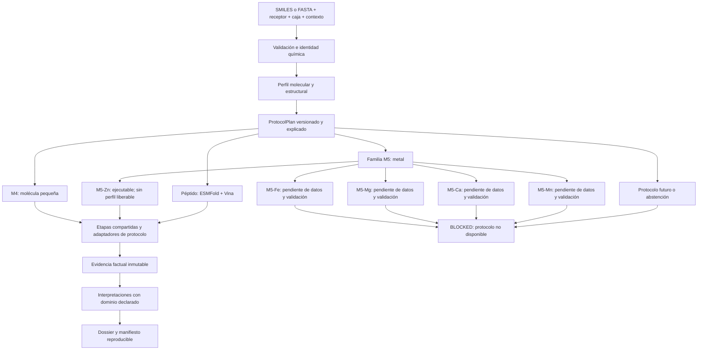

# Arquitectura del dispatcher de protocolos de MolDesign

**Estado:** propuesta revisada para implementación  
**Fecha:** septiembre de 2026  
**Ámbito:** backend embebido de Windows, Tauri v2, FastAPI, Python 3.11 y SQLite  

---

## 1. Decisión arquitectónica

MolDesign no tendrá exactamente tres pipelines para siempre. Tendrá un
**dispatcher extensible de protocolos**. M4, M5-Zn y Péptidos/ESMFold son los
tres caminos concretos que hoy merece la pena separar porque corresponden a
tres situaciones biofísicas y operativas distintas:

1. moléculas pequeñas contra dianas sin un tratamiento especializado;
2. moléculas contra centros metálicos, con soporte inicial para zinc;
3. péptidos que requieren generación estructural antes del docking.

Estos caminos son el inventario inicial, no una taxonomía cerrada. En el futuro
podrán añadirse protocolos para otros metales, macrociclos, ligandos covalentes,
péptidos no canónicos, estados múltiples del receptor u otros dominios. Añadir
uno no debe exigir modificar el orquestador central ni atribuirle validez antes
de medirlo.

La regla de producto sigue siendo:

> MolDesign debe registrar qué protocolo ejecutó, por qué lo eligió, qué señales
> son observaciones y cuáles son interpretaciones, cuál es su dominio de
> aplicabilidad y cuándo debe abstenerse.

---

## 2. No son tres productos científicos equivalentes

Los tres caminos tienen distinta madurez y no deben presentarse con el mismo
nivel de confianza:

| Protocolo | Estado actual | Resultado justificable |
|---|---|---|
| `M4_SMALL_MOLECULE` | Operativo; Vina es la observación principal y los modelos tienen dominios de transferencia distintos | Evidencia de docking, controles físicos, procedencia y rescoring con aplicabilidad declarada |
| `M5_ZN` | Infraestructura operativa; **ningún perfil positivo científicamente liberable** (ver doc. 77) | Evidencia de docking más señales específicas de coordinación de Zn, y la abstención cuando no las hay; `REVIEW` fuera del dominio medido |
| `PEPTIDE_ESMFOLD_VINA` | Operativo técnicamente; validez científica pendiente | Estructura predicha, pLDDT y docking exploratorio, sin convertir confianza en afinidad |

El número de pruebas de software no cambia esta tabla. Los tests demuestran que
el programa hace lo especificado; la validez científica requiere benchmarks,
controles, dominio de aplicabilidad y, cuando corresponda, validación externa.

---

## 3. Clasificación multidimensional, no una etiqueta destructiva

`PipelineClassifier` no debe devolver solamente un enum excluyente. Debe
producir un `ProtocolPlan` inmutable que conserve todas las características
relevantes del caso.

```python
@dataclass(frozen=True)
class ProtocolPlan:
    classifier_version: str
    protocol_id: str
    protocol_version: str
    scientific_status: str       # SUPPORTED | REVIEW | EXPERIMENTAL | BLOCKED

    ligand_profile: tuple[str, ...]
    target_profile: tuple[str, ...]
    requested_engine: str | None
    selected_engine: str | None

    stages: tuple[str, ...]
    enabled_scorers: tuple[str, ...]
    applicability: dict
    reasons: tuple[str, ...]
    warnings: tuple[str, ...]
```

Ejemplos de perfiles acumulables:

```text
ligand_profile = [RO5, PEPTIDE, HIGH_FLEXIBILITY]
target_profile = [METALLOENZYME, ZN_PRESENT]
```

Un péptido dirigido a una metaloenzima no deja de ser metálico por haber entrado
primero en la rama peptídica. Si no existe un protocolo validado para la
combinación `PEPTIDE + ZN`, el resultado correcto es `REVIEW` o `BLOCKED`, no
perder una de las dos propiedades mediante precedencia arbitraria.

### 3.1. Entradas del clasificador

El clasificador utiliza:

- molécula sanitizada, identidad química y microestado;
- masa, átomos, enlaces rotables, macroanillos y enlaces peptídicos;
- formato de entrada, por ejemplo SMILES o FASTA;
- familia estructural curada de la diana;
- metales realmente presentes en el bolsillo y su procedencia;
- cofactores y aguas declarados;
- protocolo solicitado por el usuario;
- capacidades realmente instaladas en esa máquina.

La selección explícita del usuario es una solicitud, no permiso para falsear
capacidades. Si el motor no existe, el plan se abstiene o registra una
sustitución crítica; nunca cambia silenciosamente de método.

### 3.2. Tamaño molecular

Ro5, bRo5 y Ro3 sirven para contextualizar propiedades y aplicabilidad, pero no
demuestran por sí mismos el dominio físico de Vina.

Los límites actuales de `MW > 1000 Da` o `> 70` átomos pesados pueden mantenerse
como **política operativa de MolDesign**, siempre que el resultado diga
`OUTSIDE_PRODUCT_SCOPE` y no afirme que Ghose demostró que Vina es
ininterpretable. Para convertirlos en una frontera científica del motor hay que
medir convergencia, repetibilidad entre semillas, tasa de preparación y validez
física frente a tamaño y flexibilidad.

Ro3 permanece como marca contextual; no convierte automáticamente una molécula
en fragmento.

---

## 4. Flujo general



---

## 5. M4: molécula pequeña

### 5.1. Activación

M4 es el protocolo base cuando:

- la entrada puede prepararse como ligando para Vina;
- no requiere un tratamiento metálico soportado;
- no requiere el camino peptídico;
- no activa una abstención por química, estructura o capacidad instalada.

bRo5 puede transitar por M4 con `REVIEW` y advertencias específicas; no significa
que todas las reglas de drug-likeness o todos los modelos estén calibrados allí.

### 5.2. Etapas

1. identidad química y microestado determinista;
2. generación conformacional con semilla y versión registradas;
3. preparación de receptor y ligando;
4. AutoDock Vina 1.2.7;
5. validación física de poses;
6. extracción de interacciones;
7. rescoring permitido por dominio;
8. persistencia de señales y dossier.

### 5.3. Separación de señales

`vina_affinity_kcal_mol` se conserva literalmente y nunca se sobrescribe con
XGBoost, GNN, MM-GBSA ni un score compuesto. Cada modelo recibe su propio campo,
versión, hash, estado y dominio de aplicación.

Un score combinado, si se muestra, es una interpretación derivada. No debe
ocultar los valores originales ni llamarse afinidad experimental.

---

## 6. M5: familia extensible de protocolos para metales

M5 no es un único algoritmo universal. Es una familia con un adaptador por tipo
de metal y, cuando los datos lo exijan, por geometría de coordinación o familia
de diana.

```text
M5
├── M5-Zn       ejecutable; ningún perfil positivo liberable (doc. 77)
├── M5-Fe       futuro
├── M5-Mg       futuro
├── M5-Ca       futuro
├── M5-Mn       futuro
└── M5-Other    abstención hasta disponer de protocolo
```

Cada adaptador futuro debe declarar:

- especies y estados de oxidación soportados;
- geometrías de coordinación contempladas;
- preparación y tipos atómicos requeridos;
- scoring y features específicos;
- conjunto de evaluación y partición;
- métricas, controles negativos y límites;
- artefactos, versiones y hashes;
- regla de abstención fuera del dominio.

### 6.1. Activación de M5

La presencia de un warhead en el ligando **no basta** para seleccionar M5. Un
carboxilato, sulfonamida o tiol también puede aparecer en ligandos de dianas no
metálicas.

M5 requiere contexto metálico del target, sustentado por al menos una fuente
registrable:

- familia curada compatible;
- metal observado en la estructura o snapshot del receptor;
- declaración explícita revisable del investigador.

Los warheads son features dentro de M5. Ayudan a interpretar compatibilidad de
coordinación, pero no convierten por sí solos una diana en metaloenzima.

Si el target es metálico y no existe adaptador para ese metal, MolDesign no
degrada silenciosamente a M4: emite `BLOCKED` o `REVIEW`. M4 puede ejecutarse
como comparación exploratoria sólo si queda solicitado y etiquetado como
protocolo no especializado.

### 6.2. M5-Zn actual

> **Corrigendum.** Este apartado describía M5-Zn como «evaluado
> retrospectivamente» y «disponible hoy». El benchmark que sostenía esa lectura
> no acopló en el sitio del zinc; `docs/77_CORRIGENDUM_SITIO_DEL_BENCHMARK_M5_ZN.md`
> lo documenta. Lo que queda demostrado es que la maquinaria de ejecución,
> persistencia y abstención funciona: **M5-Zn es infraestructura operativa sin
> perfil positivo científicamente liberable**. La entrada genérica salió de
> `stacking_weights.json`; el protocolo se activa por perfil exacto y ninguno de
> los perfiles existentes es liberable. Las etapas de abajo describen el diseño
> del protocolo, no un resultado validado.

El alcance inicial de M5-Zn se limita a las condiciones realmente evaluadas en
los artefactos de UMS. No se generaliza automáticamente a todos los targets de
zinc ni a otros metales.

Etapas específicas:

1. verificar que el Zn relevante está presente y pertenece al bolsillo;
2. conservar el ion y registrar identidad, coordenadas y procedencia;
3. detectar warheads W1-W6;
4. obtener features geométricas Zn-ligando cuando haya una pose válida;
5. ejecutar el protocolo de docking declarado;
6. aplicar UMS o un stack sólo dentro de su dominio medido;
7. emitir `REVIEW` cuando la diana, warhead o geometría quede fuera de él.

Conservar el metal y centrar la caja sobre éste no equivale por sí solo a usar
un scoring metal-aware. El dossier debe distinguir `METAL_PRESERVED`,
`METAL_GEOMETRY_EVALUATED` y `METAL_AWARE_SCORING`.

### 6.3. Pesos y artefactos

No se implementa un rango ambiguo como `w5 = 0.25-0.40`. Cada configuración
activa debe contener un valor exacto ligado a target o dominio, dataset, split,
métrica, versión y hash.

Antes de activar M5-Zn sobre el catálogo se debe resolver como una sola decisión
científica:

1. normalización `metaloenzyme`/`metalloenzyme`;
2. fórmula exacta de integración de UMS;
3. discrepancia entre `model-manifest.json`, `stacking_weights.json`, el
   manuscrito y `scoring/engine.py`;
4. comportamiento fuera de las dianas evaluadas;
5. pruebas de ranking sobre artefactos congelados.

Los modelos no reciben autoridad por aparecer en el stack. Por ejemplo, la
transferencia de CL-GNN depende de la familia y debe abstenerse o perder peso
cuando su manifiesto no respalde el caso.

---

## 7. Péptidos: ESMFold + Vina

### 7.1. Activación

El perfil peptídico se activa por:

- entrada FASTA o secuencia explícita;
- química peptídica reconocida con estereoquímica compatible;
- solicitud explícita de ESMFold que además supera las validaciones anteriores.

El umbral de tres enlaces peptídicos puede ser una señal inicial, pero no debe
ser el único criterio: hay peptidomiméticos, péptidos cíclicos, residuos no
canónicos y moléculas con varias amidas que requieren decisiones distintas.

### 7.2. Señales que no deben mezclarse

El resultado conserva por separado:

```text
fold_plddt                  confianza del plegamiento ESMFold
vina_affinity_kcal_mol      salida literal de Vina, si Vina realmente corrió
pose_generation_method      ESMFold + Vina, estructura solamente o fallback
refinement_status           aplicado, omitido o fallido
scientific_status           EXPERIMENTAL / REVIEW / BLOCKED
```

pLDDT no se convierte a kcal/mol. Una transformación de confianza puede servir
para ordenar estructuras como heurística si se valida, pero se denomina índice
de confianza y nunca afinidad.

### 7.3. Correctivo previo obligatorio

Antes de extraer esta rama hay que corregir el camino actual:

- el sidecar lee la afinidad de Vina pero la reduce a un campo `confidence`;
- la transformación actual hace disminuir esa confianza al mejorar la afinidad;
- `peptide_docking.py` transforma valores normalizados de 0 a 1 mediante un
  clamp que produce `-4.0` para prácticamente todas las poses;
- el valor real de Vina se pierde antes de persistir;
- una estructura devuelta sin docking puede terminar representada como pose.

La refactorización no debe copiar este comportamiento. Primero se fija el
contrato factual y después se extrae el módulo.

ESMFold predice una conformación del péptido; no debe describirse como garantía
de la estructura nativa ni como predictor de afinidad. Vina sobre péptidos se
mantiene como resultado exploratorio hasta disponer de benchmark de poses,
repetibilidad y controles físicos para el protocolo exacto.

---

## 8. Caminos adicionales ya identificados

No tienen que implementarse ahora, pero deben quedar representados en el
registro para evitar que terminen absorbidos por M4 sin advertencia:

| Camino futuro | Motivo para separarlo | Estado inicial |
|---|---|---|
| `M5-FE`, `M5-MG`, `M5-CA`, `M5-MN` | Química y geometría de coordinación distintas de Zn | `BLOCKED_UNTIL_VALIDATED` |
| `MACROCYCLE` | Muestreo correlacionado y preparación especial de anillos | `REVIEW` |
| `COVALENT_LIGAND` | Requiere residuo, reacción y protocolo covalente explícitos | `BLOCKED` |
| `NONCANONICAL_PEPTIDE` | ESMFold no representa de forma general residuos D o modificaciones | `BLOCKED` o protocolo externo futuro |
| `COFACTOR_OR_WATER_DEPENDENT` | Quitar o conservar estos elementos cambia la hipótesis estructural | `REVIEW` |
| `RECEPTOR_ENSEMBLE` | Una sola conformación puede ser insuficiente | futuro |
| `UNKNOWN_DOMAIN` | No existe evidencia para seleccionar un protocolo fiable | `BLOCKED` |

El registro permite que la interfaz explique “todavía no existe un camino
validado para este caso” en lugar de devolver un número genérico.

---

## 9. Diseño modular

La modularización debe maximizar etapas compartidas y minimizar tres copias del
mismo pipeline.

```text
backend/services/pipeline/
├── classifier.py              # construye perfiles, no ejecuta ciencia pesada
├── protocol_plan.py           # modelo inmutable, versión y serialización
├── registry.py                # protocolos disponibles y sus capacidades
├── orchestrator.py            # ejecuta etapas y controla estados/cancelación
├── stages/
│   ├── validate.py
│   ├── prepare_ligand.py
│   ├── prepare_receptor.py
│   ├── generate_pose.py
│   ├── validate_pose.py
│   ├── interactions.py
│   ├── rescore.py
│   └── persist_evidence.py
├── protocols/
│   ├── m4_small_molecule.py
│   ├── m5/
│   │   ├── base.py
│   │   ├── zinc.py
│   │   ├── iron.py            # registrado, deshabilitado
│   │   ├── magnesium.py       # registrado, deshabilitado
│   │   ├── calcium.py         # registrado, deshabilitado
│   │   └── manganese.py       # registrado, deshabilitado
│   └── peptide_esmfold_vina.py
└── dossier_builder.py
```

Los módulos de protocolo seleccionan o parametrizan etapas; no vuelven a
implementar persistencia, cancelación, progreso, dossier y errores.

`queue_handler.py` queda como adaptador de trabajos de escritorio:

1. registrar y recuperar la tarea;
2. administrar progreso, cancelación y reinicio;
3. invocar al orquestador;
4. traducir el resultado al contrato de la API.

No debe contener química, docking ni scoring.

---

## 10. Una sola fuente de verdad

La persistencia se divide conceptualmente en:

1. **Evidencia factual:** entradas, archivos, hashes, versiones, parámetros,
   salidas literales, fallos y advertencias.
2. **Interpretación:** scores normalizados, aplicabilidad, comparaciones y
   recomendaciones.
3. **Módulos experimentales:** señales que todavía no tienen autoridad para
   modificar la evidencia primaria.

El dossier y cualquier constancia de reproducibilidad se generan desde el mismo
snapshot sellado. Ninguna vista del frontend debe reconstruir por su cuenta un
resultado diferente.

Campos mínimos del protocolo persistido:

```text
protocol_id
protocol_version
classifier_version
classification_reasons
scientific_status
applicability
requested_engine
executed_engine
fallback_or_substitution
artifact_hashes
raw_outputs
derived_outputs
warnings
```

---

## 11. Plan de implementación seguro

### Fase 0 — Reparar contratos científicos antes de mover código

1. Conservar la afinidad real de Vina en el camino peptídico.
2. Eliminar toda conversión pLDDT → kcal/mol.
3. Distinguir estructura sin docking de pose dockeada.
4. Resolver conjuntamente grafía, pesos y aplicabilidad de M5-Zn.
5. Alinear manifiestos, documentación y comportamiento ejecutado.
6. Crear corridas doradas de M4, M5-Zn y péptidos con artefactos y dossier.

### Fase 1 — Caracterización de los dos ejecutores actuales

Antes de borrar duplicación, fijar pruebas de caracterización sobre el camino
legacy y el configurable:

- mismo receptor y snapshot;
- mismo microestado y hash;
- misma caja, seed y exhaustividad;
- mismas poses y afinidad Vina dentro de tolerancia;
- mismos campos de procedencia;
- mismos estados de fallo y abstención.

### Fase 2 — `ProtocolPlan` y clasificador sin cambio de comportamiento

Crear el modelo y el registro. Inicialmente se ejecuta el camino existente, pero
se persiste qué habría seleccionado el clasificador. Esto permite medir errores
de enrutamiento sin cambiar resultados.

Casos mínimos:

- aspirina y una molécula Ro5 convencional;
- ritonavir u otro caso bRo5;
- acetazolamida/CA2, inhibidor de MMP y enalaprilato/ACE;
- warhead de Zn contra una diana no metálica;
- target de Zn con ligando sin warhead;
- target con Fe/Mg/Ca/Mn sin adaptador;
- péptido L, péptido D, peptidomimético y molécula con tres amidas no peptídicas;
- péptido contra target metálico;
- motor solicitado pero no instalado.

### Fase 3 — Extraer etapas compartidas

Extraer preparación, docking, validación, rescoring y persistencia sin cambiar
algoritmos. Los golden tests deben seguir pasando.

### Fase 4 — Adaptadores M4, M5-Zn y Péptidos

Construir los tres adaptadores iniciales sobre las etapas compartidas. Los
protocolos futuros se registran como no disponibles y deben producir abstención
explicable.

### Fase 5 — Ejecución sombra y comparación

Durante la transición, ejecutar el orquestador nuevo en modo sombra sobre una
cohorte pequeña y comparar con el camino anterior:

- clasificación;
- archivos generados;
- afinidades y orden de poses;
- warnings;
- estado final;
- manifiesto y dossier.

Una diferencia exige explicación; no se actualiza el golden automáticamente.

### Fase 6 — Sustitución de `queue_handler.py`

Cuando la equivalencia esté demostrada, `queue_handler.py` delega en el nuevo
orquestador y se elimina la lógica duplicada. Los endpoints FastAPI y contratos
OpenAPI permanecen estables.

### Fase 7 — Verificación del artefacto distribuido

La aceptación final se realiza también sobre el runtime embebido:

- tests del backend relevante;
- tests del frontend y TypeScript;
- `verify:desktop-runtime`;
- `smoke:prod`;
- corrida M4 completa con dossier;
- arranque del sidecar ESMFold cuando esté instalado;
- ausencia de red después de la descarga autorizada;
- prueba en máquina virtual limpia.

---

## 12. Gates para añadir un nuevo camino

Un protocolo nuevo sólo pasa de registrado a disponible cuando cumple:

1. **Capacidad:** todos los binarios, pesos y dependencias viajan o se descargan
   mediante el mecanismo autorizado.
2. **Identidad:** entradas y salidas tienen hashes, versiones y unidades.
3. **Determinismo controlado:** las semillas se fijan o la variabilidad se mide.
4. **Validez técnica:** produce archivos correctos y supera controles físicos.
5. **Validez científica:** benchmark apropiado, split honesto y controles
   negativos.
6. **Aplicabilidad:** declara dónde se midió y cómo se abstiene fuera.
7. **Transferencia:** un tercero reconstruye el paquete sin conocer la sesión.
8. **Artefacto:** la misma prueba se ejecuta con el backend embebido que viajará
   en la aplicación.

Hasta entonces el protocolo puede aparecer en el registro como
`COMING_SOON`, `EXPERIMENTAL` o `BLOCKED`, pero no como motor activo equivalente
a los protocolos soportados.

---

## 13. Conclusión

MolDesign parte hoy de tres caminos reales, pero la arquitectura se diseña para
muchos más. M4 es el protocolo base; M5 es una familia extensible cuyo primer
adaptador es M5-Zn; y ESMFold/Vina es un camino peptídico experimental que debe
separar estrictamente confianza estructural y afinidad de docking.

El objetivo de la refactorización no es sólo reducir aproximadamente 2.600
líneas duplicadas. Es impedir que una decisión de enrutamiento o un fallback
cambien silenciosamente el significado científico de una corrida. El producto
final debe poder responder, para cualquier camino presente o futuro:

> ¿Por qué se eligió este protocolo, qué ejecutó realmente, qué evidencia
> produjo, dentro de qué dominio puede interpretarse y qué incertidumbre queda?
