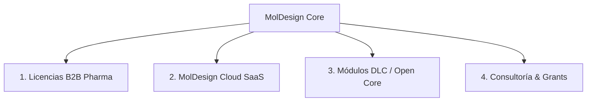

# Estrategia de Modelo de Negocio y Monetización — MolDesign AI

> **Borrador estratégico, no contrato ni estado de producto.** Las condiciones
> vigentes son LICENSE, LICENSE-MODELS, COMMERCIAL-LICENSE.md y
> docs/LICENSING.md. Las cifras y capacidades de este documento requieren
> revalidación antes de usarse en marketing o negociación.

## 1. Visión General

**MolDesign AI** es una plataforma de descubrimiento de fármacos *on-premises* y *source-available* que combina docking moleculativo (**AutoDock Vina**), química cuántica (**xTB**), rescoring multimodelo con Machine Learning (**XGBoost + GNN-v2/v3 + CL-GNN**), predicción de estructuras de proteínas (**ESMFold**) y asistencia conversacional (**MolChat / LLMs**).

El objetivo estratégico es **democratizar el acceso al descubrimiento de fármacos** para laboratorios académicos e investigadores independientes con hardware modesto (optimizando la ejecución en CPU), mientras se construye un **modelo de negocio sostenible y rentable** enfocado en la industria farmacéutica, biotechs privadas y usuarios que requieren potencia computacional en la nube.

---

## 2. Estrategia Open Source y Licenciamiento Dual (Dual Licensing)

El software científico requiere transparencia para generar confianza y adopción dentro de la comunidad científica. Sin embargo, esto no impide su comercialización.

### Esquema de Licencias Actual y Comercial
* **Código fuente y modelos propios autorizados:** **PolyForm Noncommercial 1.0.0**. Uso no comercial gratuito; cualquier uso comercial requiere acuerdo escrito separado.
* **Modelos propios autorizados:** siguen `LICENSE-MODELS` y PolyForm Noncommercial 1.0.0. Los pesos derivados de PDBbind permanecen `REVIEW_REQUIRED` y no son publicables hasta obtener permiso o reentrenarlos con procedencia limpia.

```
 ┌──────────────────────────────────────────────────────────────────────────┐
 │                           MOLDESIGN ECOSYSTEM                            │
 ├──────────────────────────────────────────┬───────────────────────────────┤
 │     Comunidad / Academia (GRATIS)        │    Industria / Pharma (PAGO)  │
 ├──────────────────────────────────────────┼───────────────────────────────┤
 │ • PolyForm NC · source-available         │ • Licencia Comercial B2B      │
 │ • Uso local en CPU / Hardware propio     │ • Derechos comerciales pactados│
 │ • Código auditable para uso no comercial │ • Soporte prioritario & SLA   │
 │ • Modelos autorizados para uso NC        │ • Commercial Product Dev      │
 │   según los términos normativos           │   requiere Enterprise License │
 └──────────────────────────────────────────┴───────────────────────────────┘
```

### ¿Por qué funciona el esquema PolyForm Noncommercial + licencia comercial?
1. **Confianza académica:** los investigadores pueden auditar y modificar la metodología para fines no comerciales. La financiación o el contexto institucional no sustituyen la definición normativa de “Noncommercial Purpose”; los casos dudosos requieren autorización escrita.
2. **Monetización B2B coherente:** cualquier uso comercial requiere un acuerdo separado; no existe una excepción automática para investigación interna de una empresa.
3. **La licencia es un disuasivo, no un candado:** el enforcement real es para organizaciones que respetan copyright (empresas establecidas con departamento legal). No es protección técnica — cualquiera puede descargar los pesos. Por eso el modelo comercial también incluye SaaS, servicios y una marca cuya disponibilidad todavía debe investigarse profesionalmente.

---

## 3. Vías de Monetización (Monetization Pillars)



### 1. Licencias Comerciales B2B (Pharma & Biotech Privadas)
* **Público Objetivo:** Empresas farmacéuticas, startups biotech en fase de aceleración y CROs (*Contract Research Organizations*) que quieran INTEGRAR los modelos en su pipeline comercial (Commercial Product Development) o redistribuirlos.
* **Oferta:**
  * Licencia comercial que concede por escrito los usos no cubiertos por PolyForm Noncommercial; la redistribución de modelos sólo puede autorizarse si MolDesign posee a su vez esos derechos.
  * Instalación y despliegue *on-premises* en clústeres privados/servidores de la empresa.
  * Soporte técnico prioritario, parches de seguridad y SLA.
* **Precio Sugerido (tiers por tamaño de empresa):**
  * **Startup / Biotech early** (< 10 FTE): $10,000 USD/año.
  * **Mid / CRO**: $20,000 USD/año.
  * **Enterprise** (> 250 FTE): $30,000+ USD/año, negociable por volumen.
* **Racional del precio:** el mercado (Schrödinger, OpenEye, BioSolveIT) cobra $20k–$100k+/año. Un precio de $1,500–5,000 señalaría "no validado" y no cubriría el SLA. El precio alto se justifica SOLO cuando el paper JCIM y la validación reproducible lo respaldan — ver Fase 1.
* **Límite jurídico:** no prometer que la investigación interna empresarial es gratuita. Debe evaluarse contra la definición de “Noncommercial Purpose” o cubrirse con licencia escrita.

### 2. MolDesign Cloud / SaaS (Pay-per-Compute)
* **Público Objetivo:** Investigadores, estudiantes o laboratorios cuyo hardware no puede ejecutar jobs pesados de 8-12 horas en local.
* **Oferta:**
  * Plataforma Web donde el usuario carga archivos PDB/SMILES y ejecuta Vina + ESMFold + GNN rescoring en la nube en cuestión de minutos.
  * Sin necesidad de instalar Python, controladores GPU ni binarios locales.
* **Modelo de Cobro:**
  * **Suscripción Fija:** $19 USD/mes (Tier Estudiante) / $99 USD/mes (Tier Lab).
  * **Créditos de Cómputo (Pay-as-you-go):** Paquetes de créditos por job completado ($0.05 - $0.20 USD por molécula/docking).

### 3. Módulos DLC / Freemium (Open Core)
* **Core Gratis (Desktop):** Docking Vina básico, rescoring XGBoost local, visualización 3D y MolChat local.
* **Módulos DLC de Pago:**
  * **GPU Acceleration Module:** Engine nativo para cribado virtual masivo (*virtual screening*) de >500k moléculas usando GPUs en clúster.
  * **Target Library Pro:** Acceso a bases de datos de receptores curados, preparados y listos para cribado inmediato.
  * **Executive Report Generator:** Generación automatizada de reportes científicos en PDF/HTML interactivo listos para publicación o pitch con inversores.

> **⚠️ Advertencia estratégica:** los DLC son el pilar más débil del modelo. PolyForm limita el uso comercial, pero no sustituye una ventaja técnica ni una oferta de servicio. No invertir en DLC antes que SaaS/servicios.

### 4. Consultoría Especializada y Subvenciones (Grants)
* **Servicios a la Medida:** Desarrollo de pipelines de rescoring personalizados para receptores o familias de proteínas específicas solicitados por startups biotech.
* **Grants de Ciencia Abierta:** Postulación a fondos como *Chan Zuckerberg Initiative (CZI)*, *NIH Open Science*, *Open Collective* y becas de la UE para el mantenimiento de infraestructura científica abierta.

> **Prioridad (reordenada):** los pilares con mayor ROI a corto plazo son **4 (servicios/grants)** y **2 (SaaS)** — no requieren "producto terminado" ni reputación previa. El pilar 1 (B2B Enterprise) es el de mayor ticket pero SOLO llega después de la validación publicada. El pilar 3 (DLC) es el de menor prioridad.

---

## 4. Roadmap Estratégico de Implementación

> **Principio rector:** la validación científica ES el activo más valioso del modelo de negocio. Sin paper publicado y reproducible, no hay ventas B2B a ningún precio. Las ventas NO empiezan antes de que Fase 1 complete su validación.

### Fase 1: Validación, Reputación y Lanzamiento (Meses 1 – 6) — SIN VENTAS
- [x] Consolidación del pipeline Vina + XGB + GNN stacking.
- [ ] **Cerrar deuda de validación crítica** (bloquea todo lo demás):
  - [ ] Reparar docking ACE (AUC 0.40 = random — bloquea N=3 pipeline).
  - [ ] Verificar SMILES TODO del dict contra PubChem (~60 entradas).
  - [ ] Corregir los 8 tests de pipeline fallando (`test_pipeline_registry`).
  - [ ] Rehacer GNN metal-aware LOTO sin data leakage (o descartarlo del paper).
- [ ] Publicación del paper en *Journal of Chemical Information and Modeling (JCIM)* con todo reproducible.
- [ ] Lanzamiento del repositorio GitHub bajo PolyForm Noncommercial, una vez resueltos los derechos de datasets y pesos.
- [ ] Construcción de comunidad en GitHub, Discord/Slack y recopilación de métricas de uso.
- [ ] **5+ colaboraciones de investigación** (papers conjuntos con labs) — el KPI real de Fase 1.

### Fase 2: SaaS + Servicios a Medida (Meses 6 – 12)
- [ ] **MolDesign Cloud / SaaS** (pay-per-compute) — el canal más corto a ingresos, sin requerir "producto terminado".
- [ ] **Servicios de screening a medida (CRO-lite):** labs pagan por correr SU pipeline en SUS targets con TU validación.
- [ ] Postulación a grants de ciencia abierta (CZI, NIH Open Science, Open Collective, becas UE).
- [ ] Creación de la página web oficial con portal de ventas (informativo — ventas Enterprise aún no).

### Fase 3: Comercialización Enterprise (Año 2+)
- [ ] Definición del acuerdo de licencia comercial para conceder usos no cubiertos por PolyForm Noncommercial.
- [ ] Oferta de paquetes de soporte dedicado y generación de reportes ejecutivos (PDF Pro).
- [ ] Primeras prospecciones con startups biotecnológicas (con paper + validación publicados).
- [ ] Despliegue de nodos GPU auto-escalables en RunPod / AWS / Hetzner.
- [ ] Pasarela de pagos (Stripe) e integración del sistema de créditos de cómputo.

---

## 5. Indicadores Clave de Rendimiento (KPIs)

> **Principio:** los KPIs de adopción (estrellas, citas) son LEADING indicators. Los KPIs de ingresos (clientes, suscripciones) son LAGGING — dependen de la validación publicada. No fijar metas de ingresos en Fase 1 sin paper.

| Indicador | Meta Fase 1 | Meta Fase 2 | Meta Fase 3 |
|---|---|---|---|
| **Validación** (paper JCIM aceptado + reproducible) | ✅ **1 paper aceptado** | — | — |
| **Colaboraciones de investigación** (papers conjuntos) | **5+** | 10+ | 20+ |
| Estrellas en GitHub | 300+ | 1,000+ | 3,000+ |
| Citas Académicas | 5+ | 25+ | 100+ |
| **Servicios a medida** (CRO-lite) completados | 0 | 5+ | 15+ |
| Clientes Licencia Enterprise | 0 (aún no se vende) | 1 - 2 pilotos | 10+ empresas |
| Usuarios Activos SaaS Web | — | Alpha cerrado (50-100) | 500+ suscripciones |

**Nota honesta:** "1,000+ suscripciones SaaS en año 2" sin equipo de ventas/marketing era irreal. La meta realista para Fase 3 es 500+ suscripciones CON SaaS lanzado en Fase 2 y tracción de comunidad. Los ingresos por servicios a medida y grants suelen llegar ANTES que el SaaS masivo.

---

## 6. Deuda de Validación — Bloqueador Crítico (Leer Primero)

> **La validación científica es el cuello de botella, no el precio.** El modelo de negocio asume tracción, pero el estado actual del proyecto tiene hallazgos que una pharma detectaría en due diligence. Cerrar esto es PREREQUISITO para cualquier venta.

| Hallazgo | Impacto en ventas | Acción requerida |
|---|---|---|
| Docking ACE roto (AUC 0.40 = random) | Bloquea claim N=3 pipeline completo | Reparar grid center (Zn²⁺ vs centroid) |
| GNN metal-aware invalidado por data leakage | Papel roto → reputación | Rehacer LOTO sin `gnn_d_best.pt` o descartar del paper |
| ~60 SMILES del dict sin verificar contra PubChem | Paper-grade cuestionable | Batch script de verificación de CIDs |
| 8 tests de pipeline fallando (`test_pipeline_registry`) | Auditoría externa lo ve | Corregir runner.py (cambios sin commitear de otro trabajo) |
| PubChem HTTP 400 (User-Agent) — tool web nunca funcionó | El "dato verificado" del pitch no funciona | YA CORREGIDO (F12, esta sesión) |
| MolChat: guard de valores ADME no atrapaba invención | Demos fallan | YA CORREGIDO (F8, esta sesión) |

**Regla:** ninguna de las vías de monetización (B2B, SaaS, servicios) se activa antes de que esta tabla esté en cero. El paper JCIM con todo reproducible es la puerta de entrada.

---

> **Nota:** Este documento debe ser revisado periódicamente a medida que evolucione la tracción del repositorio en GitHub y las métricas de feedback de la comunidad científica.
